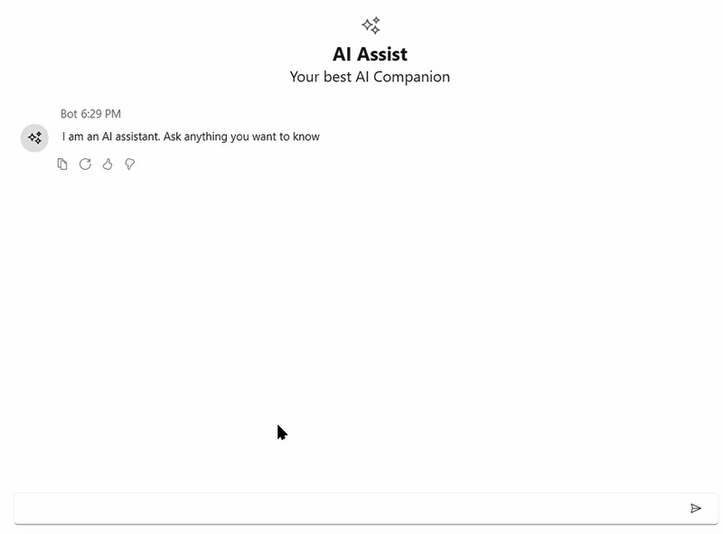

# Stop Responding in WPF AI AssistView

## EnableStopResponding

The **SfAIAssistView** control includes a **Stop Responding** feature, allowing users to cancel an ongoing AI response by clicking the Stop Responding button. This feature ensures that users can interrupt the response if it is no longer needed.

By default, the Stop Responding button is not displayed. To enable it, set the EnableStopResponding property to true.





<Page
    x:Class="GettingStarted.MainPage"
    xmlns="http://schemas.microsoft.com/winfx/2006/xaml/presentation"
    xmlns:x="http://schemas.microsoft.com/winfx/2006/xaml"
    xmlns:local="using:GettingStarted"
    xmlns:d="http://schemas.microsoft.com/expression/blend/2008"
    xmlns:mc="http://schemas.openxmlformats.org/markup-compatibility/2006"
    xmlns:syncfusion="using:Syncfusion.UI.Xaml.Chat"
    mc:Ignorable="d">
    <Grid>
      <syncfusion:SfAIAssistView  x:Name="sfAIAssistView"
                                  EnableStopResponding= "True"/>
    </Grid>
</Page>

 



SfAIAssistView sfAIAssistView = new SfAIAssistView();
sfAIAssistView.EnableStopResponding = true;




### Event and Command

The **SfAIAssistView** control provides the **StopResponding** event and **StopRespondingCommand**. These are triggered when the Stop Responding button is clicked. You can handle these actions to stop an ongoing AI response, as shown below.

#### StopResponding Event





<syncfusion:SfAIAssistView x:Name="sfAIAssistView"
                           StopResponding="sfAIAssistView_StopResponding"/>

 



SfAIAssistView sfAIAssistView = new SfAIAssistView();
sfAIAssistView.StopResponding += sfAIAssistView_StopResponding;

private void sfAIAssistView_StopResponding(object sender, EventArgs e)
{
    // Handle the Stop Responding action
}




#### StopResponding Command  





<syncfusion:SfAIAssistView x:Name="sfAIAssistView"
                           StopRespondingCommand="{Binding StopRespondingCommand}"/>

 



public class ViewModel : INotifyPropertyChanged
{
    public ICommand StopRespondingCommand { get; set; }
  
    public ViewModel()
    {
        StopRespondingCommand = new RelayCommand(ExecuteStopResponding);
    }

    private void ExecuteStopResponding()
    {
        Chats.Add(new AIMessage
        {
           Author = new Author { Name = "Bot", ContentTemplate = AIIcon },
           DateTime = DateTime.Now,
           Solution = "You canceled the response",
        });
    }
}




#### StopRespondingTemplate

The **StopRespondingTemplate** property in SfAIAssistView defines the UI template for the Stop Responding button. This allows customization of the button’s appearance and behavior.





<Grid>
   <Grid.Resources>
        <DataTemplate x:Key="stopRespondingTemplate">
            <Grid Background="Transparent">
                <Button x:Name="btn" Content="Stop AI" Foreground="White" FontSize="14" HorizontalAlignment="Center" VerticalAlignment="Center">
            </Grid>
        </DataTemplate>
   </Grid.Resources>
   <syncfusion:SfAIAssistView  x:Name="sfAIAssistView"
                                  EnableStopResponding= "True"
                                  StopRespondingTemplate="{StaticResource stopRespondingTemplate}">
   </syncfusion:SfAIAssistView>
</Grid>

 



SfAIAssistView sfAIAssistView = new SfAIAssistView();
sfAIAssistView.EnableStopResponding = true;
if (this.TryFindResource("stopRespondingTemplate") is DataTemplate template)
{
    sfAIAssistView.StopRespondingTemplate = template;
}




