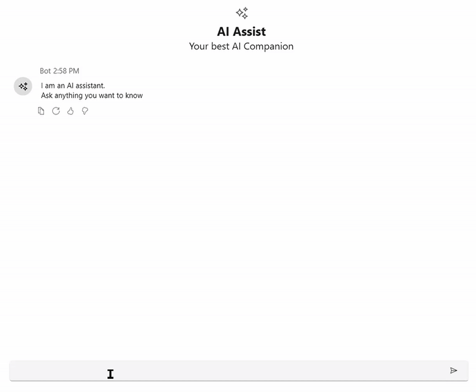

# OpenAI connection for AI AssistView

This section explains about how to connect the AI AssistView with OpenAI.

## Creating an application with NuGet reference.

1. Create a [Wpf desktop app for C# and .NET 6](https://learn.microsoft.com/en-us/dotnet/desktop/wpf/get-started/create-app-visual-studio?view=netdesktop-9.0).
2. Add reference to [Syncfusion.SfChat.Wpf](https://www.nuget.org/packages/Syncfusion.SfChat.Wpf) NuGet. 
3. Import the control namespace `Syncfusion.UI.Xaml.Chat` in XAML or C# code.
4. Initialize the [SfAIAssistView](https://help.syncfusion.com/cr/wpf/Syncfusion.UI.Xaml.Chat.SfAIAssistView.html) control.
5. Add reference to [Microsoft Semantic NuGet](https://www.nuget.org/packages/Microsoft.SemanticKernel) NuGet. 

## Creating the OpenAI view model class.

To connect with OpenAI, we need the following details.
* OPENAI_KEY: A string variable where we should add our valid OpenAI API key.
* OPENAI_MODEL: A string variable representing the OpenAI language model we want to use.
* API_ENDPOINT: A string variable representing the URL endpoint of the OpenAI API.




 public class ViewModel : INotifyPropertyChanged
 {
     AIAssistChatService service;

     private ObservableCollection<object> chats;
     public ObservableCollection<object> Chats
     {
         get
         {
             return this.chats;
         }
         set
         {
             this.chats = value;
             RaisePropertyChanged("Messages");
         }
     }
     public DataTemplate AIIcon { get; set; }
     private ObservableCollection<string> suggestion;

     public void RaisePropertyChanged(string propName)
     {
         if (PropertyChanged != null)
         {
             PropertyChanged(this, new PropertyChangedEventArgs(propName));
         }
     }

     public event PropertyChangedEventHandler PropertyChanged;

     private Author currentUser;
     public Author CurrentUser
     {
         get
         {
             return this.currentUser;
         }
         set
         {
             this.currentUser = value;
             RaisePropertyChanged("CurrentUser");
         }
     }

     private bool showTypingIndicator;
     public bool ShowTypingIndicator
     {
         get
         {
             return this.showTypingIndicator;
         }
         set
         {
             this.showTypingIndicator = value;
             RaisePropertyChanged("ShowTypingIndicator");
         }
     }

     public ObservableCollection<string> Suggestion
     {
         get
         {
             return this.suggestion;
         }
         set
         {
             this.suggestion = value;
             RaisePropertyChanged("Suggestion");
         }
     }

     private TypingIndicator typingIndicator;
     public TypingIndicator TypingIndicator
     {
         get
         {
             return this.typingIndicator;
         }
         set
         {
             this.typingIndicator = value;
             RaisePropertyChanged("TypingIndicator");
         }
     }

     public ViewModel()
     {
         this.Chats = new ObservableCollection<object>();
         this.Chats.CollectionChanged += Chats_CollectionChanged;
         this.CurrentUser = new Author() { Name = "User" };
        this.TypingIndicator = new TypingIndicator() { Author = new Author { ContentTemplate = AIIcon } };
         service = new AIAssistChatService();
         service.Initialize();
         
     }

     private async void Chats_CollectionChanged(object sender, System.Collections.Specialized.NotifyCollectionChangedEventArgs e)
     {
         var item = e.NewItems?[0] as ITextMessage;
         if (item != null)
         {
             if (item.Author.Name == currentUser.Name)
             {
                 ShowTypingIndicator = true;
                 await service.NonStreamingChat(item.Text);
                 Chats.Add(new TextMessage
                 {
                     Author = new Author { Name = "Bot", ContentTemplate = AIIcon },
                     DateTime = DateTime.Now,
                     Text = service.Response
                 });
                 ShowTypingIndicator = false;
             }
         }
     }

     public class AIAssistChatService
     {
         IChatCompletionService gpt;
         Kernel kernel;
         private string OPENAI_KEY = "";// Add a valid OpenAI key here.

         private string OPENAI_MODEL = "gpt-4o-mini";
 
         private string API_ENDPOINT = "https://openai.azure.com";

         public string Response { get; set; }
         public async Task Initialize()
         {
              var builder = Kernel.CreateBuilder().AddAzureOpenAIChatCompletion(
    OPENAI_MODEL, API_ENDPOINT, OPENAI_KEY);       

             kernel = builder.Build();
             gpt = kernel.GetRequiredService<IChatCompletionService>();
         }
         public async Task NonStreamingChat(string line)
         {
             Response = string.Empty;
             var response = await gpt.GetChatMessageContentAsync(line);
             Response = response.ToString();
         }
     }
 }




## Bind Messages

Set the ViewModel as the DataContext for the AI AssistView or the parent window. This allows data binding between the UI and the ViewModel properties.




<Page
    x:Class="GettingStarted.MainPage"
    xmlns="http://schemas.microsoft.com/winfx/2006/xaml/presentation"
    xmlns:x="http://schemas.microsoft.com/winfx/2006/xaml"
    xmlns:local="using:GettingStarted"
    xmlns:d="http://schemas.microsoft.com/expression/blend/2008"
    xmlns:mc="http://schemas.openxmlformats.org/markup-compatibility/2006"
    xmlns:syncfusion="using:Syncfusion.UI.Xaml.Chat"
    mc:Ignorable="d"
    Background="{ThemeResource ApplicationPageBackgroundThemeBrush}">
    <Grid>
     <Grid.DataContext>
        <local:ViewModel/>
     </Grid.DataContext>
     <syncfusion:SfAIAssistView    CurrentUser="{Binding CurrentUser}"
                                   Suggestions="{Binding Suggestion}"
                                   ShowTypingIndicator="True"
                                   TypingIndicator="{Binding TypingIndicator}"
                                   Messages="{Binding Chats}"/>
    </Grid>
</Page>

 


## Customize AI Response Rendering with ViewTemplateSelector in SfAIAssistView
Use the [ViewTemplateSelector](https://help.syncfusion.com/cr/wpf/Syncfusion.UI.Xaml.Chat.SfAIAssistView.html#Syncfusion_UI_Xaml_Chat_SfAIAssistView_ViewTemplateSelector) property to assign a DataTemplateSelector that controls how messages (including AI responses) are rendered in SfAIAssistView. The selector can return different DataTemplates based on the message type or role (user/assistant/system), enabling rich presentations such as:
- Markdown (via a Markdown viewer like MdXaml)
- FlowDocument-based layouts
- Images and custom visuals
- HTML (via a WebBrowser control or third-party HTML renderer)

This approach lets you tailor the appearance of assistant messages without modifying your data model.



<Page
    x:Class="GettingStarted.MainPage"
    xmlns="http://schemas.microsoft.com/winfx/2006/xaml/presentation"
    xmlns:x="http://schemas.microsoft.com/winfx/2006/xaml"
    xmlns:local="using:GettingStarted"
    xmlns:mdxam="clr-namespace:MdXaml;assembly=MdXaml"
    xmlns:d="http://schemas.microsoft.com/expression/blend/2008"
    xmlns:mc="http://schemas.openxmlformats.org/markup-compatibility/2006"
    xmlns:syncfusion="using:Syncfusion.UI.Xaml.Chat"
    mc:Ignorable="d"
    Background="{ThemeResource ApplicationPageBackgroundThemeBrush}">
    <Window.Resources>
        <local:ViewTemplateSelector x:Key="viewTS">
            <local:ViewTemplateSelector.AITemplate>
                <DataTemplate>
                    <Border Background="Transparent">
                        <StackPanel>
                            <Image Height="200" Width="500" 
                                Source="statue-liberty.jpg"
                                HorizontalAlignment="Left"/>
                            <mdxam:MarkdownScrollViewer 
                                Markdown="{Binding Text}" 
                                Foreground="{DynamicResource {x:Static SystemColors.ControlTextBrushKey}}"
                                VerticalScrollBarVisibility="Auto"
                                IsHitTestVisible="False"
                                Padding="8">
                                <mdxam:MarkdownScrollViewer.MarkdownStyle>
                                    
                                            
                                            
                                        </Style.Resources>
                                    </Style>
                                </mdxam:MarkdownScrollViewer.MarkdownStyle>
                            </mdxam:MarkdownScrollViewer>
                        </StackPanel>
                    </Border>
                </DataTemplate>
            </local:ViewTemplateSelector.AITemplate>
        </local:ViewTemplateSelector>
    </Window.Resources>
    <Grid>
     <Grid.DataContext>
        <local:ViewModel/>
     </Grid.DataContext>
     <syncfusion:SfAIAssistView    CurrentUser="{Binding CurrentUser}"
                                   Suggestions="{Binding Suggestion}"
                                   ShowTypingIndicator="True"
                                   TypingIndicator="{Binding TypingIndicator}"
                                   Messages="{Binding Chats}"
                                   ViewTemplateSelector="{StaticResource viewTS}"/>
    </Grid>
</Page>




public class ViewTemplateSelector : DataTemplateSelector
{
    public DataTemplate AITemplate { get; set; }

    public override DataTemplate SelectTemplate(object item, DependencyObject container)
    {
        if (item is AIMessage)
        {
            return AITemplate;
        }
        return null;
    }
}

public class AIMessage : NotificationObject, ITextMessage
{

    private string solution;

    /// 

    /// Gets or sets the text to be display as the message.
    /// 

    public string Solution
    {
        get
        {
            return this.solution;
        }
        set
        {
            this.solution = value;
            RaisePropertyChanged(nameof(Solution));
        }
    }

    private Author author;

    /// 

    /// Gets or sets the author to be display in the message.
    /// 

    public Author Author
    {
        get { return author; }
        set
        {
            author = value;
            RaisePropertyChanged(nameof(Author));
        }
    }

    private DateTime dateTime;

    /// 

    /// Gets or sets the date and time details when the message was created.
    /// 

    public DateTime DateTime
    {
        get { return dateTime; }
        set
        {
            dateTime = value;
            RaisePropertyChanged(nameof(DateTime));
        }
    }

    private string text;

    /// 

    /// Gets or sets the text to be display as the message.
    /// 

    public string Text
    {
        get { return text; }
        set { text = value; RaisePropertyChanged(nameof(Text)); }
    }
}




