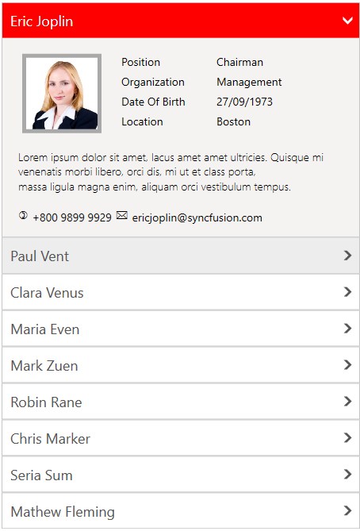

# Appearance and Styling in WPF Accordion (SfAccordion)

## Applying accent colors

SfAccordion supports accent colors to highlight the hot spots of the control. You can customize the accent colors using the [AccentBrush](https://help.syncfusion.com/cr/wpf/Syncfusion.Windows.Controls.Layout.SfAccordion.html#Syncfusion_Windows_Controls_Layout_SfAccordion_AccentBrush) property.



<syncfusion:SfAccordion x:Name="accordion"  AccentBrush="Red"  HorizontalAlignment="Center" VerticalAlignment="Center"/>


accordion.AccentBrush = new SolidColorBrush() { Color = Windows.UI.Colors.Red };



## Accordion header style

You can customize the appearance of SfAccordionItem header by setting the [HeaderTemplate](https://help.syncfusion.com/cr/wpf/Syncfusion.Windows.Controls.Layout.SfAccordion.html#Syncfusion_Windows_Controls_Layout_SfAccordion_HeaderTemplate) property of SfAccordion.



<syncfusion:SfAccordion HorizontalAlignment="Center" Height="250"  VerticalAlignment="Center" Width="300">
	<!-- For customizinng header -->
	<syncfusion:SfAccordion.HeaderTemplate>
		<DataTemplate>
			<TextBlock Text="{Binding}" Foreground="Red" Opacity="1" FontFamily="Calibri" FontWeight="Bold" FontSize="20"/>
		</DataTemplate>
	</syncfusion:SfAccordion.HeaderTemplate>
	<syncfusion:SfAccordionItem Header="WindowsForms"/>
	<syncfusion:SfAccordionItem Header="WPF"/>
	<syncfusion:SfAccordionItem Header="UWP"/>
	<syncfusion:SfAccordionItem Header="WinRT"/>
</syncfusion:SfAccordion>



## Accordion expander style

You can customize the appearance of expander button by writing style of [AccordionButton](https://help.syncfusion.com/cr/wpf/Syncfusion.Windows.Controls.Layout.AccordionButton.html), the edited style can be applied to accordion item by setting the [AccordionButtonStyle](https://help.syncfusion.com/cr/wpf/Syncfusion.Windows.Controls.Layout.SfAccordionItem.html#Syncfusion_Windows_Controls_Layout_SfAccordionItem_AccordionButtonStyle) property of SfAccordionItem.



<!--  AccordionButton Style -->

<!--SfAccordion Control -->
<syncfusion:SfAccordion x:Name="accordion1" HorizontalAlignment="Right" VerticalAlignment="Center" Width="180">
	<!-- Setting AccordionButtonStyle -->
	<syncfusion:SfAccordion.ItemContainerStyle>
		
	</syncfusion:SfAccordion.ItemContainerStyle>
</syncfusion:SfAccordion>



## AccordionItem header height customization

You can customize the height of SfAccordionItem header by setting the [HeaderTemplate](https://help.syncfusion.com/cr/wpf/Syncfusion.Windows.Controls.Layout.SfAccordion.html#Syncfusion_Windows_Controls_Layout_SfAccordion_HeaderTemplate) property of SfAccordion. 



<!-- For customizinng header -->		
<syncfusion:SfAccordion.HeaderTemplate>
	<DataTemplate>
		<TextBlock Text="{Binding Name}"  Height="50" FontSize="30"  VerticalAlignment="Center"/>
	</DataTemplate>
</syncfusion:SfAccordion.HeaderTemplate>



## AccordionItem content height customization

You can customize the height of SfAccordionItem content by setting the [ContentTemplate](https://help.syncfusion.com/cr/wpf/Syncfusion.Windows.Controls.Layout.SfAccordion.html#Syncfusion_Windows_Controls_Layout_SfAccordion_ContentTemplate) property of SfAccordion.



<!-- For customizinng SfAccordionItem content -->	
<syncfusion:SfAccordion.ContentTemplate>
	<DataTemplate>
		<TextBlock Text="{Binding Description}" Height="60"/>
	</DataTemplate>
</syncfusion:SfAccordion.ContentTemplate>



## Enable or disable the animation behaviour

You can enable or disable the animation behaviour when its item is expanded or collapsed. It can be achieved by setting [TargetSize](https://help.syncfusion.com/cr/wpf/Syncfusion.Windows.Controls.Layout.ExpandableContentControl.html#Syncfusion_Windows_Controls_Layout_ExpandableContentControl_TargetSize) and [Percentage](https://help.syncfusion.com/cr/wpf/Syncfusion.Windows.Controls.Layout.ExpandableContentControl.html#Syncfusion_Windows_Controls_Layout_ExpandableContentControl_Percentage) properties in [ExpandableContentControl](https://help.syncfusion.com/cr/wpf/Syncfusion.Windows.Controls.Layout.ExpandableContentControl.html) and writing the animation style in [SfAccordionItem](https://help.syncfusion.com/cr/wpf/Syncfusion.Windows.Controls.Layout.SfAccordionItem.html), the edited style can be applied by using the [ItemContainerStyle](https://help.syncfusion.com/cr/wpf/Syncfusion.Windows.Controls.Layout.SfAccordion.html#Syncfusion_Windows_Controls_Layout_SfAccordion_ItemContainerStyle) property of the SfAccordion control.



<!--  SfAccordionItem Style  -->

<!--SfAccordion Control -->
<syncfusion:SfAccordion x:Name="accordion1" HorizontalAlignment="Center" VerticalAlignment="Center"  ItemContainerStyle="{StaticResource animationStyle}" />



