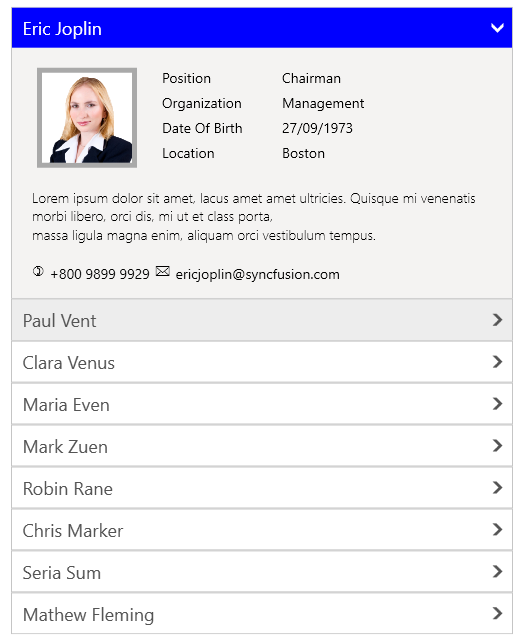
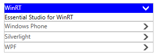

# Getting Started with WPF Accordion (SfAccordion)

## Assembly deployment

Refer to the [control dependencies](https://help.syncfusion.com/wpf/control-dependencies#sfaccordion) section to get the list of assemblies or NuGet package that needs to be added as a reference to use the control in any application.

You can find more details about installing the NuGet package in a WPF application in the following link: 

[How to install nuget packages](https://help.syncfusion.com/wpf/welcome-to-syncfusion-essential-wpf)

## Create a simple application with SfAccordion

You can create a WPF application with SfAccordion control using the following steps:

## Create a project

Create a new WPF project in Visual Studio to display the SfAccordion with functionalities.

## Add control through designer

The SfAccordion control can be added to an application by dragging it from the toolbox to a designer view. The **Syncfusion.SfAccordion.WPF** assembly reference will be added automatically to the project.

## Add control manually in XAML

To add the control manually in XAML, follow the given steps:

1. Add the **Syncfusion.SfAccordion.WPF** assembly reference to the project.
2. Import Syncfusion WPF schema **http://schemas.syncfusion.com/wpf** in the XAML page.
3. Declare the SfAccordion control in the XAML page.



<Window xmlns="http://schemas.microsoft.com/winfx/2006/xaml/presentation"
        xmlns:x="http://schemas.microsoft.com/winfx/2006/xaml"
        xmlns:syncfusion="http://schemas.syncfusion.com/wpf" 
        x:Class="SfAccordionSample.MainWindow"
        Title="SfAccordion Sample" Height="350" Width="525">
    <Grid>
        <!-- Adding SfAccordion control -->
        <syncfusion:SfAccordion x:Name="SfAccordion" HorizontalAlignment="Center"  VerticalAlignment="Center" Width="100"/>
    </Grid>
</Window>



## Add control manually in C\#

To add the control manually in C#, follow the given steps:

1. Add the **Syncfusion.SfAccordion.WPF** assembly reference to the project. 
2. Import SfAccordion namespace **using Syncfusion.Windows.Controls.Layout;**.
3. Create a SfAccordion instance, and add it to the window.



using Syncfusion.Windows.Controls.Layout;
namespace SfAccordionSample
{
    /// 

    /// Interaction logic for MainWindow.xaml
    /// 

    public partial class MainWindow : Window
    {
        public MainWindow()
        {
                InitializeComponent();
	        //Creating an instance of SfAccordion control
	        SfAccordion accordion = new SfAccordion();
                //Adding SfAccordion as window content
		this.Content = accordion;
        }       
    }
}



## Add items using SfAccordionItem

SfAccordion accepts [SfAccordionItem](https://help.syncfusion.com/cr/wpf/Syncfusion.Windows.Controls.Layout.SfAccordionItem.html) as its child when adding it directly.



<syncfusion:SfAccordion HorizontalAlignment="Center" Width="300" Height="200" VerticalAlignment="Center">
        <syncfusion:SfAccordionItem Header="Eric Joplin"/>
        <syncfusion:SfAccordionItem Header="Paul Vent"/>
        <syncfusion:SfAccordionItem Header="Clara Venus"/>
        <syncfusion:SfAccordionItem Header="Maria Even"/>
        <syncfusion:SfAccordionItem Header="Robin Ranee"/>
</syncfusion:SfAccordion>


SfAccordion accordion = new SfAccordion();

//Instance of SfAccordionItem control
SfAccordionItem accordionItem1 = new SfAccordionItem();
SfAccordionItem accordionItem2 = new SfAccordionItem();
SfAccordionItem accordionItem3 = new SfAccordionItem();
SfAccordionItem accordionItem4 = new SfAccordionItem();
SfAccordionItem accordionItem5 = new SfAccordionItem();

//Setting header for SfAccordionItem
accordionItem1.Header = "Eric Joplin";
accordionItem2.Header = "Paul Vent";
accordionItem3.Header = "Clara Venus";
accordionItem4.Header = "Maria Even";
accordionItem5.Header = "Robin Ranee";

accordion.Items.Add(accordionItem1);
accordion.Items.Add(accordionItem2);
accordion.Items.Add(accordionItem3);
accordion.Items.Add(accordionItem4);
accordion.Items.Add(accordionItem5);

this.Content = accordion;



## Bind data

SfAccordion accepts any business object collection to be bound using its [ItemsSource](https://docs.microsoft.com/en-us/dotnet/api/system.windows.controls.itemscontrol.itemssourceproperty?view=netframework-4.7.2) property.

* **Model.cs**



public class Person
{
        public ImageSource Image { get; set; }
        public string Name { get; set; }
        public string Position { get; set; }
        public string organization { get; set; }
        public string DateOfBirth { get; set; }
        public string Location { get; set; }
        public string Phone { get; set; }
        public string Email { get; set; }
        public string TileColor { get; set; }
        public Person(string name, ImageSource image, string position, string organization, string birth, string location, string phone, string email)
        {
            Name = name;
            Image = image;
            Position = position;
            organization = organization;
            DateOfBirth = birth;
            Location = location;
            Phone = phone;
            Email = email;
        }
}



* **ViewModel.cs**



public class ViewModel
{
        private ObservableCollection<Person> _employee;
        public ObservableCollection<Person> Employees
        {
            get { return _employee; }
            set { _employee = value; }
        }
        public ViewModel()
        {
            Employees = new ObservableCollection<Person>();
            Employees.Add(new Person("Eric Joplin", new BitmapImage(new Uri("pack://application:,,,/DataBinding;Component/Images/Emp_02.png")), "Chairman", "Management", "27/09/1973", "Boston", "+800 9899 9929", "Joplin@syncfusion.com"));
            Employees.Add(new Person("Paul Vent", new BitmapImage(new Uri("pack://application:,,,/DataBinding;Component/Images/Emp_04.png")), "Chief Executive Officer", "Management", "27/09/1975", "New York", "+800 9899 9930", "Paul@syncfusion.com"));
            Employees.Add(new Person("Clara Venus", new BitmapImage(new Uri("pack://application:,,,/DataBinding;Component/Images/Emp_06.png")), "Chief Executive Assistant", "Management", "27/09/1978", "California", "+800 9899 9931", "Clara@syncfusion.com"));
            Employees.Add(new Person("Maria Even", new BitmapImage(new Uri("pack://application:,,,/DataBinding;Component/Images/Emp_11.png")), "Executive Manager", "Operational Unit", "27/09/1970", "New York", "+800 9899 9932", "Maria@syncfusion.com"));
            Employees.Add(new Person("Mark Zune", new BitmapImage(new Uri("pack://application:,,,/DataBinding;Component/Images/Emp_13.png")), "Senior Executive", "Operational Unit", "27/09/1983", "Boston", "+800 9899 9933", "Mark@syncfusion.com"));
            Employees.Add(new Person("Robin Ranee", new BitmapImage(new Uri("pack://application:,,,/DataBinding;Component/Images/Emp_16.png")), "Manager", "Customer Service", "27/09/1985", "New Jersey", "+800 9899 9934", "Robin@syncfusion.com"));
            Employees.Add(new Person("Chris Marker", new BitmapImage(new Uri("pack://application:,,,/DataBinding;Component/Images/Emp_21.png")), "Team Manager", "Customer Service", "27/09/1963", "California", "+800 9899 9935", "Chris@syncfusion.com"));
			Employees.Add(new Person("Serra Sum", new BitmapImage(new Uri("pack://application:,,,/DataBinding;Component/Images/Emp_23.png")), "Coordinator", "Customer Service", "27/09/1961", "New York", "+800 9899 9936", "Serra@syncfusion.com"));
			Employees.Add(new Person("Mathew Fleming", new BitmapImage(new Uri("pack://application:,,,/DataBinding;Component/Images/Emp_25.png")), "Recruitment Manager", "Human Resource", "27/09/1986", "Boston", "+800 9899 9937", "Mathew@syncfusion.com"));
	} 
}




* **MainWindow.Xaml**

<Window.DataContext>
        <local:ViewModel/>
</Window.DataContext>

<syncfusion:SfAccordion x:Name="accordion" ItemsSource="{Binding Employees}" HorizontalAlignment="Center" VerticalAlignment="Center" SelectionMode="ZeroOrOne" >
        <syncfusion:SfAccordion.HeaderTemplate>
                <DataTemplate>
                        <Grid>
                                <TextBlock Text="{Binding Name}" Width="450" FontSize="18"  VerticalAlignment="Center" Margin="8" />
			</Grid>
		</DataTemplate>
	</syncfusion:SfAccordion.HeaderTemplate>
        <syncfusion:SfAccordion.ContentTemplate>
                <DataTemplate>
                        <Grid>
			        <TextBlock Text="Position "/>
			        <TextBlock Text="{Binding Position}" Grid.Column="1"/>
			        <TextBlock Text="Organization " Grid.Row="1"/>
			        <TextBlock Text="{Binding organization}" Grid.Row="1" Grid.Column="1"/>
			        <TextBlock Text="Date Of Birth " Grid.Row="2"/>
			        <TextBlock Text="{Binding DateOfBirth}" Grid.Row="2" Grid.Column="1"/>
			        <TextBlock Text="Location " Grid.Row="3"/>
			        <TextBlock Text="{Binding Location}" Grid.Row="3" Grid.Column="1"/>
       			        <TextBlock Grid.ColumnSpan="2" Grid.Row="2" VerticalAlignment="Top" Margin="20" FontSize="14" FontWeight="Light" >
                                        <TextBlock TextWrapping="Wrap" Text= "Lorem ipsum dolor sit amet, lacus amet amet ultricies. Quisque mi venenatis morbi libero, orci dis, mi ut et class porta, massa ligula magna enim, aliquam orci vestibulum tempus."/>
                                </TextBlock>
			        <TextBlock Text=")" FontFamily="Wingdings"/>
			        <TextBlock Text="{Binding Phone}" Grid.Column="1" Margin="5 0" VerticalAlignment="Center"/>
			        <TextBlock Text="*" FontFamily="Wingdings" Grid.Column="2"/>
        		        <TextBlock Text="{Binding Email}" Grid.Column="3" Margin="5 0" VerticalAlignment="Center"/> 
			</Grid>
		</DataTemplate>
	</syncfusion:SfAccordion.ContentTemplate>
</syncfusion:SfAccordion>

## Apply template to item header

SfAccordion provides the [HeaderTemplate](https://help.syncfusion.com/cr/wpf/Syncfusion.Windows.Controls.Layout.SfAccordion.html#Syncfusion_Windows_Controls_Layout_SfAccordion_HeaderTemplate) property; it allows to apply a common data template to all accordion items header.



<syncfusion:SfAccordion x:Name="accordion">
        <syncfusion:SfAccordion.HeaderTemplate>
                <DataTemplate>
                    <Grid>
                        <TextBlock Text="{Binding}" Foreground="Red"/>
                    </Grid>
                </DataTemplate> 
        </syncfusion:SfAccordion.HeaderTemplate>
</syncfusion:SfAccordion>



## Set content to children

You can set content to SfAccordionItem using the [Content](https://docs.microsoft.com/en-us/dotnet/api/system.windows.controls.contentcontrol.content?view=netframework-4.7.2) property of SfAccordion.



<syncfusion:SfAccordion Width="300" Height="300">
        <syncfusion:SfAccordionItem Header="WinRT" Content="Essential Studio for WinRT" />
        <syncfusion:SfAccordionItem Header="Windows Phone" Content="Essential Studio for Windows Phone 7"/>
        <syncfusion:SfAccordionItem Header="Silverlight" Content="Essential Studio for Silverlight"/>
        <syncfusion:SfAccordionItem Header="WPF" Content="Essential Studio for WPF"/>
</syncfusion:SfAccordion>



## Theme

SfAccordion supports various built-in themes. Refer to the below links to apply themes for the SfAccordion,

  * [Apply theme using SfSkinManager](https://help.syncfusion.com/wpf/themes/skin-manager)
	
  * [Create a custom theme using ThemeStudio](https://help.syncfusion.com/wpf/themes/theme-studio#creating-custom-theme)

  