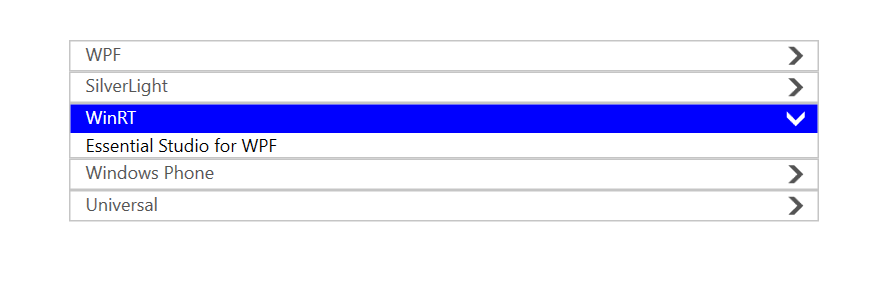
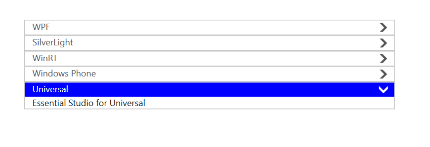
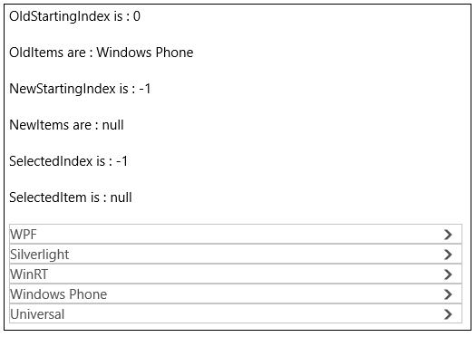

# Selecting Items in WPF Accordion (SfAccordion)

Items can be selected programmatically using the properties [SelectedIndex](https://help.syncfusion.com/cr/wpf/Syncfusion.Windows.Controls.Layout.SfAccordion.html#Syncfusion_Windows_Controls_Layout_SfAccordion_SelectedIndex), [SelectedItem](https://help.syncfusion.com/cr/wpf/Syncfusion.Windows.Controls.Layout.SfAccordion.html#Syncfusion_Windows_Controls_Layout_SfAccordion_SelectedItem) and [SelectedItems](https://help.syncfusion.com/cr/wpf/Syncfusion.Windows.Controls.Layout.SfAccordion.html#Syncfusion_Windows_Controls_Layout_SfAccordion_SelectedItems).

## Selecting item using SelectedIndex

[SelectedIndex](https://help.syncfusion.com/cr/wpf/Syncfusion.Windows.Controls.Layout.SfAccordion.html#Syncfusion_Windows_Controls_Layout_SfAccordion_SelectedIndex) property is used to select an item using its index. It contains the index of most recently selected item in case of OneOrMore, ZeroOrMore SelectionModes. 





 <Grid>
     <StackPanel>
     <layout:SfAccordion SelectedIndex="2" Width="500" Height="200">
         <layout:SfAccordionItem Header="WPF" Content="Essential Studio for WPF"/>
         <layout:SfAccordionItem Header="SilverLight" Content="Essential Studio for WPF"/>
         <layout:SfAccordionItem Header="WinRT" Content="Essential Studio for WPF"/>
         <layout:SfAccordionItem Header="Windows Phone" Content="Essential Studio for WPF"/>
         <layout:SfAccordionItem Header="Universal" Content="Essential Studio for WPF"/>
     </layout:SfAccordion>
     </StackPanel>
 </Grid>





// Create SfAccordion control
SfAccordion accordion = new SfAccordion();
accordion.Width = 500;
accordion.Height = 200;

// Create SfAccordionItems
SfAccordionItem wpfItem = new SfAccordionItem
{
    Header = "WPF",
    Content = "Essential Studio for WPF"
};

SfAccordionItem silverlightItem = new SfAccordionItem
{
    Header = "SilverLight",
    Content = "Essential Studio for WPF"
};

SfAccordionItem winrtItem = new SfAccordionItem
{
    Header = "WinRT",
    Content = "Essential Studio for WPF"
};

SfAccordionItem windowsPhoneItem = new SfAccordionItem
{
    Header = "Windows Phone",
    Content = "Essential Studio for WPF"
};

SfAccordionItem universalItem = new SfAccordionItem
{
    Header = "Universal",
    Content = "Essential Studio for WPF"
};

// Add the items to the accordion
accordion.Items.Add(wpfItem);
accordion.Items.Add(silverlightItem);
accordion.Items.Add(winrtItem);
accordion.Items.Add(windowsPhoneItem);
accordion.Items.Add(universalItem);
accordion.SelectedIndex = 2;
this.Content = accordion;





## Selecting item using SelectedItem

[SelectedItem](https://help.syncfusion.com/cr/wpf/Syncfusion.Windows.Controls.Layout.SfAccordion.html#Syncfusion_Windows_Controls_Layout_SfAccordion_SelectedItem) property is used to select an item using its instance. It contains the instance of most recently selected item in case of OneOrMore, ZeroOrMore SelectionModes. 





 <Grid>
     <Grid.DataContext>
         <local:AccordionViewModel/>
     </Grid.DataContext>
     <StackPanel>
     <layout:SfAccordion ItemsSource="{Binding Items}" SelectedItem="{Binding SelectedAccordionItem, Mode=TwoWay}" Width="500" Height="200" Margin="50">
         <layout:SfAccordion.HeaderTemplate>
             <DataTemplate>
                 <TextBlock Text="{Binding Name}"/>
             </DataTemplate>
         </layout:SfAccordion.HeaderTemplate>
         <layout:SfAccordion.ContentTemplate>
             <DataTemplate>
                 <TextBlock Text="{Binding Description}"/>
             </DataTemplate>
         </layout:SfAccordion.ContentTemplate>
     </layout:SfAccordion>
     </StackPanel>
 </Grid>





  public class AccordionViewModel 
  {
      private object _selectedAccordionItem;
      public object SelectedAccordionItem
      {
          get { return _selectedAccordionItem; }
          set
          {
              _selectedAccordionItem = value;
              OnPropertyChanged(nameof(SelectedAccordionItem));
          }
      }

      private ObservableCollection<AccordionItem> _items;
      public ObservableCollection<AccordionItem> Items
      {
          get { return _items; }
          set
          {
              _items = value;
              OnPropertyChanged(nameof(Items));
          }
      }

      public AccordionViewModel()
      {
          Items = new ObservableCollection<AccordionItem>
      {
          new AccordionItem { Name = "WPF", Description = "Essential Studio for WPF"},
          new AccordionItem { Name = "SilverLight", Description = "Essential Studio for Silverlight" },
          new AccordionItem { Name = "WinRT", Description = "Essential Studio for WinRT" },
          new AccordionItem { Name = "Windows Phone", Description = "Essential Studio for Windows Phone" },
          new AccordionItem { Name = "Universal", Description = "Essential Studio for Universal" }
      };

          SelectedAccordionItem = Items[4];   
      }
  }

  public class AccordionItem
  {
      public string Name { get; set; }
      public string Description { get; set; }
  }





## Retrieving the selected items

[SelectedItems](https://help.syncfusion.com/cr/wpf/Syncfusion.Windows.Controls.Layout.SfAccordion.html#Syncfusion_Windows_Controls_Layout_SfAccordion_SelectedItems) property contains a collection of selected items instances for all the SelectionModes. It is a read only property and it cannot be set.

## Retrieving the selected item indices

[SelectedIndices](https://help.syncfusion.com/cr/wpf/Syncfusion.Windows.Controls.Layout.SfAccordion.html#Syncfusion_Windows_Controls_Layout_SfAccordion_SelectedIndices) property contains a collection of selected items indices for all the SelectionModes. It is a read only property and it cannot be set.

Here is an example showing the functioning of these properties in which items are selected in run time by touch: 





    <Grid>

    <StackPanel>

    <TextBlock x:Name="selectedItem"/>

    <TextBlock x:Name="selectedIndex"/>

    <TextBlock x:Name="selectedItems"/>

    <TextBlock x:Name="selectedIndices"/>

    <layout:SfAccordion SelectionMode="ZeroOrMore" x:Name="accordion"
                        SelectedItemsChanged="accordion_SelectedItemsChanged">

    <layout:SfAccordionItem Header="WPF" Content="Essential Studio for WPF"/>

    <layout:SfAccordionItem Header="Silverlight" Content="Essential Studio for Silverlight"/>

    <layout:SfAccordionItem Header="WinRT" Content="Essential Studio for WinRT"/>

    <layout:SfAccordionItem Header="Windows Phone" Content="Essential Studio for Windows Phone"/>

    <layout:SfAccordionItem Header="Universal" Content="Essential Studio for Universal"/>

    </layout:SfAccordion>

    </StackPanel>

    </Grid>









    private void accordion_SelectedItemsChanged(object sender, System.Collections.Specialized.NotifyCollectionChangedEventArgs e)

    {

    string items = string.Empty;

    string indices = string.Empty;

    foreach (var item in accordion.SelectedItems)

    items += (item as SfAccordionItem).Header + " , ";            

    foreach (var item in accordion.SelectedIndices)

    indices += item + " , ";

    selectedItem.Text = "SelectedItem is : " + (accordion.SelectedItem as SfAccordionItem).Header;

    selectedIndex.Text = "SelectedIndex is : " + accordion.SelectedIndex;

    selectedItems.Text = "SelectedItems are : " + items;

    selectedIndices.Text = "SelectedIndices are : " + indices;

    }





    Option Infer On

    Private Sub accordion_SelectedItemsChanged(ByVal sender As Object, ByVal e As System.Collections.Specialized.NotifyCollectionChangedEventArgs)

    Dim items As String = String.Empty

    Dim indices As String = String.Empty

    For Each item In accordion.SelectedItems

    items &= (TryCast(item, SfAccordionItem)).Header & " , "
    Next item

    For Each item In accordion.SelectedIndices

    indices &= item & " , "
    Next item

    selectedItem.Text = "SelectedItem is : " & (TryCast(accordion.SelectedItem, SfAccordionItem)).Header

    selectedIndex.Text = "SelectedIndex is : " & accordion.SelectedIndex

    selectedItems.Text = "SelectedItems are : " & items

    selectedIndices.Text = "SelectedIndices are : " & indices

    End Sub





## Selecting item using IsSelected

`SfAccordionItem` has a property [IsSelected](https://help.syncfusion.com/cr/wpf/Syncfusion.Windows.Controls.Layout.SfAccordionItem.html#Syncfusion_Windows_Controls_Layout_SfAccordionItem_IsSelected) that determines whether the item is expanded or collapsed. More than one accordion item can have IsSelected as `True` based on the [SelectionMode](https://help.syncfusion.com/cr/wpf/Syncfusion.Windows.Controls.Layout.SfAccordion.html#Syncfusion_Windows_Controls_Layout_SfAccordion_SelectionMode).

* IsSelected=true – Item is expanded
* IsSelected=false – Item is collapsed





    <layout:SfAccordion>

    <layout:SfAccordionItem Header="Linda" IsSelected="True" Content="Description about Linda">

    </layout:SfAccordion>           









    SfAccordion accordion = new SfAccordion();

    accordion.Items.Add(new SfAccordionItem() { Header = "Linda",
    Content = "Description about Linda" , IsSelected = true });





    Dim accordion As New SfAccordion()

    accordion.Items.Add(New SfAccordionItem() With {
        .Header = "Linda",
        .Content = "Description about Linda",
        .IsSelected = True
    })





Here is an example showing the behavior of this property by binding [SfAccordionItem.IsSelected](https://help.syncfusion.com/cr/wpf/Syncfusion.Windows.Controls.Layout.SfAccordionItem.html#Syncfusion_Windows_Controls_Layout_SfAccordionItem_IsSelected) property to CheckBox.IsChecked property in Two-way.





    <Grid>

    <StackPanel>            

    <CheckBox Content="WPF" IsChecked="{Binding ElementName=wpf,Path=IsSelected,Mode=TwoWay}"/>

    <CheckBox Content="Silverlight" IsChecked="{Binding ElementName=silverlight,Path=IsSelected,Mode=TwoWay}"/>

    <CheckBox Content="WinRT" IsChecked="{Binding ElementName=winrt,Path=IsSelected,Mode=TwoWay}"/>

    <CheckBox Content="Windows Phone" IsChecked="{Binding ElementName=phone,Path=IsSelected,Mode=TwoWay}"/>

    <CheckBox Content="Universal" IsChecked="{Binding ElementName=universal,Path=IsSelected,Mode=TwoWay}"/>

    <layout:SfAccordion SelectionMode="ZeroOrMore">

    <layout:SfAccordionItem x:Name="wpf"  Header="WPF" Content="Essential Studio for WPF"/>

    <layout:SfAccordionItem x:Name="silverlight" Header="Silverlight" 

    Content="Essential Studio for Silverlight"/>

    <layout:SfAccordionItem x:Name="winrt" Header="WinRT" Content="Essential Studio for WinRT"/>

    <layout:SfAccordionItem x:Name="phone" IsSelected="True" Header="Windows Phone" 

    Content="Essential Studio for Windows Phone"/>

    <layout:SfAccordionItem x:Name="universal" Header="Universal" 

    Content="Essential Studio for Universal"/>

    </layout:SfAccordion>           

    </StackPanel>

    </Grid>





## Checking the lock state of an item

`SfAccordionItem` provides a read-only property [IsLocked](https://help.syncfusion.com/cr/wpf/Syncfusion.Windows.Controls.Layout.SfAccordionItem.html#Syncfusion_Windows_Controls_Layout_SfAccordionItem_IsLocked) to check whether an item is locked or not. An accordion item is said to be locked when it cannot be unselected/collapsed. 
For example: In One SelectionMode, the selected item cannot be collapsed directly by clicking on its header, it is locked. It can be unlocked by selecting another accordion item, now the newly selected item is locked.

## Select All Items

`SfAccordion` provides a method [SelectAll](https://help.syncfusion.com/cr/wpf/Syncfusion.Windows.Controls.Layout.SfAccordion.html#Syncfusion_Windows_Controls_Layout_SfAccordion_SelectAll) to select all the items. In One and ZeroOrOne SelectionModes, only the last item is selected.





    accordion.SelectAll();





    accordion.SelectAll()




 
## Unselect All Items

`SfAccordion` provides a method [UnselectAll](https://help.syncfusion.com/cr/wpf/Syncfusion.Windows.Controls.Layout.SfAccordion.html#Syncfusion_Windows_Controls_Layout_SfAccordion_UnselectAll) to unselect all the items. In One [SelectionMode](https://help.syncfusion.com/cr/wpf/Syncfusion.Windows.Controls.Layout.SfAccordion.html#Syncfusion_Windows_Controls_Layout_SfAccordion_SelectionMode), there is no change in calling this method. In OneOrMore SelectionMode, the element which has higher index remains selected whereas others are unselected.





    accordion.UnselectAll();





    accordion.SelectAll()





## Notifying selected item change

[SelectedItemChanged](https://help.syncfusion.com/cr/wpf/Syncfusion.Windows.Controls.Layout.SfAccordion.html#Syncfusion_Windows_Controls_Layout_SfAccordion_SelectedItemsChanged) event is fired whenever an item is expanded or collapsed. The arguments of the event are

<table>
<tr>
<td>
S.No</td><td>
Argument</td><td>
Item expanded</td><td>
Item collapsed</td></tr>
<tr>
<td>
1</td><td>
OldStartingIndex</td><td>
-1</td><td>
Index of collapsed item</td></tr>
<tr>
<td>
2</td><td>
OldItems</td><td>
null</td><td>
Instance of collapsed</td></tr>
<tr>
<td>
3</td><td>
NewStartingIndex</td><td>
SelectedIndex</td><td>
-1</td></tr>
<tr>
<td>
4</td><td>
NewItems</td><td>
SelectedItem</td><td>
null</td></tr>
</table>

Here is an example to demonstrate the values of event arguments:





    <Grid>

    <StackPanel>

    <TextBlock x:Name="oldStartingIndex"/>

    <TextBlock x:Name="oldItems"/>

    <TextBlock x:Name="newStartingIndex"/>

    <TextBlock x:Name="newItems"/>

    <TextBlock x:Name="selectedIndex"/>

    <TextBlock x:Name="selectedItem"/>   
    
    <layout:SfAccordion SelectionMode="ZeroOrMore" x:Name="accordion"
                        SelectedItemsChanged="accordion_SelectedItemsChanged">

    <layout:SfAccordionItem Header="WPF" Content="Essential Studio for WPF"/>

    <layout:SfAccordionItem Header="Silverlight" 

    Content="Essential Studio for Silverlight"/>

    <layout:SfAccordionItem Header="WinRT" Content="Essential Studio for WinRT"/>

    <layout:SfAccordionItem Header="Windows Phone" Content="Essential Studio for Windows Phone"/>

    <layout:SfAccordionItem Header="Universal" Content="Essential Studio for Universal"/>

    </layout:SfAccordion>

    </StackPanel>

    </Grid>









    private void accordion_SelectedItemsChanged(object sender, System.Collections.Specialized.NotifyCollectionChangedEventArgs e)

    {
        
    string olditems = string.Empty;

    string newitems = string.Empty;

    if (e.OldItems != null)

    {
        
    foreach (var item in e.OldItems)

    olditems += (item as SfAccordionItem).Header + " , ";

    }

    else

    olditems = "null";

    if (e.NewItems != null)

    {
        
    foreach (var item in e.NewItems)

    newitems += (item as SfAccordionItem).Header + " , ";

    }
    
    else

    newitems = "null";

    oldStartingIndex.Text = "OldStartingIndex is : " + e.OldStartingIndex;

    newStartingIndex.Text = "NewStartingIndex is : " + e.NewStartingIndex;

    selectedIndex.Text = "SelectedIndex is : " + accordion.SelectedIndex;

    selectedItem.Text = "SelectedItem is : " + ((accordion.SelectedItem == null)? "null":(accordion.SelectedItem as SfAccordionItem).Header);

    oldItems.Text = "OldItems are : " + olditems;

    newItems.Text = "NewItems are : " + newitems;
    
    }





    Option Infer On

    Private Sub accordion_SelectedItemsChanged(ByVal sender As Object, ByVal e As System.Collections.Specialized.NotifyCollectionChangedEventArgs)

    Dim olditems As String = String.Empty

    Dim newitems As String = String.Empty

    If e.OldItems IsNot Nothing Then

    For Each item In e.OldItems

    olditems &= (TryCast(item, SfAccordionItem)).Header & " , "
    Next item

    Else

    olditems = "null"
    End If

    If e.NewItems IsNot Nothing Then

    For Each item In e.NewItems

    newitems &= (TryCast(item, SfAccordionItem)).Header & " , "
    Next item

    Else

    newitems = "null"
    End If

    oldStartingIndex.Text = "OldStartingIndex is : " & e.OldStartingIndex

    newStartingIndex.Text = "NewStartingIndex is : " & e.NewStartingIndex

    selectedIndex.Text = "SelectedIndex is : " & accordion.SelectedIndex

    selectedItem.Text = "SelectedItem is : " & (If(accordion.SelectedItem Is Nothing, "null", (TryCast(accordion.SelectedItem, SfAccordionItem)).Header))

    oldItems.Text = "OldItems are : " & olditems

    newItems.Text = "NewItems are : " & newitems

    End Sub





Expand the item with header Windows Phone

Collapse the item with header Windows Phone

## Notifying an item selection

[SfAccordionItem.Selected](https://help.syncfusion.com/cr/wpf/Syncfusion.Windows.Controls.Layout.SfAccordion.html#Syncfusion_Windows_Controls_Layout_SfAccordion_SelectAll) event is fired whenever the item is selected/expanded.





    <layout:SfAccordionItem x:Name="wpf" Selected="Selected"
                        Header="WPF" Content="Essential Studio for WPF"/>









    private void Selected(object sender, RoutedEventArgs e)
    {
        
    }





    Private Sub Selected(ByVal sender As Object, ByVal e As RoutedEventArgs)

    End Sub





## Notifying an item un-selection

[SfAccordionItem.Unselected](https://help.syncfusion.com/cr/wpf/Syncfusion.Windows.Controls.Layout.SfAccordion.html#Syncfusion_Windows_Controls_Layout_SfAccordion_UnselectAll) event is fired whenever the item is unselected/collapsed.





    <layout:SfAccordionItem x:Name="wpf" Unselected="Unselected"
                        Header="WPF" Content="Essential Studio for WPF"/>









    private void Unselected(object sender, RoutedEventArgs e)

    {
        
    }





    Private Sub Unselected(ByVal sender As Object, ByVal e As RoutedEventArgs)

    End Sub





## Notifying selection change

[SelectionChanged](https://help.syncfusion.com/cr/wpf/Syncfusion.Windows.Controls.Layout.SfAccordion.html#Syncfusion_Windows_Controls_Layout_SfAccordion_SelectionChanged) event fires when an item is selected and unselected. It behaves same as that of [SelectedItemChanged](https://help.syncfusion.com/cr/wpf/Syncfusion.Windows.Controls.Layout.SfAccordion.html#Syncfusion_Windows_Controls_Layout_SfAccordion_SelectedItemsChanged) event. 
The difference between these two events are the event argument parameters. The parameters of [SelectionChanged](https://help.syncfusion.com/cr/wpf/Syncfusion.Windows.Controls.Layout.SfAccordion.html#Syncfusion_Windows_Controls_Layout_SfAccordion_SelectionChanged) event are AddedItems and RemovedItems.Added items have the list of recently selected items whereas RemovedItems have the list of recently unselected items.

