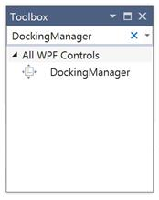

# Add Syncfusion Controls

## Through Drag and Drop

The following steps will helps to add a required Essential WPF Control (For example: DockingManager) by Drag and Drop.

1. Create a WPF project in Visual Studio
2. Find DockingManager control by start writing the name of the DockingManager in the search box

3. Drag DockingManager and drop it to the designer.

