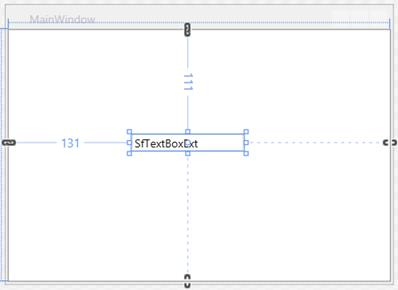
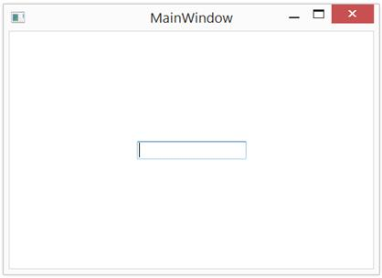

# Add Syncfusion Controls

The Syncfusion WPF controls can be added in a Visual Studio projects by using either of the following ways,

* Through Designer
* Through Code-Behind
* Through Project Template

## Through Designer

Syncfusion UI for WPF are added automatically to the Visual Studio Toolbox during installation. The following steps helps to add required Essential WPF control through drag and drop from Toolbox. For example: **SfTextBoxExt**

1) Create a WPF project in Visual Studio.

2) Find **SfTextBoxExt** by typing the name of the "SfTextBoxExt" in the search box.

3) Drag **SfTextBoxExt** and drop it in the designer.

### Through XAML

The following steps helps to add a required Essential WPF Control through XAML Code, for example: **SfTextBoxExt**.

1) Create a WPF project in Visual Studio and refer the following assemblies.

* Syncfusion.SfInput.WPF.dll
* Syncfusion.SfShared.WPF.dll

2) Include an XML namespace for the above assemblies to the Main window.





<Window
    xmlns="http://schemas.microsoft.com/winfx/2006/xaml/presentation"
    xmlns:x="http://schemas.microsoft.com/winfx/2006/xaml"
    xmlns:syncfusion="http://schemas.syncfusion.com/wpf" />





3) Now, Add the SfTextBoxExt control with a required optimal name, using the included namespace.





<syncfusion:SfTextBoxExt HorizontalAlignment="Center" Name="textBoxExt1" Margin="10" Height ="20" Width="120" Text="SfTextBoxExt" VerticalAlignment="Center"/>





## Through Code-Behind

Syncfusion UI for WPF can added at runtime using C# / VB. The following steps helps to add required Essential WPF control through code. For example: **SfTextBoxExt**.

1) Create a WPF project in Visual Studio and refer to the following assemblies.

* Syncfusion.SfInput.WPF.dll
* Syncfusion.SfShared.WPF.dll

2) Create an instance of **SfTextBoxExt** using it namespace





Syncfusion.Windows.Controls.Input.SfTextBoxExt textBoxExt1 = new Syncfusion.Windows.Controls.Input.SfTextBoxExt();





Dim textBoxExt1 As New Syncfusion.Windows.Controls.Input.SfTextBoxExt()





3) Set Size and Alignment of the control with require value.
 




textBoxExt1.Height = 20;
textBoxExt1.Width = 120;
textBoxExt1.Margin = new Thickness(10, 10, 10, 10);
textBoxExt1.VerticalAlignment = VerticalAlignment.Center;
textBoxExt1.HorizontalAlignment = HorizontalAlignment.Center;





textBoxExt1.Height = 20
textBoxExt1.Width = 120
textBoxExt1.Margin = New Thickness(10, 10, 10, 10)
textBoxExt1.VerticalAlignment = VerticalAlignment.Center
textBoxExt1.HorizontalAlignment = HorizontalAlignment.Center





4) Add the created instance to the parent window (or the needed layout panels).





// Here this denotes parent Window
this.Content = textBoxExt1; 





' Here this denotes parent Window
Me.Content = textBoxExt1





## Through Project Template

Syncfusion provides the Visual Studio Project Templates for the Syncfusion WPF platform to create Syncfusion WPF Application. 

I> The Syncfusion WPF templates are available from v16.1.0.24. 

### Create Syncfusion WPF Project 

The following steps direct you to create the Syncfusion WPF project through the Visual Studio Project Template. 

1) To create a Syncfusion WPF project, choose New Project-> Syncfusion->Windows->Syncfusion WPF Application from Visual Studio

2) Name the Project, choose the destination location when required and set the Framework of the project, then click OK.  

N> Minimum target Framework is 4.0 for Syncfusion WPF project templates. 

3) Choose the options to configure the Syncfusion WPF Application by using the following Project Configuration Wizard.  
  

                                                     
### Project configurations: 

**Language:** Select the language, either C# or VB. 

**Choose Theme:** Choose the required theme. 

**Assemblies From:** Choose the assembly location from where it is going to be added to the project. 

**Select Control:** Choose the control based on your need. 

      
4) Once the Project Configuration Wizard is done, the Syncfusion WPF project is created with required references and XAML. 

5) Then, Syncfusion licensing registration required message box will be shown as follow, if you are installed the trial setup or NuGet packages since Syncfusion introduced the licensing system from 2018 Volume 2 (v16.2.0.41) Essential Studio release. Please navigate to the [help topic](https://help.syncfusion.com/common/essential-studio/licensing/license-key#how-to-generate-syncfusion-license-key) which is shown in the licensing message box to generate and register the Syncfusion license key to your project. Refer to this [blog](https://blog.syncfusion.com/post/Whats-New-in-2018-Volume-2-Licensing-Changes-in-the-1620x-Version-of-Essential-Studio.aspx) post for understanding the licensing changes introduced in Essential Studio.

