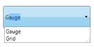
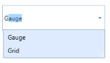
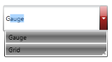
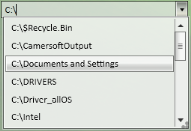

# Appearance

The Appearance of the AutoComplete control can be changed using the VisualStyle property. The following styles are supported by AutoComplete control.

* Blend
* Office2003
* Office2007Blue
* Office2007Black
* Office2007Silver
* ShinyBlue
* ShinyRed
* SyncOrange
* VS2010
* Metro
* Transparent 

The following code example illustrates how different visual styles can be applied to the control.



<syncfusion:AutoComplete Height="25" Width="200" syncfusion:SkinStorage.VisualStyle="Office2007Blue"/>




SkinStorage.SetVisualStyle(autoComplete, "Office2007Blue");



_Windows7_

_Blend_

_Office2007Blue_

_Office2007Black_

_Office2007Silver_

_Office2003_

_ShinyRed_

_ShinyBlue_

_SyncOrange_

_Metro_

_Transparent_

