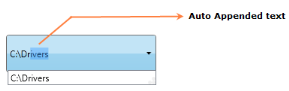

# Auto Append Support

Auto Append is used to guide the complete text by appending the entered text with suitable text from the data source, when a text is entered in the AutoComplete textbox. AutoComplete allows you to enable Auto Append using IsAutoAppend property.

Auto Append
{:.caption}

## Adding Auto Append Support to an Application 

If the IsAutoAppend property is set as True, once you enter the text the AutoComplete guides you to complete text, by appending the entered text with suitable text from the data source. If this property is set as False the matched suitable text will not append with the entered text.



<syncfusion:AutoComplete x:Name="AutoComplete1" IsAutoAppend="true"/>





AutoComplete autoComplete1 = new AutoComplete();this.autoComplete1.IsAutoAppend = true;


## Tables for properties, and events

### Properties

<table>
<tr>
<th>
Property </th><th>
Description </th><th>
Type </th><th>
Data Type </th><th>
Reference links </th></tr>
<tr>
<td>
IsAutoAppend</td><td>
Gets or sets the value of IsAutoAppend in the AutoComplete.</td><td>
DependencyProperty</td><td>
bool(true)</td><td>
</td></tr>
</table>

### Events

<table>
<tr>
<th>
Event </th><th>
Description </th><th>
Arguments </th><th>
Type </th><th colspan = "2">
Reference links </th></tr>
<tr>
<td>
IsAutoAppendChanged</td><td>
 When the value of IsAutoAppend changed this event will be triggered.It cannot be cancelled.</td><td>
DependencyObject,DependencyPropertyChangedEventArgs</td><td colspan = "2">
DependencyPropertyChangedCallBack </td><td>
</td></tr>
</table>

## Sample Link

WPF Sample Browser-> Tools -> Editors -> AutoComplete Demo

