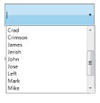

# Data Binding

Data Binding is the process of establishing a connection between the application UI and business logic. Data Binding can be unidirectional (Source -> target or target -> Source) or bidirectional (Source <-> target). You can bind the data to the AutoComplete through the CustomSource property. While binding the CustomSource to the AutoComplete, you must set the value of the DisplayMemberPath and the SelectedValuePath properties.

## Adding Data Binding to an Application 

You can use the DisplayMemberPath property to set the value for items that needs to be displayed in the drop-down list. Also you can use the SelectedValuePath property which can be used to set the value of the SelectedValue property. The below code snippet will be used to bind the Data Source to the AutoComplete.



<syncfusion:AutoComplete x:Name="AutoComplete2" Source="Custom” DisplayMemberPath="FirstName" SelectedValuePath="LastName">     
<syncfusion:AutoComplete.CustomSource>            
<local:EmployeeList/>     
</syncfusion:AutoComplete.CustomSource>
</syncfusion:AutoComplete>




public class EmployeeList
{    
public int EmployeeID { get; set; }    
public string Name { get; set; }    
public string Mailid { get; set; }    
public EmployeeList() { }    
public EmployeeList(string name, string mail, int id)    
{            
Name = name;            
Mailid = mail;            
EmployeeID = id;    
}
}
public class EmployeeListCollection : ObservableCollection<EmployeeList>
{  
 public EmployeeListCollection()  
 {            
 this.Add(new EmployeeList(){ EmployeeID = 1001, Name = "John", Mailid = "john@syncfusion.com" });           
 this.Add(new EmployeeList() { EmployeeID = 1002, Name = "Jerry", Mailid = "Jerry@syncfusion.com" });           
 this.Add(new EmployeeList() { EmployeeID = 1003, Name = "Brad", Mailid = "Brad@syncfusion.com" });           
 this.Add(new EmployeeList() { EmployeeID = 1004, Name = "lanze", Mailid = "lanze@syncfusion.com" });            
 this.Add(new EmployeeList() { EmployeeID = 1005, Name = "Chambel", Mailid = "Chambel@syncfusion.com" });            
 this.Add(new EmployeeList() { EmployeeID = 1006, Name = "Crimson", Mailid = "Crimson@syncfusion.com" });   
 }
 }


AutoComplete Bound with Data Source
{:.caption}

## Tables for properties, and events

### Properties

<table>
<tr>
<th>
Property </th><th>
Description </th><th>
Type </th><th>
Data Type </th><th>
Reference links </th></tr>
<tr>
<td>
CustomSource</td><td>
Gets or sets the CustomSource of the AutoComplete.</td><td>
DependencyProperty</td><td>
Sytem.Collections.IEnumerable</td><td>
</td></tr>
</table>

### Events

<table>
<tr>
<th>
Event </th><th>
Description </th><th>
Arguments </th><th>
Type </th><th>
Reference links </th></tr>
<tr>
<td>
SelectedValuePathChanged</td><td>
 When the SelectedValuePath property value is changed, this event will be triggered.It cannot be cancelled.</td><td>
DependencyObject,DependencyPropertyChangedEventArgs</td><td>
DependencyPropertyChangedCallBack </td><td>
</td></tr>
<tr>
<td>
CustomSourceChanged</td><td>
 When the CustomSource property value is changed, this event will be triggered.It cannot be cancelled.</td><td>
DependencyObject,DependencyPropertyChangedEventArgs</td><td>
DependencyPropertyChangedCallBack </td><th>
</th></tr>
</table>

## Sample Link

WPF Sample Browser-> Tools -> Editors -> AutoComplete Demo

