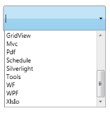

# FilePath, Registry, and Custom Data Source Support

AutoComplete can be used with different kinds of Data Source like FilePath, Registry & CustomSource. The Data 
Source of the AutoComplete control can be set using the Source property.

When the value of the Source property is set as FilePath, the AutoComplete will displays the path in the local 
system as the source. This is illustrated in the following image. 

Source—FilePath
{:.caption}

When the value of the Source property is set as Registry, the AutoComplete loads the values from the Registry. It 
is used when the Registry keys are required as input. This is illustrated in the image given below.

Source—Registry
{:.caption}

When the value of the Source property is set as Custom, the AutoComplete loads the values from the Business objects 
bounded to the AutoComplete control by using the CustomSource property. This is illustrated in the image given 
below.

Source—Custom
{:.caption}

## Adding data source support to an application

AutoComplete can be used with different kinds of Data Sources using the Source property. This support can be added 
to the application as mentioned in the following code example.




<syncfusion:AutoComplete x:Name="AutoComplete1" Source="FilePath"/>
<syncfusion:AutoComplete x:Name="AutoComplete2" Source ="Registry"/>
<syncfusion:AutoComplete x:Name="AutoComplete3" Source="Custom">     
<syncfusion:AutoComplete.CustomSource>             
<local:CustomerListCollection/>     
</syncfusion:AutoComplete.CustomSource>
</syncfusion:AutoComplete>





AutoComplete autoComplete1 = new AutoComplete();
this.autoComplete1.Source = SourceMode.FilePath;

AutoComplete autoComplete2 = new AutoComplete();
this.autoComplete2.SelectionMode = SourceMode.Registry;

AutoComplete autoComplete3 = new AutoComplete();
this.autoComplete3.SelectionMode = SourceMode.Custom;

List<String> products = new List<String>();
customSource.Add("Diagram");
customSource.Add("Gauge");
customSource.Add("Chart");
customSource.Add("Schedule");
customSource.Add("Grid");
customSource.Add("DocIo");
customSource.Add("XlsIo");
customSource.Add("Pdf");
customSource.Add("RichTextBox");
customSource.Add("ReportBuilder");
this.autoComplete3.CustomSource = products;




## Tables for properties, methods, and events

### Properties

<table>
<tr>
<th>
Property </th><th>
Description </th><th>
Type </th><th>
Data Type </th><th>
Reference links </th></tr>
<tr>
<td>
Source</td><td>
Gets or sets the Source of the AutoComplete.</td><td>
DependencyProperty</td><td>
SourceMode(enum)</td><td>
</td></tr>
</table>

### Events

<table>
<tr>
<th>
Event </th><th>
Description </th><th>
Arguments </th><th>
Type </th><th>
Reference links </th></tr>
<tr>
<td>
SourceChanged</td><td>
 When the Source property value is changed this event will be triggered.It cannot be canceled.</td><td>
DependencyObject,DependencyPropertyChangedEventArgs</td><td>
DependencyPropertyChangedCallBack </td><td>
</td></tr>
</table>

## Sample link

WPF Sample Browser-> Tools -> Editors -> AutoComplete Demo
