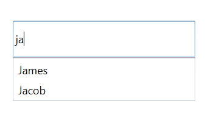

# AutoComplete

The AutoComplete functionality provides several modes of suggestions to users while typing. The suggested text can be appended to the original text, or it can be displayed in a drop-down list so that the users can choose from different options.

## AutoComplete source

The TextBoxExt control can be populated with a predefined list of items, which will assist the user while typing. Users can choose one item from the filtered list.

For illustration, let us create a textbox, which will populate a list of employees.

The Employee model will be as follows.



public class Employee
    {
        public string Name { get; set; }
        public string Email { get; set; }
    }
	


Create a collection attribute and populate the collection with items.



 public class EmployeeViewModel
    {
        private List<Employee> employees;
        public List<Employee> Employees
        {
            get { return employees; }

            set { employees = value; }
        }
        public EmployeeViewModel()
        {
            Employees = new List<Employee>();
            Employees.Add(new Employee { Name = "Lucas", Email = "lucas@syncfusion.com" });
            Employees.Add(new Employee { Name = "James", Email = "james@syncfusion.com" });
            Employees.Add(new Employee { Name = "Jacob", Email = "jacob@syncfusion.com" });
        }
    }



Bind the Employees collection to the AutoCompleteSource property of TextBoxExt.




<Window x:Class="AutoCompleteSample.MainWindow"
        xmlns="http://schemas.microsoft.com/winfx/2006/xaml/presentation"
        xmlns:x="http://schemas.microsoft.com/winfx/2006/xaml"
        xmlns:d="http://schemas.microsoft.com/expression/blend/2008"
        xmlns:mc="http://schemas.openxmlformats.org/markup-compatibility/2006"
        xmlns:local="clr-namespace:AutoCompleteSample"
        mc:Ignorable="d"
        xmlns:editors="clr-namespace:Syncfusion.Windows.Controls.Input;assembly=Syncfusion.SfInput.Wpf"
        Title="MainWindow" Height="450" Width="800">
    <Window.DataContext>
        <local:EmployeeViewModel/>
    </Window.DataContext>
    <Window.Content>
        <editors:SfTextBoxExt HorizontalAlignment="Center" 
                              VerticalAlignment="Center" 
                              Width="300"
                              Height="40"
                              AutoCompleteMode="Suggest"
                              AutoCompleteSource="{Binding Employees}" />
    </Window.Content>
</Window>




using Syncfusion.Windows.Controls.Input;
using System.Windows;

namespace SfDatePickerSample
{
    /// 

    /// Interaction logic for MainWindow.xaml
    /// 

    public partial class MainWindow : Window
    {
        public MainWindow()
        {
            SfTextBoxExt textBoxExt = new SfTextBoxExt()
            {
                HorizontalAlignment = HorizontalAlignment.Center,
                VerticalAlignment = VerticalAlignment.Center,
                Width = 300,
                Height = 40,
                AutoCompleteMode = AutoCompleteMode.Suggest
            };

            this.Content = textBoxExt;
        } 
    }
}




At this point, the control is populated with the list of employees. But the Employee model contains two properties Name and Email, so we should tell the control, by which property, it has to provide suggestions. In this case, let us make the control to provide suggestions based on Name.

The SearchItemPath property specifies the property path by which the filtering has to be done.




<Window x:Class="AutoCompleteSample.MainWindow"
        xmlns="http://schemas.microsoft.com/winfx/2006/xaml/presentation"
        xmlns:x="http://schemas.microsoft.com/winfx/2006/xaml"
        xmlns:d="http://schemas.microsoft.com/expression/blend/2008"
        xmlns:mc="http://schemas.openxmlformats.org/markup-compatibility/2006"
        xmlns:local="clr-namespace:AutoCompleteSample"
        mc:Ignorable="d"
        xmlns:editors="clr-namespace:Syncfusion.Windows.Controls.Input;assembly=Syncfusion.SfInput.Wpf"
        Title="MainWindow" Height="450" Width="800">
    <Window.DataContext>
        <local:EmployeeViewModel/>
    </Window.DataContext>
    <Window.Content>
        <editors:SfTextBoxExt HorizontalAlignment="Center" 
                              VerticalAlignment="Center" 
                              Width="300"
                              Height="40"
                              SearchItemPath="Name"
                              AutoCompleteMode="Suggest"
                              AutoCompleteSource="{Binding Employees}" />
    </Window.Content>
</Window>




using Syncfusion.Windows.Controls.Input;
using System.Windows;

namespace SfDatePickerSample
{
    /// 

    /// Interaction logic for MainWindow.xaml
    /// 

    public partial class MainWindow : Window
    {
        public MainWindow()
        {
            SfTextBoxExt textBoxExt = new SfTextBoxExt()
            {
                HorizontalAlignment = HorizontalAlignment.Center,
                VerticalAlignment = VerticalAlignment.Center,
                SearchItemPath = "Name",
                AutoCompleteMode = AutoCompleteMode.Suggest,
                Width = 300,
                Height =40
            };

            this.Content = textBoxExt;
        } 
    }
}




N> The default value of the AutoCompleteMode property is None. So, running the control without specifying this property will not show any suggestions. The detailed information about the AutoComplete modes will be provided in the next section.

## AutoComplete item template

The AutoCompleteItemTemplate helps to decorate the suggested item with visual elements. The following code block explains how to add an image to the drop-down list item.




<Window x:Class="AutoCompleteSample.MainWindow"
        xmlns="http://schemas.microsoft.com/winfx/2006/xaml/presentation"
        xmlns:x="http://schemas.microsoft.com/winfx/2006/xaml"
        xmlns:d="http://schemas.microsoft.com/expression/blend/2008"
        xmlns:mc="http://schemas.openxmlformats.org/markup-compatibility/2006"
        xmlns:local="clr-namespace:AutoCompleteSample"
        mc:Ignorable="d"
        xmlns:editors="clr-namespace:Syncfusion.Windows.Controls.Input;assembly=Syncfusion.SfInput.Wpf"
        Title="MainWindow" Height="450" Width="800">
        <Window.Content>
               <editors:SfTextBoxExt HorizontalAlignment="Center" 
                                     VerticalAlignment="Center" 
                                     Width="400"
                                     SearchItemPath="Name"
                                     AutoCompleteMode="SuggestAppend"
                                     AutoCompleteSource="{Binding Employees}" >
                    <editors:SfTextBoxExt.AutoCompleteItemTemplate>
                        <DataTemplate>
                            <StackPanel Orientation="Horizontal">
                                <Image Source="User.png" Margin="2" Stretch="Uniform" Width="12"/>
                                <TextBlock Text="{Binding Name}" Margin="5 2"/>
                            </StackPanel>
                        </DataTemplate>
                    </editors:SfTextBoxExt.AutoCompleteItemTemplate>
                </editors:SfTextBoxExt>
        </Window.Content>
</Window>




using Syncfusion.Windows.Controls.Input;
using System.Windows;

namespace SfDatePickerSample
{
    /// 

    /// Interaction logic for MainWindow.xaml
    /// 

    public partial class MainWindow : Window
    {
        public MainWindow()
        {
            SfTextBoxExt textBoxExt = new SfTextBoxExt()
            {
                HorizontalAlignment = HorizontalAlignment.Center,
                VerticalAlignment = VerticalAlignment.Center,
                SearchItemPath = "Name",
                AutoCompleteMode = AutoCompleteMode.SuggestAppend,
                Width = 400
            };

            this.Content = textBoxExt;
        } 
    }
}




Drop down list with image
{:.caption}

### Ignore case

This option allows the control to filter suggestions by ignoring the case. The default value is false.




<Window x:Class="AutoCompleteSample.MainWindow"
        xmlns="http://schemas.microsoft.com/winfx/2006/xaml/presentation"
        xmlns:x="http://schemas.microsoft.com/winfx/2006/xaml"
        xmlns:d="http://schemas.microsoft.com/expression/blend/2008"
        xmlns:mc="http://schemas.openxmlformats.org/markup-compatibility/2006"
        xmlns:local="clr-namespace:AutoCompleteSample"
        mc:Ignorable="d"
        xmlns:editors="clr-namespace:Syncfusion.Windows.Controls.Input;assembly=Syncfusion.SfInput.Wpf"
        Title="MainWindow" Height="450" Width="800">
        <Window.Content>
            <editors:SfTextBoxExt HorizontalAlignment="Center" 
                                  VerticalAlignment="Center" 
                                  Width="400"
                                  SearchItemPath="Name"
                                  IgnoreCase="True"
                                  AutoCompleteMode="Suggest"
                                  AutoCompleteSource="{Binding Employees}"/>
        </Window.Content>
</Window>




using Syncfusion.Windows.Controls.Input;
using System.Windows;

namespace SfDatePickerSample
{
    /// 

    /// Interaction logic for MainWindow.xaml
    /// 

    public partial class MainWindow : Window
    {
        public MainWindow()
        {
            SfTextBoxExt textBoxExt = new SfTextBoxExt()
            {
                HorizontalAlignment = HorizontalAlignment.Center,
                VerticalAlignment = VerticalAlignment.Center,
                SearchItemPath = "Name",
                AutoCompleteMode = AutoCompleteMode.Suggest,
                IgnoreCase = "True",
                Width = 400
            };

            this.Content = textBoxExt;
        } 
    }
}




Ignore Case
{:.caption}

### Popup delay

The PopupDelay specifies the delay after which the suggestion popup should open. 




<Window x:Class="AutoCompleteSample.MainWindow"
        xmlns="http://schemas.microsoft.com/winfx/2006/xaml/presentation"
        xmlns:x="http://schemas.microsoft.com/winfx/2006/xaml"
        xmlns:d="http://schemas.microsoft.com/expression/blend/2008"
        xmlns:mc="http://schemas.openxmlformats.org/markup-compatibility/2006"
        xmlns:local="clr-namespace:AutoCompleteSample"
        mc:Ignorable="d"
        xmlns:editors="clr-namespace:Syncfusion.Windows.Controls.Input;assembly=Syncfusion.SfInput.Wpf"
        Title="MainWindow" Height="450" Width="800">
        <Window.Content>
            <editors:SfTextBoxExt HorizontalAlignment="Center" 
                                  VerticalAlignment="Center" 
                                  Width="400"
                                  SearchItemPath="Name"
                                  PopupDelay="00:00:02"
                                  AutoCompleteMode="Suggest"
                                  AutoCompleteSource="{Binding Employees}"/>
        </Window.Content>
</Window>




using Syncfusion.Windows.Controls.Input;
using System.Windows;

namespace SfDatePickerSample
{
    /// 

    /// Interaction logic for MainWindow.xaml
    /// 

    public partial class MainWindow : Window
    {
        public MainWindow()
        {
            SfTextBoxExt textBoxExt = new SfTextBoxExt()
            {
                HorizontalAlignment = HorizontalAlignment.Center,
                VerticalAlignment = VerticalAlignment.Center,
                SearchItemPath = "Name",
                AutoCompleteMode = AutoCompleteMode.Suggest,
                PopupDelay="00:00:02",
                Width = 400
            };

            this.Content = textBoxExt;
        } 
    }
}




