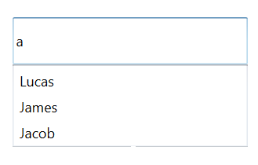
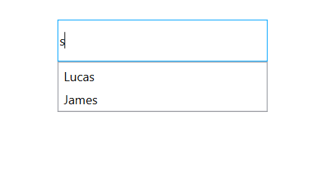
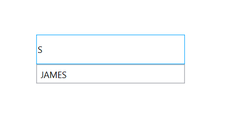

# AutoComplete Filtering Options

The phenomenon of string comparison for filtering suggestions can be changed by using the [SuggestionMode](https://help.syncfusion.com/cr/cref_files/wpf/Syncfusion.SfInput.Wpf~Syncfusion.Windows.Controls.Input.SfTextBoxExt~SuggestionMode.html) property. The default filtering strategy is “StartsWith” and is case-insensitive.

1. None
2. StartsWith
3. StartsWithCaseSensitive
4. StartsWithOrdinal
5. StartsWithOrdinalCaseSensitive
6. Contains
7. ContainsCaseSensitive
8. ContainsOrdinal
9. ContainsOrdinalCaseSensitive
10. Equals
11. EqualsCaseSensitive
12. EqualsOrdinal
13. EqualsOrdinalCaseSensitive
14. Custom
15. EndsWith
16. EndsWithCaseSensitive
17. EndsWithOrdinal
18. EndsWithOrdinalCaseSensitive

The default value is StartsWith.

## None

The control returns the entire collection without filtering when text is typed by the user.




<Window x:Class="AutoCompleteSample.MainWindow"
        xmlns="http://schemas.microsoft.com/winfx/2006/xaml/presentation"
        xmlns:x="http://schemas.microsoft.com/winfx/2006/xaml"
        xmlns:d="http://schemas.microsoft.com/expression/blend/2008"
        xmlns:mc="http://schemas.openxmlformats.org/markup-compatibility/2006"
        xmlns:local="clr-namespace:AutoCompleteSample"
        mc:Ignorable="d"
        xmlns:editors="clr-namespace:Syncfusion.Windows.Controls.Input;assembly=Syncfusion.SfInput.Wpf"
        Title="MainWindow" Height="450" Width="800">
    <Window.DataContext>
        <local:EmployeeViewModel/>
    </Window.DataContext>
    <Window.Content>
        <Grid>
            <editors:SfTextBoxExt HorizontalAlignment="Center" 
                                      VerticalAlignment="Center" 
                                      Width="400"
                                      SearchItemPath="Name"
                                      SuggestionMode="None"
                                      AutoCompleteMode="Suggest"
                                      AutoCompleteSource="{Binding Employees}"/>
        </Grid>
    </Window.Content>
</Window>




using Syncfusion.Windows.Controls.Input;
using System.Collections.Generic;
using System.Windows;
using System.Windows.Data;

namespace AutoCompleteSample
{
    /// 

    /// Interaction logic for MainWindow.xaml
    /// 

    public partial class MainWindow : Window
    {
        public MainWindow()
        {
            InitializeComponent();
            EmployeeViewModel viewModel = new EmployeeViewModel();
            this.DataContext = viewModel;
            SfTextBoxExt textBoxExt = new SfTextBoxExt()
            {
                HorizontalAlignment = HorizontalAlignment.Center,
                VerticalAlignment = VerticalAlignment.Center,
                SearchItemPath = "Name",
                AutoCompleteMode = AutoCompleteMode.Suggest,
                SuggestionMode = SuggestionMode.None,
                Width = 400
            };

            Binding autoCompleteSourceBinding = new Binding();
            autoCompleteSourceBinding.Source = viewModel;
            autoCompleteSourceBinding.Path = new PropertyPath("Employees");
            BindingOperations.SetBinding(textBoxExt, SfTextBoxExt.AutoCompleteSourceProperty, autoCompleteSourceBinding);

            this.Content = textBoxExt;
        }
    }

    public class Employee
    {
        public string Name { get; set; }
        public string Email { get; set; }
    }

    public class EmployeeViewModel
    {
        private List<Employee> employees;
        public List<Employee> Employees
        {
            get { return employees; }

            set { employees = value; }
        }
        public EmployeeViewModel()
        {
            Employees = new List<Employee>();
            Employees.Add(new Employee { Name = "Lucas", Email = "lucas@syncfusion.com" });
            Employees.Add(new Employee { Name = "James", Email = "james@syncfusion.com" });
            Employees.Add(new Employee { Name = "Jacob", Email = "jacob@syncfusion.com" });
        }
    }
}




 

None case
{:.caption}

## StartsWith

Displays all matches that begins with the typed characters in the control. This strategy is case-insensitive.




<Window x:Class="AutoCompleteSample.MainWindow"
        xmlns="http://schemas.microsoft.com/winfx/2006/xaml/presentation"
        xmlns:x="http://schemas.microsoft.com/winfx/2006/xaml"
        xmlns:d="http://schemas.microsoft.com/expression/blend/2008"
        xmlns:mc="http://schemas.openxmlformats.org/markup-compatibility/2006"
        xmlns:local="clr-namespace:AutoCompleteSample"
        mc:Ignorable="d"
        xmlns:editors="clr-namespace:Syncfusion.Windows.Controls.Input;assembly=Syncfusion.SfInput.Wpf"
        Title="MainWindow" Height="450" Width="800">
    <Window.DataContext>
        <local:EmployeeViewModel/>
    </Window.DataContext>
    <Window.Content>
        <editors:SfTextBoxExt HorizontalAlignment="Center" 
                                      VerticalAlignment="Center" 
                                      Width="400"
                                      SearchItemPath="Name"
                                      SuggestionMode="StartsWith"
                                      AutoCompleteMode="Suggest"
                                      AutoCompleteSource="{Binding Employees}"/>
    </Window.Content>
</Window>




using Syncfusion.Windows.Controls.Input;
using System.Collections.Generic;
using System.Windows;
using System.Windows.Data;

namespace AutoCompleteSample
{
    /// 

    /// Interaction logic for MainWindow.xaml
    /// 

    public partial class MainWindow : Window
    {
        public MainWindow()
        {
            InitializeComponent();
            EmployeeViewModel viewModel = new EmployeeViewModel();
            this.DataContext = viewModel;
            SfTextBoxExt textBoxExt = new SfTextBoxExt()
            {
                HorizontalAlignment = HorizontalAlignment.Center,
                VerticalAlignment = VerticalAlignment.Center,
                SearchItemPath = "Name",
                AutoCompleteMode = AutoCompleteMode.Suggest,
                SuggestionMode = SuggestionMode.StartsWith,
                Width = 400
            };

            Binding autoCompleteSourceBinding = new Binding();
            autoCompleteSourceBinding.Source = viewModel;
            autoCompleteSourceBinding.Path = new PropertyPath("Employees");
            BindingOperations.SetBinding(textBoxExt, SfTextBoxExt.AutoCompleteSourceProperty, autoCompleteSourceBinding);

            this.Content = textBoxExt;
        }
    }

    public class Employee
    {
        public string Name { get; set; }
        public string Email { get; set; }
    }

    public class EmployeeViewModel
    {
        private List<Employee> employees;
        public List<Employee> Employees
        {
            get { return employees; }

            set { employees = value; }
        }
        public EmployeeViewModel()
        {
            Employees = new List<Employee>();
            Employees.Add(new Employee { Name = "Lucas", Email = "lucas@syncfusion.com" });
            Employees.Add(new Employee { Name = "James", Email = "james@syncfusion.com" });
            Employees.Add(new Employee { Name = "Jacob", Email = "jacob@syncfusion.com" });
        }
    }
}




StartsWith case
{:.caption}

## StartsWithCaseSensitive

Displays all matches that starts with the typed characters in the control. This strategy is case-sensitive.




<Window x:Class="AutoCompleteSample.MainWindow"
        xmlns="http://schemas.microsoft.com/winfx/2006/xaml/presentation"
        xmlns:x="http://schemas.microsoft.com/winfx/2006/xaml"
        xmlns:d="http://schemas.microsoft.com/expression/blend/2008"
        xmlns:mc="http://schemas.openxmlformats.org/markup-compatibility/2006"
        xmlns:local="clr-namespace:AutoCompleteSample"
        mc:Ignorable="d"
        xmlns:editors="clr-namespace:Syncfusion.Windows.Controls.Input;assembly=Syncfusion.SfInput.Wpf"
        Title="MainWindow" Height="450" Width="800">
    <Window.DataContext>
        <local:EmployeeViewModel/>
    </Window.DataContext>
    <Window.Content>
        <editors:SfTextBoxExt HorizontalAlignment="Center" 
                                      VerticalAlignment="Center" 
                                      Width="400"
                                      SearchItemPath="Name"
                                      SuggestionMode="StartsWithCaseSensitive"
                                      AutoCompleteMode="Suggest"
                                      AutoCompleteSource="{Binding Employees}"/>
    </Window.Content>
</Window>




using Syncfusion.Windows.Controls.Input;
using System.Collections.Generic;
using System.Windows;
using System.Windows.Data;

namespace AutoCompleteSample
{
    /// 

    /// Interaction logic for MainWindow.xaml
    /// 

    public partial class MainWindow : Window
    {
        public MainWindow()
        {
            InitializeComponent();
            EmployeeViewModel viewModel = new EmployeeViewModel();
            this.DataContext = viewModel;
            SfTextBoxExt textBoxExt = new SfTextBoxExt()
            {
                HorizontalAlignment = HorizontalAlignment.Center,
                VerticalAlignment = VerticalAlignment.Center,
                SearchItemPath = "Name",
                AutoCompleteMode = AutoCompleteMode.Suggest,
                SuggestionMode = SuggestionMode.StartsWithCaseSensitive,
                Width = 400
            };

            Binding autoCompleteSourceBinding = new Binding();
            autoCompleteSourceBinding.Source = viewModel;
            autoCompleteSourceBinding.Path = new PropertyPath("Employees");
            BindingOperations.SetBinding(textBoxExt, SfTextBoxExt.AutoCompleteSourceProperty, autoCompleteSourceBinding);

            this.Content = textBoxExt;
        }
    }

    public class Employee
    {
        public string Name { get; set; }
        public string Email { get; set; }
    }

    public class EmployeeViewModel
    {
        private List<Employee> employees;
        public List<Employee> Employees
        {
            get { return employees; }

            set { employees = value; }
        }
        public EmployeeViewModel()
        {
            Employees = new List<Employee>();
            Employees.Add(new Employee { Name = "Lucas", Email = "lucas@syncfusion.com" });
            Employees.Add(new Employee { Name = "James", Email = "james@syncfusion.com" });
            Employees.Add(new Employee { Name = "Jacob", Email = "jacob@syncfusion.com" });
        }
    }
}




StartsWithCaseSensitive case
{:.caption}

## StartsWithOrdinal

The control returns all possible matches starting with the text typed by the user based on the OrdinalIgnoreCase.




<Window x:Class="AutoCompleteSample.MainWindow"
        xmlns="http://schemas.microsoft.com/winfx/2006/xaml/presentation"
        xmlns:x="http://schemas.microsoft.com/winfx/2006/xaml"
        xmlns:d="http://schemas.microsoft.com/expression/blend/2008"
        xmlns:mc="http://schemas.openxmlformats.org/markup-compatibility/2006"
        xmlns:local="clr-namespace:AutoCompleteSample"
        mc:Ignorable="d"
        xmlns:editors="clr-namespace:Syncfusion.Windows.Controls.Input;assembly=Syncfusion.SfInput.Wpf"
        Title="MainWindow" Height="450" Width="800">
    <Window.DataContext>
        <local:EmployeeViewModel/>
    </Window.DataContext>
    <Window.Content>
        <editors:SfTextBoxExt HorizontalAlignment="Center" 
                                      VerticalAlignment="Center" 
                                      Width="400"
                                      SearchItemPath="Name"
                                      SuggestionMode="StartsWithOrdinal"
                                      AutoCompleteMode="Suggest"
                                      AutoCompleteSource="{Binding Employees}"/>
    </Window.Content>
</Window>




using Syncfusion.Windows.Controls.Input;
using System.Collections.Generic;
using System.Windows;
using System.Windows.Data;

namespace AutoCompleteSample
{
    /// 

    /// Interaction logic for MainWindow.xaml
    /// 

    public partial class MainWindow : Window
    {
        public MainWindow()
        {
            InitializeComponent();
            EmployeeViewModel viewModel = new EmployeeViewModel();
            this.DataContext = viewModel;
            SfTextBoxExt textBoxExt = new SfTextBoxExt()
            {
                HorizontalAlignment = HorizontalAlignment.Center,
                VerticalAlignment = VerticalAlignment.Center,
                SearchItemPath = "Name",
                AutoCompleteMode = AutoCompleteMode.Suggest,
                SuggestionMode = SuggestionMode.StartsWithOrdinal,
                Width = 400
            };

            Binding autoCompleteSourceBinding = new Binding();
            autoCompleteSourceBinding.Source = viewModel;
            autoCompleteSourceBinding.Path = new PropertyPath("Employees");
            BindingOperations.SetBinding(textBoxExt, SfTextBoxExt.AutoCompleteSourceProperty, autoCompleteSourceBinding);

            this.Content = textBoxExt;
        }
    }

    public class Employee
    {
        public string Name { get; set; }
        public string Email { get; set; }
    }

    public class EmployeeViewModel
    {
        private List<Employee> employees;
        public List<Employee> Employees
        {
            get { return employees; }

            set { employees = value; }
        }
        public EmployeeViewModel()
        {
            Employees = new List<Employee>();
            Employees.Add(new Employee { Name = "Lucas", Email = "lucas@syncfusion.com" });
            Employees.Add(new Employee { Name = "James", Email = "james@syncfusion.com" });
            Employees.Add(new Employee { Name = "Jacob", Email = "jacob@syncfusion.com" });
        }
    }
}




StartsWithOrdinal case
{:.caption}

## StartsWithOrdinalCaseSensitive

The control returns all possible matches starting with the text typed by the user by Ordinal, which is case sensitive.




<Window x:Class="AutoCompleteSample.MainWindow"
        xmlns="http://schemas.microsoft.com/winfx/2006/xaml/presentation"
        xmlns:x="http://schemas.microsoft.com/winfx/2006/xaml"
        xmlns:d="http://schemas.microsoft.com/expression/blend/2008"
        xmlns:mc="http://schemas.openxmlformats.org/markup-compatibility/2006"
        xmlns:local="clr-namespace:AutoCompleteSample"
        mc:Ignorable="d"
        xmlns:editors="clr-namespace:Syncfusion.Windows.Controls.Input;assembly=Syncfusion.SfInput.Wpf"
        Title="MainWindow" Height="450" Width="800">
    <Window.DataContext>
        <local:EmployeeViewModel/>
    </Window.DataContext>
    <Window.Content>
        <editors:SfTextBoxExt HorizontalAlignment="Center" 
                                      VerticalAlignment="Center" 
                                      Width="400"
                                      SearchItemPath="Name"
                                      SuggestionMode="StartsWithOrdinalCaseSensitive"
                                      AutoCompleteMode="Suggest"
                                      AutoCompleteSource="{Binding Employees}"/>
    </Window.Content>
</Window>




using Syncfusion.Windows.Controls.Input;
using System.Collections.Generic;
using System.Windows;
using System.Windows.Data;

namespace AutoCompleteSample
{
    /// 

    /// Interaction logic for MainWindow.xaml
    /// 

    public partial class MainWindow : Window
    {
        public MainWindow()
        {
            InitializeComponent();
            EmployeeViewModel viewModel = new EmployeeViewModel();
            this.DataContext = viewModel;
            SfTextBoxExt textBoxExt = new SfTextBoxExt()
            {
                HorizontalAlignment = HorizontalAlignment.Center,
                VerticalAlignment = VerticalAlignment.Center,
                SearchItemPath = "Name",
                AutoCompleteMode = AutoCompleteMode.Suggest,
                SuggestionMode = SuggestionMode.StartsWithOrdinalCaseSensitive,
                Width = 400
            };

            Binding autoCompleteSourceBinding = new Binding();
            autoCompleteSourceBinding.Source = viewModel;
            autoCompleteSourceBinding.Path = new PropertyPath("Employees");
            BindingOperations.SetBinding(textBoxExt, SfTextBoxExt.AutoCompleteSourceProperty, autoCompleteSourceBinding);

            this.Content = textBoxExt;
        }
    }

    public class Employee
    {
        public string Name { get; set; }
        public string Email { get; set; }
    }

    public class EmployeeViewModel
    {
        private List<Employee> employees;
        public List<Employee> Employees
        {
            get { return employees; }

            set { employees = value; }
        }
        public EmployeeViewModel()
        {
            Employees = new List<Employee>();
            Employees.Add(new Employee { Name = "Lucas", Email = "lucas@syncfusion.com" });
            Employees.Add(new Employee { Name = "James", Email = "james@syncfusion.com" });
            Employees.Add(new Employee { Name = "Jacob", Email = "jacob@syncfusion.com" });
        }
    }
}




StartsWithOrdinalCaseSensitive case
{:.caption}

## Contains

Displays all matches that contains typed characters in the control. This strategy is case-insensitive.




<Window x:Class="AutoCompleteSample.MainWindow"
        xmlns="http://schemas.microsoft.com/winfx/2006/xaml/presentation"
        xmlns:x="http://schemas.microsoft.com/winfx/2006/xaml"
        xmlns:d="http://schemas.microsoft.com/expression/blend/2008"
        xmlns:mc="http://schemas.openxmlformats.org/markup-compatibility/2006"
        xmlns:local="clr-namespace:AutoCompleteSample"
        mc:Ignorable="d"
        xmlns:editors="clr-namespace:Syncfusion.Windows.Controls.Input;assembly=Syncfusion.SfInput.Wpf"
        Title="MainWindow" Height="450" Width="800">
    <Window.DataContext>
        <local:EmployeeViewModel/>
    </Window.DataContext>
    <Window.Content>
        <editors:SfTextBoxExt HorizontalAlignment="Center" 
                                      VerticalAlignment="Center" 
                                      Width="400"
                                      SearchItemPath="Name"
                                      SuggestionMode="Contains"
                                      AutoCompleteMode="Suggest"
                                      AutoCompleteSource="{Binding Employees}"/>
    </Window.Content>
</Window>




using Syncfusion.Windows.Controls.Input;
using System.Collections.Generic;
using System.Windows;
using System.Windows.Data;

namespace AutoCompleteSample
{
    /// 

    /// Interaction logic for MainWindow.xaml
    /// 

    public partial class MainWindow : Window
    {
        public MainWindow()
        {
            InitializeComponent();
            EmployeeViewModel viewModel = new EmployeeViewModel();
            this.DataContext = viewModel;
            SfTextBoxExt textBoxExt = new SfTextBoxExt()
            {
                HorizontalAlignment = HorizontalAlignment.Center,
                VerticalAlignment = VerticalAlignment.Center,
                SearchItemPath = "Name",
                AutoCompleteMode = AutoCompleteMode.Suggest,
                SuggestionMode = SuggestionMode.Contains,
                Width = 400
            };

            Binding autoCompleteSourceBinding = new Binding();
            autoCompleteSourceBinding.Source = viewModel;
            autoCompleteSourceBinding.Path = new PropertyPath("Employees");
            BindingOperations.SetBinding(textBoxExt, SfTextBoxExt.AutoCompleteSourceProperty, autoCompleteSourceBinding);

            this.Content = textBoxExt;
        }
    }

    public class Employee
    {
        public string Name { get; set; }
        public string Email { get; set; }
    }

    public class EmployeeViewModel
    {
        private List<Employee> employees;
        public List<Employee> Employees
        {
            get { return employees; }

            set { employees = value; }
        }
        public EmployeeViewModel()
        {
            Employees = new List<Employee>();
            Employees.Add(new Employee { Name = "Lucas", Email = "lucas@syncfusion.com" });
            Employees.Add(new Employee { Name = "James", Email = "james@syncfusion.com" });
            Employees.Add(new Employee { Name = "Jacob", Email = "jacob@syncfusion.com" });
        }
    }
}




Contains case
{:.caption}

## ContainsCaseSensitive

The control returns all possible matches that contains the text typed by the user, which is culture and case-sensitive.




<Window x:Class="AutoCompleteSample.MainWindow"
        xmlns="http://schemas.microsoft.com/winfx/2006/xaml/presentation"
        xmlns:x="http://schemas.microsoft.com/winfx/2006/xaml"
        xmlns:d="http://schemas.microsoft.com/expression/blend/2008"
        xmlns:mc="http://schemas.openxmlformats.org/markup-compatibility/2006"
        xmlns:local="clr-namespace:AutoCompleteSample"
        mc:Ignorable="d"
        xmlns:editors="clr-namespace:Syncfusion.Windows.Controls.Input;assembly=Syncfusion.SfInput.Wpf"
        Title="MainWindow" Height="450" Width="800">
    <Window.DataContext>
        <local:EmployeeViewModel/>
    </Window.DataContext>
    <Window.Content>
        <editors:SfTextBoxExt HorizontalAlignment="Center" 
                                      VerticalAlignment="Center" 
                                      Width="400"
                                      SearchItemPath="Name"
                                      SuggestionMode="ContainsCaseSensitive"
                                      AutoCompleteMode="Suggest"
                                      AutoCompleteSource="{Binding Employees}"/>
    </Window.Content>
</Window>




using Syncfusion.Windows.Controls.Input;
using System.Collections.Generic;
using System.Windows;
using System.Windows.Data;

namespace AutoCompleteSample
{
    /// 

    /// Interaction logic for MainWindow.xaml
    /// 

    public partial class MainWindow : Window
    {
        public MainWindow()
        {
            InitializeComponent();
            EmployeeViewModel viewModel = new EmployeeViewModel();
            this.DataContext = viewModel;
            SfTextBoxExt textBoxExt = new SfTextBoxExt()
            {
                HorizontalAlignment = HorizontalAlignment.Center,
                VerticalAlignment = VerticalAlignment.Center,
                SearchItemPath = "Name",
                AutoCompleteMode = AutoCompleteMode.Suggest,
                SuggestionMode = SuggestionMode.ContainsCaseSensitive,
                Width = 400
            };

            Binding autoCompleteSourceBinding = new Binding();
            autoCompleteSourceBinding.Source = viewModel;
            autoCompleteSourceBinding.Path = new PropertyPath("Employees");
            BindingOperations.SetBinding(textBoxExt, SfTextBoxExt.AutoCompleteSourceProperty, autoCompleteSourceBinding);

            this.Content = textBoxExt;
        }
    }

    public class Employee
    {
        public string Name { get; set; }
        public string Email { get; set; }
    }

    public class EmployeeViewModel
    {
        private List<Employee> employees;
        public List<Employee> Employees
        {
            get { return employees; }

            set { employees = value; }
        }
        public EmployeeViewModel()
        {
            Employees = new List<Employee>();
            Employees.Add(new Employee { Name = "Lucas", Email = "lucas@syncfusion.com" });
            Employees.Add(new Employee { Name = "James", Email = "james@syncfusion.com" });
            Employees.Add(new Employee { Name = "Jacob", Email = "jacob@syncfusion.com" });
        }
    }
}




ContainsCaseSensitive case
{:.caption}

## ContainsOrdinal

The control returns all possible matches that contains the text typed by the user based on the OrdinalIgnoreCase.




<Window x:Class="AutoCompleteSample.MainWindow"
        xmlns="http://schemas.microsoft.com/winfx/2006/xaml/presentation"
        xmlns:x="http://schemas.microsoft.com/winfx/2006/xaml"
        xmlns:d="http://schemas.microsoft.com/expression/blend/2008"
        xmlns:mc="http://schemas.openxmlformats.org/markup-compatibility/2006"
        xmlns:local="clr-namespace:AutoCompleteSample"
        mc:Ignorable="d"
        xmlns:editors="clr-namespace:Syncfusion.Windows.Controls.Input;assembly=Syncfusion.SfInput.Wpf"
        Title="MainWindow" Height="450" Width="800">
    <Window.DataContext>
        <local:EmployeeViewModel/>
    </Window.DataContext>
    <Window.Content>
        <editors:SfTextBoxExt HorizontalAlignment="Center" 
                                      VerticalAlignment="Center" 
                                      Width="400"
                                      SearchItemPath="Name"
                                      SuggestionMode="ContainsOrdinal"
                                      AutoCompleteMode="Suggest"
                                      AutoCompleteSource="{Binding Employees}"/>
    </Window.Content>
</Window>




using Syncfusion.Windows.Controls.Input;
using System.Collections.Generic;
using System.Windows;
using System.Windows.Data;

namespace AutoCompleteSample
{
    /// 

    /// Interaction logic for MainWindow.xaml
    /// 

    public partial class MainWindow : Window
    {
        public MainWindow()
        {
            InitializeComponent();
            EmployeeViewModel viewModel = new EmployeeViewModel();
            this.DataContext = viewModel;
            SfTextBoxExt textBoxExt = new SfTextBoxExt()
            {
                HorizontalAlignment = HorizontalAlignment.Center,
                VerticalAlignment = VerticalAlignment.Center,
                SearchItemPath = "Name",
                AutoCompleteMode = AutoCompleteMode.Suggest,
                SuggestionMode = SuggestionMode.ContainsOrdinal,
                Width = 400
            };

            Binding autoCompleteSourceBinding = new Binding();
            autoCompleteSourceBinding.Source = viewModel;
            autoCompleteSourceBinding.Path = new PropertyPath("Employees");
            BindingOperations.SetBinding(textBoxExt, SfTextBoxExt.AutoCompleteSourceProperty, autoCompleteSourceBinding);

            this.Content = textBoxExt;
        }
    }

    public class Employee
    {
        public string Name { get; set; }
        public string Email { get; set; }
    }

    public class EmployeeViewModel
    {
        private List<Employee> employees;
        public List<Employee> Employees
        {
            get { return employees; }

            set { employees = value; }
        }
        public EmployeeViewModel()
        {
            Employees = new List<Employee>();
            Employees.Add(new Employee { Name = "Lucas", Email = "lucas@syncfusion.com" });
            Employees.Add(new Employee { Name = "James", Email = "james@syncfusion.com" });
            Employees.Add(new Employee { Name = "Jacob", Email = "jacob@syncfusion.com" });
        }
    }
}




ContainsOrdinal case
{:.caption}

## ContainsOrdinalCaseSensitive

The control returns all possible matches that contains the text typed by the user based on the Ordinal, which is case-sensitive.




<Window x:Class="AutoCompleteSample.MainWindow"
        xmlns="http://schemas.microsoft.com/winfx/2006/xaml/presentation"
        xmlns:x="http://schemas.microsoft.com/winfx/2006/xaml"
        xmlns:d="http://schemas.microsoft.com/expression/blend/2008"
        xmlns:mc="http://schemas.openxmlformats.org/markup-compatibility/2006"
        xmlns:local="clr-namespace:AutoCompleteSample"
        mc:Ignorable="d"
        xmlns:editors="clr-namespace:Syncfusion.Windows.Controls.Input;assembly=Syncfusion.SfInput.Wpf"
        Title="MainWindow" Height="450" Width="800">
    <Window.DataContext>
        <local:EmployeeViewModel/>
    </Window.DataContext>
    <Window.Content>
        <editors:SfTextBoxExt HorizontalAlignment="Center" 
                                      VerticalAlignment="Center" 
                                      Width="400"
                                      SearchItemPath="Name"
                                      SuggestionMode="ContainsOrdinalCaseSensitive"
                                      AutoCompleteMode="Suggest"
                                      AutoCompleteSource="{Binding Employees}"/>
    </Window.Content>
</Window>




using Syncfusion.Windows.Controls.Input;
using System.Collections.Generic;
using System.Windows;
using System.Windows.Data;

namespace AutoCompleteSample
{
    /// 

    /// Interaction logic for MainWindow.xaml
    /// 

    public partial class MainWindow : Window
    {
        public MainWindow()
        {
            InitializeComponent();
            EmployeeViewModel viewModel = new EmployeeViewModel();
            this.DataContext = viewModel;
            SfTextBoxExt textBoxExt = new SfTextBoxExt()
            {
                HorizontalAlignment = HorizontalAlignment.Center,
                VerticalAlignment = VerticalAlignment.Center,
                SearchItemPath = "Name",
                AutoCompleteMode = AutoCompleteMode.Suggest,
                SuggestionMode = SuggestionMode.ContainsOrdinalCaseSensitive,
                Width = 400
            };

            Binding autoCompleteSourceBinding = new Binding();
            autoCompleteSourceBinding.Source = viewModel;
            autoCompleteSourceBinding.Path = new PropertyPath("Employees");
            BindingOperations.SetBinding(textBoxExt, SfTextBoxExt.AutoCompleteSourceProperty, autoCompleteSourceBinding);

            this.Content = textBoxExt;
        }
    }

    public class Employee
    {
        public string Name { get; set; }
        public string Email { get; set; }
    }

    public class EmployeeViewModel
    {
        private List<Employee> employees;
        public List<Employee> Employees
        {
            get { return employees; }

            set { employees = value; }
        }
        public EmployeeViewModel()
        {
            Employees = new List<Employee>();
            Employees.Add(new Employee { Name = "Lucas", Email = "lucas@syncfusion.com" });
            Employees.Add(new Employee { Name = "James", Email = "james@syncfusion.com" });
            Employees.Add(new Employee { Name = "Jacob", Email = "jacob@syncfusion.com" });
        }
    }
}




ContainsOrdinalCaseSensitive
{:.caption}

## Equals

Displays all words that completely matches the typed characters in the control. This strategy is case-insensitive.




<Window x:Class="AutoCompleteSample.MainWindow"
        xmlns="http://schemas.microsoft.com/winfx/2006/xaml/presentation"
        xmlns:x="http://schemas.microsoft.com/winfx/2006/xaml"
        xmlns:d="http://schemas.microsoft.com/expression/blend/2008"
        xmlns:mc="http://schemas.openxmlformats.org/markup-compatibility/2006"
        xmlns:local="clr-namespace:AutoCompleteSample"
        mc:Ignorable="d"
        xmlns:editors="clr-namespace:Syncfusion.Windows.Controls.Input;assembly=Syncfusion.SfInput.Wpf"
        Title="MainWindow" Height="450" Width="800">
    <Window.DataContext>
        <local:EmployeeViewModel/>
    </Window.DataContext>
    <Window.Content>
        <editors:SfTextBoxExt HorizontalAlignment="Center" 
                                      VerticalAlignment="Center" 
                                      Width="400"
                                      SearchItemPath="Name"
                                      SuggestionMode="Equals"
                                      AutoCompleteMode="Suggest"
                                      AutoCompleteSource="{Binding Employees}"/>
    </Window.Content>
</Window>




using Syncfusion.Windows.Controls.Input;
using System.Collections.Generic;
using System.Windows;
using System.Windows.Data;

namespace AutoCompleteSample
{
    /// 

    /// Interaction logic for MainWindow.xaml
    /// 

    public partial class MainWindow : Window
    {
        public MainWindow()
        {
            InitializeComponent();
            EmployeeViewModel viewModel = new EmployeeViewModel();
            this.DataContext = viewModel;
            SfTextBoxExt textBoxExt = new SfTextBoxExt()
            {
                HorizontalAlignment = HorizontalAlignment.Center,
                VerticalAlignment = VerticalAlignment.Center,
                SearchItemPath = "Name",
                AutoCompleteMode = AutoCompleteMode.Suggest,
                SuggestionMode = SuggestionMode.Equals,
                Width = 400
            };

            Binding autoCompleteSourceBinding = new Binding();
            autoCompleteSourceBinding.Source = viewModel;
            autoCompleteSourceBinding.Path = new PropertyPath("Employees");
            BindingOperations.SetBinding(textBoxExt, SfTextBoxExt.AutoCompleteSourceProperty, autoCompleteSourceBinding);

            this.Content = textBoxExt;
        }
    }

    public class Employee
    {
        public string Name { get; set; }
        public string Email { get; set; }
    }

    public class EmployeeViewModel
    {
        private List<Employee> employees;
        public List<Employee> Employees
        {
            get { return employees; }

            set { employees = value; }
        }
        public EmployeeViewModel()
        {
            Employees = new List<Employee>();
            Employees.Add(new Employee { Name = "Lucas", Email = "lucas@syncfusion.com" });
            Employees.Add(new Employee { Name = "James", Email = "james@syncfusion.com" });
            Employees.Add(new Employee { Name = "Jacob", Email = "jacob@syncfusion.com" });
        }
    }
}




Equals case
{:.caption}

## EqualsCaseSensitive

Displays all words that completely matches the typed characters in the control. This strategy is case-sensitive.




<Window x:Class="AutoCompleteSample.MainWindow"
        xmlns="http://schemas.microsoft.com/winfx/2006/xaml/presentation"
        xmlns:x="http://schemas.microsoft.com/winfx/2006/xaml"
        xmlns:d="http://schemas.microsoft.com/expression/blend/2008"
        xmlns:mc="http://schemas.openxmlformats.org/markup-compatibility/2006"
        xmlns:local="clr-namespace:AutoCompleteSample"
        mc:Ignorable="d"
        xmlns:editors="clr-namespace:Syncfusion.Windows.Controls.Input;assembly=Syncfusion.SfInput.Wpf"
        Title="MainWindow" Height="450" Width="800">
    <Window.DataContext>
        <local:EmployeeViewModel/>
    </Window.DataContext>
    <Window.Content>
        <editors:SfTextBoxExt HorizontalAlignment="Center" 
                                      VerticalAlignment="Center" 
                                      Width="400"
                                      SearchItemPath="Name"
                                      SuggestionMode="EqualsCaseSensitive"
                                      AutoCompleteMode="Suggest"
                                      AutoCompleteSource="{Binding Employees}"/>
    </Window.Content>
</Window>




using Syncfusion.Windows.Controls.Input;
using System.Collections.Generic;
using System.Windows;
using System.Windows.Data;

namespace AutoCompleteSample
{
    /// 

    /// Interaction logic for MainWindow.xaml
    /// 

    public partial class MainWindow : Window
    {
        public MainWindow()
        {
            InitializeComponent();
            EmployeeViewModel viewModel = new EmployeeViewModel();
            this.DataContext = viewModel;
            SfTextBoxExt textBoxExt = new SfTextBoxExt()
            {
                HorizontalAlignment = HorizontalAlignment.Center,
                VerticalAlignment = VerticalAlignment.Center,
                SearchItemPath = "Name",
                AutoCompleteMode = AutoCompleteMode.Suggest,
                SuggestionMode = SuggestionMode.EqualsCaseSensitive,
                Width = 400
            };

            Binding autoCompleteSourceBinding = new Binding();
            autoCompleteSourceBinding.Source = viewModel;
            autoCompleteSourceBinding.Path = new PropertyPath("Employees");
            BindingOperations.SetBinding(textBoxExt, SfTextBoxExt.AutoCompleteSourceProperty, autoCompleteSourceBinding);

            this.Content = textBoxExt;
        }
    }

    public class Employee
    {
        public string Name { get; set; }
        public string Email { get; set; }
    }

    public class EmployeeViewModel
    {
        private List<Employee> employees;
        public List<Employee> Employees
        {
            get { return employees; }

            set { employees = value; }
        }
        public EmployeeViewModel()
        {
            Employees = new List<Employee>();
            Employees.Add(new Employee { Name = "Lucas", Email = "lucas@syncfusion.com" });
            Employees.Add(new Employee { Name = "James", Email = "james@syncfusion.com" });
            Employees.Add(new Employee { Name = "Jacob", Email = "jacob@syncfusion.com" });
        }
    }
}




EqualsCaseSensitive case
{:.caption}

## EqualsOrdinal

The control returns all possible matches that equals the text typed by the user based on the OrdinalIgnoreCase.




<Window x:Class="AutoCompleteSample.MainWindow"
        xmlns="http://schemas.microsoft.com/winfx/2006/xaml/presentation"
        xmlns:x="http://schemas.microsoft.com/winfx/2006/xaml"
        xmlns:d="http://schemas.microsoft.com/expression/blend/2008"
        xmlns:mc="http://schemas.openxmlformats.org/markup-compatibility/2006"
        xmlns:local="clr-namespace:AutoCompleteSample"
        mc:Ignorable="d"
        xmlns:editors="clr-namespace:Syncfusion.Windows.Controls.Input;assembly=Syncfusion.SfInput.Wpf"
        Title="MainWindow" Height="450" Width="800">
    <Window.DataContext>
        <local:EmployeeViewModel/>
    </Window.DataContext>
    <Window.Content>
        <editors:SfTextBoxExt HorizontalAlignment="Center" 
                                      VerticalAlignment="Center" 
                                      Width="400"
                                      SearchItemPath="Name"
                                      SuggestionMode="EqualsOrdinal"
                                      AutoCompleteMode="Suggest"
                                      AutoCompleteSource="{Binding Employees}"/>
    </Window.Content>
</Window>




using Syncfusion.Windows.Controls.Input;
using System.Collections.Generic;
using System.Windows;
using System.Windows.Data;

namespace AutoCompleteSample
{
    /// 

    /// Interaction logic for MainWindow.xaml
    /// 

    public partial class MainWindow : Window
    {
        public MainWindow()
        {
            InitializeComponent();
            EmployeeViewModel viewModel = new EmployeeViewModel();
            this.DataContext = viewModel;
            SfTextBoxExt textBoxExt = new SfTextBoxExt()
            {
                HorizontalAlignment = HorizontalAlignment.Center,
                VerticalAlignment = VerticalAlignment.Center,
                SearchItemPath = "Name",
                AutoCompleteMode = AutoCompleteMode.Suggest,
                SuggestionMode = SuggestionMode.EqualsOrdinal,
                Width = 400
            };

            Binding autoCompleteSourceBinding = new Binding();
            autoCompleteSourceBinding.Source = viewModel;
            autoCompleteSourceBinding.Path = new PropertyPath("Employees");
            BindingOperations.SetBinding(textBoxExt, SfTextBoxExt.AutoCompleteSourceProperty, autoCompleteSourceBinding);

            this.Content = textBoxExt;
        }
    }

    public class Employee
    {
        public string Name { get; set; }
        public string Email { get; set; }
    }

    public class EmployeeViewModel
    {
        private List<Employee> employees;
        public List<Employee> Employees
        {
            get { return employees; }

            set { employees = value; }
        }
        public EmployeeViewModel()
        {
            Employees = new List<Employee>();
            Employees.Add(new Employee { Name = "Lucas", Email = "lucas@syncfusion.com" });
            Employees.Add(new Employee { Name = "James", Email = "james@syncfusion.com" });
            Employees.Add(new Employee { Name = "Jacob", Email = "jacob@syncfusion.com" });
        }
    }
}




EqualsOrdinal case
{:.caption}

## EqualsOrdinalCaseSensitive

The control returns all possible matches that equals the text typed by the user based on the Ordinal, which is case-sensitive.




<Window x:Class="AutoCompleteSample.MainWindow"
        xmlns="http://schemas.microsoft.com/winfx/2006/xaml/presentation"
        xmlns:x="http://schemas.microsoft.com/winfx/2006/xaml"
        xmlns:d="http://schemas.microsoft.com/expression/blend/2008"
        xmlns:mc="http://schemas.openxmlformats.org/markup-compatibility/2006"
        xmlns:local="clr-namespace:AutoCompleteSample"
        mc:Ignorable="d"
        xmlns:editors="clr-namespace:Syncfusion.Windows.Controls.Input;assembly=Syncfusion.SfInput.Wpf"
        Title="MainWindow" Height="450" Width="800">
    <Window.DataContext>
        <local:EmployeeViewModel/>
    </Window.DataContext>
    <Window.Content>
        <editors:SfTextBoxExt HorizontalAlignment="Center" 
                                      VerticalAlignment="Center" 
                                      Width="400"
                                      SearchItemPath="Name"
                                      SuggestionMode="EqualsOrdinalCaseSensitive"
                                      AutoCompleteMode="Suggest"
                                      AutoCompleteSource="{Binding Employees}"/>
    </Window.Content>
</Window>




using Syncfusion.Windows.Controls.Input;
using System.Collections.Generic;
using System.Windows;
using System.Windows.Data;

namespace AutoCompleteSample
{
    /// 

    /// Interaction logic for MainWindow.xaml
    /// 

    public partial class MainWindow : Window
    {
        public MainWindow()
        {
            InitializeComponent();
            EmployeeViewModel viewModel = new EmployeeViewModel();
            this.DataContext = viewModel;
            SfTextBoxExt textBoxExt = new SfTextBoxExt()
            {
                HorizontalAlignment = HorizontalAlignment.Center,
                VerticalAlignment = VerticalAlignment.Center,
                SearchItemPath = "Name",
                AutoCompleteMode = AutoCompleteMode.Suggest,
                SuggestionMode = SuggestionMode.EqualsOrdinalCaseSensitive,
                Width = 400
            };

            Binding autoCompleteSourceBinding = new Binding();
            autoCompleteSourceBinding.Source = viewModel;
            autoCompleteSourceBinding.Path = new PropertyPath("Employees");
            BindingOperations.SetBinding(textBoxExt, SfTextBoxExt.AutoCompleteSourceProperty, autoCompleteSourceBinding);

            this.Content = textBoxExt;
        }
    }

    public class Employee
    {
        public string Name { get; set; }
        public string Email { get; set; }
    }

    public class EmployeeViewModel
    {
        private List<Employee> employees;
        public List<Employee> Employees
        {
            get { return employees; }

            set { employees = value; }
        }
        public EmployeeViewModel()
        {
            Employees = new List<Employee>();
            Employees.Add(new Employee { Name = "Lucas", Email = "lucas@syncfusion.com" });
            Employees.Add(new Employee { Name = "James", Email = "james@syncfusion.com" });
            Employees.Add(new Employee { Name = "Jacob", Email = "jacob@syncfusion.com" });
        }
    }
}




EqualsOrdinalCaseSensitive case
{:.caption}

## Custom

The control returns all possible matches based on the Filter property. Filter is of type SuggestionPredicate. In the MyFilter method, filtration is done by checking whether the collection contains the typed text.




<Window x:Class="AutoCompleteSample.MainWindow"
        xmlns="http://schemas.microsoft.com/winfx/2006/xaml/presentation"
        xmlns:x="http://schemas.microsoft.com/winfx/2006/xaml"
        xmlns:d="http://schemas.microsoft.com/expression/blend/2008"
        xmlns:mc="http://schemas.openxmlformats.org/markup-compatibility/2006"
        xmlns:local="clr-namespace:AutoCompleteSample"
        mc:Ignorable="d"
        xmlns:editors="clr-namespace:Syncfusion.Windows.Controls.Input;assembly=Syncfusion.SfInput.Wpf"
        Title="MainWindow" Height="450" Width="800">
    <Window.DataContext>
        <local:EmployeeViewModel/>
    </Window.DataContext>
    <Window.Content>
        <editors:SfTextBoxExt HorizontalAlignment="Center" 
                                      VerticalAlignment="Center" 
                                      Width="400"
                                      SearchItemPath="Name"
                                      SuggestionMode="Custom"
                                      AutoCompleteMode="Suggest"
                                      AutoCompleteSource="{Binding Employees}"/>
    </Window.Content>
</Window>


    
    
using Syncfusion.Windows.Controls.Input;
using System.Collections.Generic;
using System.Windows;
using System.Windows.Data;

namespace AutoCompleteSample
{
    /// 

    /// Interaction logic for MainWindow.xaml
    /// 

    public partial class MainWindow : Window
    {
        public MainWindow()
        {
            InitializeComponent();
            EmployeeViewModel viewModel = new EmployeeViewModel();
            this.DataContext = viewModel;
            SfTextBoxExt textBoxExt = new SfTextBoxExt()
            {
                HorizontalAlignment = HorizontalAlignment.Center,
                VerticalAlignment = VerticalAlignment.Center,
                SearchItemPath = "Name",
                AutoCompleteMode = AutoCompleteMode.Suggest,
                SuggestionMode = SuggestionMode.Custom,
                Width = 400
            };

            Binding autoCompleteSourceBinding = new Binding();
            autoCompleteSourceBinding.Source = viewModel;
            autoCompleteSourceBinding.Path = new PropertyPath("Employees");
            BindingOperations.SetBinding(textBoxExt, SfTextBoxExt.AutoCompleteSourceProperty, autoCompleteSourceBinding);

            textBoxExt.Filter = MyFilter;

            this.Content = textBoxExt;
        }

        public bool MyFilter(string search, object item)
        {
            Employee model = item as Employee;
            if (model != null)
            {
                if (model.Name.ToLower().Contains(search))
                {
                    return true;
                }
                else
                    return false;
            }
            else
                return false;

        }
    }

    public class Employee
    {
        public string Name { get; set; }
        public string Email { get; set; }
    }

    public class EmployeeViewModel
    {
        private List<Employee> employees;
        public List<Employee> Employees
        {
            get { return employees; }

            set { employees = value; }
        }
        public EmployeeViewModel()
        {
            Employees = new List<Employee>();
            Employees.Add(new Employee { Name = "Lucas", Email = "lucas@syncfusion.com" });
            Employees.Add(new Employee { Name = "James", Email = "james@syncfusion.com" });
            Employees.Add(new Employee { Name = "Jacob", Email = "jacob@syncfusion.com" });
        }
    }
}




Custom case
{:.caption}

N> Append mode always works with StartsWith behavior. If the typed text is not the same as the start text of any item, nothing will be append even if the auto complete mode is set to Append or SuggestAppend.

## EndsWith

Displays all matches that ends with the typed characters in the control. This strategy is case-insensitive.




<Window x:Class="AutoCompleteSample.MainWindow"
        xmlns="http://schemas.microsoft.com/winfx/2006/xaml/presentation"
        xmlns:x="http://schemas.microsoft.com/winfx/2006/xaml"
        xmlns:d="http://schemas.microsoft.com/expression/blend/2008"
        xmlns:mc="http://schemas.openxmlformats.org/markup-compatibility/2006"
        xmlns:local="clr-namespace:AutoCompleteSample"
        mc:Ignorable="d"
        xmlns:editors="clr-namespace:Syncfusion.Windows.Controls.Input;assembly=Syncfusion.SfInput.Wpf"
        Title="MainWindow" Height="450" Width="800">
    <Window.DataContext>
        <local:EmployeeViewModel/>
    </Window.DataContext>
    <Window.Content>
        <editors:SfTextBoxExt HorizontalAlignment="Center" 
                                      VerticalAlignment="Center" 
                                      Width="200"
                                      SearchItemPath="Name"
                                      SuggestionMode="EndsWith"
                                      AutoCompleteMode="Suggest"
                                      AutoCompleteSource="{Binding Employees}"/>
    </Window.Content>
</Window>




using Syncfusion.Windows.Controls.Input;
using System.Collections.Generic;
using System.Windows;
using System.Windows.Data;

namespace AutoCompleteSample
{
    /// 

    /// Interaction logic for MainWindow.xaml
    /// 

    public partial class MainWindow : Window
    {
        public MainWindow()
        {
            InitializeComponent();
            EmployeeViewModel viewModel = new EmployeeViewModel();
            this.DataContext = viewModel;
            SfTextBoxExt textBoxExt = new SfTextBoxExt()
            {
                HorizontalAlignment = HorizontalAlignment.Center,
                VerticalAlignment = VerticalAlignment.Center,
                SearchItemPath = "Name",
                AutoCompleteMode = AutoCompleteMode.Suggest,
                SuggestionMode = SuggestionMode.EndsWith,
                Width = 200
            };

            Binding autoCompleteSourceBinding = new Binding();
            autoCompleteSourceBinding.Source = viewModel;
            autoCompleteSourceBinding.Path = new PropertyPath("Employees");
            BindingOperations.SetBinding(textBoxExt, SfTextBoxExt.AutoCompleteSourceProperty, autoCompleteSourceBinding);

            this.Content = textBoxExt;
        }
    }

    public class Employee
    {
        public string Name { get; set; }
        public string Email { get; set; }
    }

    public class EmployeeViewModel
    {
        private List<Employee> employees;
        public List<Employee> Employees
        {
            get { return employees; }

            set { employees = value; }
        }
        public EmployeeViewModel()
        {
            Employees = new List<Employee>();
            Employees.Add(new Employee { Name = "Lucas", Email = "lucas@syncfusion.com" });
            Employees.Add(new Employee { Name = "James", Email = "james@syncfusion.com" });
            Employees.Add(new Employee { Name = "Jacob", Email = "jacob@syncfusion.com" });
        }
    }
}




EndsWith case
{:.caption}

## EndsWithCaseSensitive

Displays all matches that ends with the typed characters in the control. This strategy is case-sensitive.




<Window x:Class="AutoCompleteSample.MainWindow"
        xmlns="http://schemas.microsoft.com/winfx/2006/xaml/presentation"
        xmlns:x="http://schemas.microsoft.com/winfx/2006/xaml"
        xmlns:d="http://schemas.microsoft.com/expression/blend/2008"
        xmlns:mc="http://schemas.openxmlformats.org/markup-compatibility/2006"
        xmlns:local="clr-namespace:AutoCompleteSample"
        mc:Ignorable="d"
        xmlns:editors="clr-namespace:Syncfusion.Windows.Controls.Input;assembly=Syncfusion.SfInput.Wpf"
        Title="MainWindow" Height="450" Width="800">
    <Window.DataContext>
        <local:EmployeeViewModel/>
    </Window.DataContext>
    <Window.Content>
        <editors:SfTextBoxExt HorizontalAlignment="Center" 
                                      VerticalAlignment="Center" 
                                      Width="200"
                                      SearchItemPath="Name"
                                      SuggestionMode="EndsWithCaseSensitive"
                                      AutoCompleteMode="Suggest"
                                      AutoCompleteSource="{Binding Employees}"/>
    </Window.Content>
</Window>




using Syncfusion.Windows.Controls.Input;
using System.Collections.Generic;
using System.Windows;
using System.Windows.Data;

namespace AutoCompleteSample
{
    /// 

    /// Interaction logic for MainWindow.xaml
    /// 

    public partial class MainWindow : Window
    {
        public MainWindow()
        {
            InitializeComponent();
            EmployeeViewModel viewModel = new EmployeeViewModel();
            this.DataContext = viewModel;
            SfTextBoxExt textBoxExt = new SfTextBoxExt()
            {
                HorizontalAlignment = HorizontalAlignment.Center,
                VerticalAlignment = VerticalAlignment.Center,
                SearchItemPath = "Name",
                AutoCompleteMode = AutoCompleteMode.Suggest,
                SuggestionMode = SuggestionMode.EndsWithCaseSensitive,
                Width = 200
            };

            Binding autoCompleteSourceBinding = new Binding();
            autoCompleteSourceBinding.Source = viewModel;
            autoCompleteSourceBinding.Path = new PropertyPath("Employees");
            BindingOperations.SetBinding(textBoxExt, SfTextBoxExt.AutoCompleteSourceProperty, autoCompleteSourceBinding);

            this.Content = textBoxExt;
        }
    }

    public class Employee
    {
        public string Name { get; set; }
        public string Email { get; set; }
    }

    public class EmployeeViewModel
    {
        private List<Employee> employees;
        public List<Employee> Employees
        {
            get { return employees; }

            set { employees = value; }
        }
        public EmployeeViewModel()
        {
            Employees = new List<Employee>();
            Employees.Add(new Employee { Name = "Lucas", Email = "lucas@syncfusion.com" });
            Employees.Add(new Employee { Name = "JAMES", Email = "james@syncfusion.com" });
            Employees.Add(new Employee { Name = "Jacob", Email = "jacob@syncfusion.com" });
        }
    }
}




EndsWithCaseSensitive case
{:.caption}

## EndsWithOrdinal

The control returns all possible matches ending with the text typed by the user based on the OrdinalIgnoreCase.




<Window x:Class="AutoCompleteSample.MainWindow"
        xmlns="http://schemas.microsoft.com/winfx/2006/xaml/presentation"
        xmlns:x="http://schemas.microsoft.com/winfx/2006/xaml"
        xmlns:d="http://schemas.microsoft.com/expression/blend/2008"
        xmlns:mc="http://schemas.openxmlformats.org/markup-compatibility/2006"
        xmlns:local="clr-namespace:AutoCompleteSample"
        mc:Ignorable="d"
        xmlns:editors="clr-namespace:Syncfusion.Windows.Controls.Input;assembly=Syncfusion.SfInput.Wpf"
        Title="MainWindow" Height="450" Width="800">
    <Window.DataContext>
        <local:EmployeeViewModel/>
    </Window.DataContext>
    <Window.Content>
        <editors:SfTextBoxExt HorizontalAlignment="Center" 
                                      VerticalAlignment="Center" 
                                      Width="200"
                                      SearchItemPath="Name"
                                      SuggestionMode="EndsWithOrdinal"
                                      AutoCompleteMode="Suggest"
                                      AutoCompleteSource="{Binding Employees}"/>
    </Window.Content>
</Window>




using Syncfusion.Windows.Controls.Input;
using System.Collections.Generic;
using System.Windows;
using System.Windows.Data;

namespace AutoCompleteSample
{
    /// 

    /// Interaction logic for MainWindow.xaml
    /// 

    public partial class MainWindow : Window
    {
        public MainWindow()
        {
            InitializeComponent();
            EmployeeViewModel viewModel = new EmployeeViewModel();
            this.DataContext = viewModel;
            SfTextBoxExt textBoxExt = new SfTextBoxExt()
            {
                HorizontalAlignment = HorizontalAlignment.Center,
                VerticalAlignment = VerticalAlignment.Center,
                SearchItemPath = "Name",
                AutoCompleteMode = AutoCompleteMode.Suggest,
                SuggestionMode = SuggestionMode.EndsWithOrdinal,
                Width = 200
            };

            Binding autoCompleteSourceBinding = new Binding();
            autoCompleteSourceBinding.Source = viewModel;
            autoCompleteSourceBinding.Path = new PropertyPath("Employees");
            BindingOperations.SetBinding(textBoxExt, SfTextBoxExt.AutoCompleteSourceProperty, autoCompleteSourceBinding);

            this.Content = textBoxExt;
        }
    }

    public class Employee
    {
        public string Name { get; set; }
        public string Email { get; set; }
    }

    public class EmployeeViewModel
    {
        private List<Employee> employees;
        public List<Employee> Employees
        {
            get { return employees; }

            set { employees = value; }
        }
        public EmployeeViewModel()
        {
            Employees = new List<Employee>();
            Employees.Add(new Employee { Name = "Lucas", Email = "lucas@syncfusion.com" });
            Employees.Add(new Employee { Name = "James", Email = "james@syncfusion.com" });
            Employees.Add(new Employee { Name = "Jacob", Email = "jacob@syncfusion.com" });
        }
    }
}




## EndsWithOrdinalCaseSensitive

The control returns all possible matches ending with the text typed by the user by Ordinal, which is case-sensitive.




<Window x:Class="AutoCompleteSample.MainWindow"
        xmlns="http://schemas.microsoft.com/winfx/2006/xaml/presentation"
        xmlns:x="http://schemas.microsoft.com/winfx/2006/xaml"
        xmlns:d="http://schemas.microsoft.com/expression/blend/2008"
        xmlns:mc="http://schemas.openxmlformats.org/markup-compatibility/2006"
        xmlns:local="clr-namespace:AutoCompleteSample"
        mc:Ignorable="d"
        xmlns:editors="clr-namespace:Syncfusion.Windows.Controls.Input;assembly=Syncfusion.SfInput.Wpf"
        Title="MainWindow" Height="450" Width="800">
    <Window.DataContext>
        <local:EmployeeViewModel/>
    </Window.DataContext>
    <Window.Content>
        <editors:SfTextBoxExt HorizontalAlignment="Center" 
                                      VerticalAlignment="Center" 
                                      Width="200"
                                      SearchItemPath="Name"
                                      SuggestionMode="EndsWithOrdinalCaseSensitive"
                                      AutoCompleteMode="Suggest"
                                      AutoCompleteSource="{Binding Employees}"/>
    </Window.Content>
</Window>




using Syncfusion.Windows.Controls.Input;
using System.Collections.Generic;
using System.Windows;
using System.Windows.Data;

namespace AutoCompleteSample
{
    /// 

    /// Interaction logic for MainWindow.xaml
    /// 

    public partial class MainWindow : Window
    {
        public MainWindow()
        {
            InitializeComponent();
            EmployeeViewModel viewModel = new EmployeeViewModel();
            this.DataContext = viewModel;
            SfTextBoxExt textBoxExt = new SfTextBoxExt()
            {
                HorizontalAlignment = HorizontalAlignment.Center,
                VerticalAlignment = VerticalAlignment.Center,
                SearchItemPath = "Name",
                AutoCompleteMode = AutoCompleteMode.Suggest,
                SuggestionMode = SuggestionMode.EndsWithOrdinalCaseSensitive,
                Width = 200
            };

            Binding autoCompleteSourceBinding = new Binding();
            autoCompleteSourceBinding.Source = viewModel;
            autoCompleteSourceBinding.Path = new PropertyPath("Employees");
            BindingOperations.SetBinding(textBoxExt, SfTextBoxExt.AutoCompleteSourceProperty, autoCompleteSourceBinding);

            this.Content = textBoxExt;
        }
    }

    public class Employee
    {
        public string Name { get; set; }
        public string Email { get; set; }
    }

    public class EmployeeViewModel
    {
        private List<Employee> employees;
        public List<Employee> Employees
        {
            get { return employees; }

            set { employees = value; }
        }
        public EmployeeViewModel()
        {
            Employees = new List<Employee>();
            Employees.Add(new Employee { Name = "Lucas", Email = "lucas@syncfusion.com" });
            Employees.Add(new Employee { Name = "James", Email = "james@syncfusion.com" });
            Employees.Add(new Employee { Name = "Jacob", Email = "jacob@syncfusion.com" });
        }
    }
}



