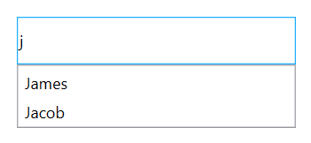

# AutoComplete mode

Suggestions can be shown in number of ways. TextBoxExt supports the following AutoComplete modes:

* Suggest: Shows the suggestion in the drop down list.
* Append: Appends the first suggestion to the text.
* SuggestAppend: Shows the suggestion in the drop-down list and appends the first suggestion to the text.
* None: In None mode, the Search algorithm starts even when the item is not available in the DataSource.

The default value of [AutoCompleteMode](https://help.syncfusion.com/cr/wpf/Syncfusion.SfInput.Wpf~Syncfusion.Windows.Controls.Input.SfTextBoxExt~AutoCompleteModeProperty.html) is None.

## Suggesting Choices in List

Filtered suggestions are shown in a drop-down list. Users can choose an item from the list.




<Window x:Class="AutoCompleteSample.MainWindow"
        xmlns="http://schemas.microsoft.com/winfx/2006/xaml/presentation"
        xmlns:x="http://schemas.microsoft.com/winfx/2006/xaml"
        xmlns:d="http://schemas.microsoft.com/expression/blend/2008"
        xmlns:mc="http://schemas.openxmlformats.org/markup-compatibility/2006"
        xmlns:local="clr-namespace:AutoCompleteSample"
        mc:Ignorable="d"
        xmlns:editors="clr-namespace:Syncfusion.Windows.Controls.Input;assembly=Syncfusion.SfInput.Wpf"
        Title="MainWindow" Height="450" Width="800">
    <Window.DataContext>
        <local:EmployeeViewModel/>
    </Window.DataContext>
    <Window.Content>
        <editors:SfTextBoxExt HorizontalAlignment="Center" 
                                 VerticalAlignment="Center" 
                                 Width="300"
                                 Height="40"
                                 SearchItemPath="Name"
                                 AutoCompleteMode="Suggest"
                                 SuggestionMode="StartsWith"
                                 AutoCompleteSource="{Binding Employees}" />
    </Window.Content>
</Window>




using Syncfusion.Windows.Controls.Input;
using System.Collections.Generic;
using System.Windows;
using System.Windows.Data;

namespace AutoCompleteSample
{
    /// 

    /// Interaction logic for MainWindow.xaml
    /// 

    public partial class MainWindow : Window
    {
        public MainWindow()
        {
            InitializeComponent();
            EmployeeViewModel viewModel = new EmployeeViewModel();
            this.DataContext = viewModel;
            SfTextBoxExt textBoxExt = new SfTextBoxExt()
            {
                HorizontalAlignment = HorizontalAlignment.Center,
                VerticalAlignment = VerticalAlignment.Center,
                Width = 300,
                Height = 40,
                SearchItemPath = "Name",
                AutoCompleteMode = AutoCompleteMode.Suggest,
                SuggestionMode = SuggestionMode.StartsWith,
            };

            Binding autoCompleteSourceBinding = new Binding();
            autoCompleteSourceBinding.Source = viewModel;
            autoCompleteSourceBinding.Path = new PropertyPath("Employees");
            BindingOperations.SetBinding(textBoxExt, SfTextBoxExt.AutoCompleteSourceProperty, autoCompleteSourceBinding);
            this.Content = textBoxExt;
        }
    }

    public class Employee
    {
        public string Name { get; set; }
        public string Email { get; set; }
    }

    public class EmployeeViewModel
    {
        private List<Employee> employees;
        public List<Employee> Employees
        {
            get { return employees; }

            set { employees = value; }
        }
        public EmployeeViewModel()
        {
            Employees = new List<Employee>();
            Employees.Add(new Employee { Name = "Lucas", Email = "lucas@syncfusion.com" });
            Employees.Add(new Employee { Name = "James", Email = "james@syncfusion.com" });
            Employees.Add(new Employee { Name = "Jacob", Email = "jacob@syncfusion.com" });
        }
    }
}




Filtered suggestions displayed in drop-down list
{:.caption}

## Appending suggestion to text

The first item in filtered suggestions is appended to the text of SfAutoComplete. Drop-down is still closed in this mode.




<Window x:Class="AutoCompleteSample.MainWindow"
        xmlns="http://schemas.microsoft.com/winfx/2006/xaml/presentation"
        xmlns:x="http://schemas.microsoft.com/winfx/2006/xaml"
        xmlns:d="http://schemas.microsoft.com/expression/blend/2008"
        xmlns:mc="http://schemas.openxmlformats.org/markup-compatibility/2006"
        xmlns:local="clr-namespace:AutoCompleteSample"
        mc:Ignorable="d"
        xmlns:editors="clr-namespace:Syncfusion.Windows.Controls.Input;assembly=Syncfusion.SfInput.Wpf"
        Title="MainWindow" Height="450" Width="800">
    <Window.DataContext>
        <local:EmployeeViewModel/>
    </Window.DataContext>
    <Window.Content>
        <editors:SfTextBoxExt HorizontalAlignment="Center" 
                                 VerticalAlignment="Center" 
                                 Width="300"
                                 Height="40"
                                 SearchItemPath="Name"
                                 AutoCompleteMode="Append"
                                 SuggestionMode="StartsWith"
                                 AutoCompleteSource="{Binding Employees}" />
    </Window.Content>
</Window>




using Syncfusion.Windows.Controls.Input;
using System.Collections.Generic;
using System.Windows;
using System.Windows.Data;

namespace AutoCompleteSample
{
    /// 

    /// Interaction logic for MainWindow.xaml
    /// 

    public partial class MainWindow : Window
    {
        public MainWindow()
        {
            InitializeComponent();
            EmployeeViewModel viewModel = new EmployeeViewModel();
            this.DataContext = viewModel;
            SfTextBoxExt textBoxExt = new SfTextBoxExt()
            {
                HorizontalAlignment = HorizontalAlignment.Center,
                VerticalAlignment = VerticalAlignment.Center,
                Width = 300,
                Height = 40,
                SearchItemPath = "Name",
                AutoCompleteMode = AutoCompleteMode.Append,
                SuggestionMode = SuggestionMode.StartsWith,
            };

            Binding autoCompleteSourceBinding = new Binding();
            autoCompleteSourceBinding.Source = viewModel;
            autoCompleteSourceBinding.Path = new PropertyPath("Employees");
            BindingOperations.SetBinding(textBoxExt, SfTextBoxExt.AutoCompleteSourceProperty, autoCompleteSourceBinding);
            this.Content = textBoxExt;
        }
    }

    public class Employee
    {
        public string Name { get; set; }
        public string Email { get; set; }
    }

    public class EmployeeViewModel
    {
        private List<Employee> employees;
        public List<Employee> Employees
        {
            get { return employees; }

            set { employees = value; }
        }
        public EmployeeViewModel()
        {
            Employees = new List<Employee>();
            Employees.Add(new Employee { Name = "Lucas", Email = "lucas@syncfusion.com" });
            Employees.Add(new Employee { Name = "James", Email = "james@syncfusion.com" });
            Employees.Add(new Employee { Name = "Jacob", Email = "jacob@syncfusion.com" });
        }
    }
}




N> The text will be attached to the first matched item by default, but users can still search using keyboard up and down to other items.

## Suggesting choices and appending suggestions to text

The text will be appended to the first matched item in the suggestions collection, in addition to opening the drop-down list.




<Window x:Class="AutoCompleteSample.MainWindow"
        xmlns="http://schemas.microsoft.com/winfx/2006/xaml/presentation"
        xmlns:x="http://schemas.microsoft.com/winfx/2006/xaml"
        xmlns:d="http://schemas.microsoft.com/expression/blend/2008"
        xmlns:mc="http://schemas.openxmlformats.org/markup-compatibility/2006"
        xmlns:local="clr-namespace:AutoCompleteSample"
        mc:Ignorable="d"
        xmlns:editors="clr-namespace:Syncfusion.Windows.Controls.Input;assembly=Syncfusion.SfInput.Wpf"
        Title="MainWindow" Height="450" Width="800">
    <Window.DataContext>
        <local:EmployeeViewModel/>
    </Window.DataContext>
    <Window.Content>
        <editors:SfTextBoxExt HorizontalAlignment="Center" 
                                 VerticalAlignment="Center" 
                                 Width="300"
                                 Height="40"
                                 SearchItemPath="Name"
                                 AutoCompleteMode="SuggestAppend"
                                 SuggestionMode="StartsWith"
                                 AutoCompleteSource="{Binding Employees}" />
    </Window.Content>
</Window>




using Syncfusion.Windows.Controls.Input;
using System.Collections.Generic;
using System.Windows;
using System.Windows.Data;

namespace AutoCompleteSample
{
    /// 

    /// Interaction logic for MainWindow.xaml
    /// 

    public partial class MainWindow : Window
    {
        public MainWindow()
        {
            InitializeComponent();
            EmployeeViewModel viewModel = new EmployeeViewModel();
            this.DataContext = viewModel;
            SfTextBoxExt textBoxExt = new SfTextBoxExt()
            {
                HorizontalAlignment = HorizontalAlignment.Center,
                VerticalAlignment = VerticalAlignment.Center,
                Width = 300,
                Height = 40,
                SearchItemPath = "Name",
                AutoCompleteMode = AutoCompleteMode.SuggestAppend,
                SuggestionMode = SuggestionMode.StartsWith,
            };

            Binding autoCompleteSourceBinding = new Binding();
            autoCompleteSourceBinding.Source = viewModel;
            autoCompleteSourceBinding.Path = new PropertyPath("Employees");
            BindingOperations.SetBinding(textBoxExt, SfTextBoxExt.AutoCompleteSourceProperty, autoCompleteSourceBinding);
            this.Content = textBoxExt;
        }
    }

    public class Employee
    {
        public string Name { get; set; }
        public string Email { get; set; }
    }

    public class EmployeeViewModel
    {
        private List<Employee> employees;
        public List<Employee> Employees
        {
            get { return employees; }

            set { employees = value; }
        }
        public EmployeeViewModel()
        {
            Employees = new List<Employee>();
            Employees.Add(new Employee { Name = "Lucas", Email = "lucas@syncfusion.com" });
            Employees.Add(new Employee { Name = "James", Email = "james@syncfusion.com" });
            Employees.Add(new Employee { Name = "Jacob", Email = "jacob@syncfusion.com" });
        }
    }
}




SuggestAppend mode
{:.caption}

Get the sample from [this](https://www.syncfusion.com/downloads/support/directtrac/general/ze/SuggestionMode913577965) link.
### None

This option neither appends text nor opens the drop-down list of suggestions. 