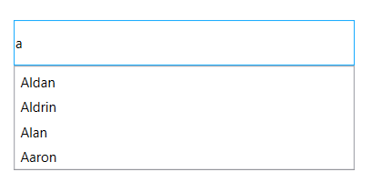
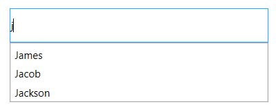
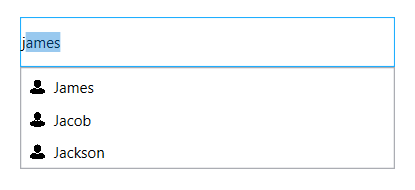
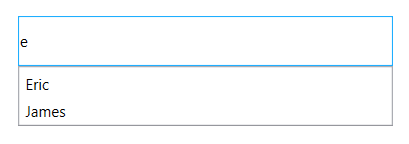
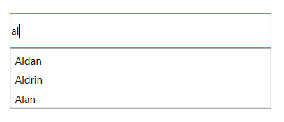
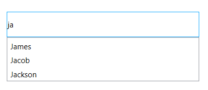
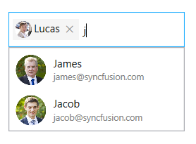
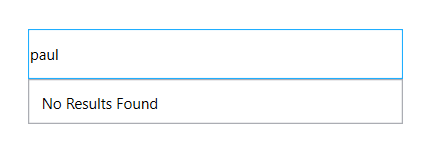

---
layout: post
title: AutoComplete | SfTextBoxExt | wpf | Syncfusion
description: This section provides details about AutoComplete and how to populate the strings or objects in AutoComplete of SfTextBoxExt control.
platform: wpf
control: SfTextBoxExt
documentation: ug
---

# AutoComplete and filtering 

The AutoComplete functionality provides several modes of suggestions while typing. The suggested text can be appended to the original text, or it can be displayed in a drop-down list so that it can choose from the different options.

## Autocomplete source

The [SfTextBoxExt](https://help.syncfusion.com/cr/cref_files/wpf/Syncfusion.SfInput.Wpf~Syncfusion.Windows.Controls.Input.SfTextBoxExt.html) control can be populated with a predefined list of items, which will assist while typing. It can choose one item from the filtered list.




<editors:SfTextBoxExt HorizontalAlignment="Center" 
                      VerticalAlignment="Center" 
                      Width="300"
                      Height="40"
                      SearchItemPath="Name"
                      AutoCompleteMode="Suggest"
                      AutoCompleteSource="{Binding Employees}" />




For further details, refer to [Populating Autocomplete with Data](https://help.syncfusion.com/wpf/autocomplete/getting-started#populating-autocomplete-with-data).

## SearchItemPath

The [SearchItemPath](https://help.syncfusion.com/cr/cref_files/wpf/Syncfusion.SfInput.Wpf~Syncfusion.Windows.Controls.Input.SfTextBoxExt~SearchItemPath.html) property, specifies the suggestion items path, by which the filtering has to be done.




<editors:SfTextBoxExt HorizontalAlignment="Center" 
                      VerticalAlignment="Center" 
                      Width="300"
                      Height="40"
                      SearchItemPath="Name"
                      AutoCompleteMode="Suggest"
                      AutoCompleteSource="{Binding Employees}" />




textBoxExt.SearchItemPath = "Name";




N> The default value of the AutoCompleteMode property is None. So, running the control without specifying this property will not show any suggestions. The detailed information about the AutoComplete modes will be provided in the next section.

## Customize using the ItemTemplate

The [AutoCompleteItemTemplate](https://help.syncfusion.com/cr/cref_files/wpf/Syncfusion.SfInput.Wpf~Syncfusion.Windows.Controls.Input.SfTextBoxExt~AutoCompleteItemTemplate.html) helps to decorate the suggested item with visual elements. The following code block explains how to add an image to the drop-down list items.




<editors:SfTextBoxExt HorizontalAlignment="Center" 
                      VerticalAlignment="Center" 
                      Width="400"
                      Height="40"
                      SearchItemPath="Name"
                      AutoCompleteMode="SuggestAppend"
                      AutoCompleteSource="{Binding Employees}" >
                      <editors:SfTextBoxExt.AutoCompleteItemTemplate>
                        <DataTemplate>
                            <StackPanel Orientation="Horizontal">
                                <Image Source="User.png" Margin="2" Stretch="Uniform" Width="12"/>
                                <TextBlock Text="{Binding Name}" Margin="5 2"/>
                            </StackPanel>
                        </DataTemplate>
                      </editors:SfTextBoxExt.AutoCompleteItemTemplate>
</editors:SfTextBoxExt>




## Filtering options

The phenomenon of string comparison for filtering suggestions can be changed using the [SuggestionMode](https://help.syncfusion.com/cr/cref_files/wpf/Syncfusion.SfInput.Wpf~Syncfusion.Windows.Controls.Input.SfTextBoxExt~SuggestionMode.html) property. The default filtering strategy is “StartsWith” and it is case-insensitive.

<table>
<tr>
<th>SuggestionMode</th>
<th>Description</th>
</tr>
<tr>
<td>None</td>
<td>
The control returns the entire collection without filtering when text is typed.
</td>
</tr>
<tr>
<td>
StartsWith
</td>
<td>
Displays all matches that begins with the typed characters in the control. This strategy is case-insensitive.
</td>
</tr>
<tr>
<td>
StartsWithCaseSensitive
</td>
<td>
Displays all matches that begins with the typed characters in the control. This strategy is case-sensitive.
</td>
</tr>
<tr>
<td>
StartsWithOrdinal
</td>
<td>
The control returns all possible matches that begins with the typed text based on the OrdinalIgnoreCase.
</td>
</tr>
<tr>
<td>
StartsWithOrdinalCaseSensitive
</td>
<td>
The control returns all possible matches that begins with the typed text based on the Ordinal, which is case-sensitive.
</td>
</tr>
<tr>
<td>
Contains
</td>
<td>
Displays all matches that contains typed characters in the control. This strategy is case-insensitive.
</td>
</tr>
<tr>
<td>
ContainsCaseSensitive
</td>
<td>
The control returns all possible matches that contains the typed text, which is culture and case-sensitive.
</td>
</tr>
<tr>
<td>
ContainsOrdinal
</td>
<td>
The control returns all possible matches that contains the typed text based on the OrdinalIgnoreCase.
</td>
</tr>
<tr>
<td>
ContainsOrdinalCaseSensitive
</td>
<td>
The control returns all possible matches that contains the typed text based on the Ordinal, which is case-sensitive.
</td>
</tr>
<tr>
<td>Equals</td>
<td>
Displays all words that completely matches the typed characters in the control. This strategy is case-insensitive.
</td>
</tr>
<tr>
<td>
EqualsCaseSensitive
</td>
<td>
Displays all words that completely matches the typed characters in the control. This strategy is case-sensitive.
</td>
</tr>
<tr>
<td>
EqualsOrdinal
</td>
<td>
The control returns all possible matches that equals the typed text based on the OrdinalIgnoreCase.
</td>
</tr>
<tr>
<td>
EqualsOrdinalCaseSensitive
</td>
<td>
The control returns all possible matches that equals the typed text based on the Ordinal, which is case-sensitive.
</td>
</tr>
<tr>
<td>
Custom
</td>
<td>
The control returns all possible matches based on the Filter property. Filter is of type SuggestionPredicate. In the MyFilter method, filtration is done by checking whether the collection contains the typed text.
</td>
</tr>
<tr>
<td>
EndsWith
</td>
<td>
Displays all matches that ends with the typed characters in the control. This strategy is case-insensitive.
</td>
</tr>
<tr>
<td>
EndsWithCaseSensitive
</td>
<td>
Displays all matches that ends with the typed characters in the control. This strategy is case-sensitive.
</td>
</tr>
<tr>
<td>
EndsWithOrdinal
</td>
<td>
The control returns all possible matches ending with the typed text based on the OrdinalIgnoreCase.
</td>
</tr>
<tr>
<td>
EndsWithOrdinalCaseSensitive
</td>
<td>
The control returns all possible matches ending with the typed text based on the Ordinal, which is case-sensitive.
</td>
</tr>
</table>




<editors:SfTextBoxExt HorizontalAlignment="Center" 
                      VerticalAlignment="Center" 
                      Width="400"
                      Height="40"
                      SearchItemPath="Name"
                      SuggestionMode="Contains"
                      AutoCompleteMode="Suggest"
                      AutoCompleteSource="{Binding Employees}"/>




textBoxExt.SuggestionMode = SuggestionMode.Contains;




## Prefix characters constraint

Instead of displaying suggestion list on every character entry, matches can be filtered and displayed after a few character entries. This can be done using the [MinimumPrefixCharacter](https://help.syncfusion.com/cr/cref_files/wpf/Syncfusion.SfInput.Wpf~Syncfusion.Windows.Controls.Input.SfTextBoxExt~MinimumPrefixCharacters.html) property, and their default value is 1.





<editors:SfTextBoxExt HorizontalAlignment="Center" 
                      VerticalAlignment="Center" 
                      Width="300"
                      Height="40"
                      SearchItemPath="Name"
                      AutoCompleteMode="Suggest"
                      MinimumPrefixCharacters="2"
                      AutoCompleteSource="{Binding Employees}" />
     



textBoxExt.MinimumPrefixCharacters = 2;





## Working with case sensitivity

[IgnoreCase](https://help.syncfusion.com/cr/cref_files/wpf/Syncfusion.SfInput.Wpf~Syncfusion.Windows.Controls.Input.SfTextBoxExt~IgnoreCase.html) option allows the control to filter the suggestions by ignoring the case. The default value is false.




<editors:SfTextBoxExt HorizontalAlignment="Center" 
                      VerticalAlignment="Center" 
                      Width="400"
                      Height="40"
                      SearchItemPath="Name"
                      IgnoreCase="True"
                      AutoCompleteMode="Suggest"
                      AutoCompleteSource="{Binding Employees}"/>




textBoxExt.IgnoreCase = true;




## Showing image in token and drop-down 

To show the image in token using the [ImageMemberPath](https://help.syncfusion.com/cr/cref_files/wpf/Syncfusion.SfInput.Wpf~Syncfusion.Windows.Controls.Input.SfTextBoxExt~ImageMemberPath.html) property and show the image in drop-down by the way of [AutoCompleteItemTemplate](https://help.syncfusion.com/cr/cref_files/wpf/Syncfusion.SfInput.Wpf~Syncfusion.Windows.Controls.Input.SfTextBoxExt~AutoCompleteItemTemplate.html) support. 




<editors:SfTextBoxExt HorizontalAlignment="Left"
                      AutoCompleteMode="Suggest"
                      SearchItemPath="Name"
                      ImageMemberPath="Image"
                      MultiSelectMode="Token" 
                      TokensWrapMode="None"
                      Height="40"
                      AutoCompleteSource="{Binding Employees}"
                      VerticalAlignment="Center"
                      Width="200">
            <editors:SfTextBoxExt.AutoCompleteItemTemplate>
                <DataTemplate>
                    <StackPanel Orientation="Horizontal" Height="40">
                        <Image Source="{Binding Image}" Margin="2" Height="35" Stretch="Uniform" Width="35"/>
                        <StackPanel  Margin="2"
                                            Orientation="Vertical">
                            <TextBlock Text="{Binding Name}" Margin="4,2,4,0" FontSize="12" Foreground="Black"/>
                            <TextBlock Text="{Binding Email}" Margin="4,1,2,2" FontSize="10" Foreground="Gray"/>
                        </StackPanel>
                    </StackPanel>
                </DataTemplate>
            </editors:SfTextBoxExt.AutoCompleteItemTemplate>
</editors:SfTextBoxExt>





N> View [sample](https://github.com/SyncfusionExamples/wpf-textboxext-examples/tree/master/Samples/ImageMemberPath) in GitHub

## Display a message when suggestions are empty 

When the entered item is not in the suggestion list, AutoComplete displays a text indicating that there is no search results found. You can set the desire text to be displayed for indicating no results found with the [NoResultsFoundTemplate](https://help.syncfusion.com/cr/cref_files/wpf/Syncfusion.SfInput.Wpf~Syncfusion.Windows.Controls.Input.SfTextBoxExt~NoResultsFoundTemplate.html) property.



       
<editors:SfTextBoxExt HorizontalAlignment="Center" 
                      VerticalAlignment="Center" 
                      Height="40"
                      Width="400"
                      SearchItemPath="Name"
                      AutoCompleteMode="Suggest"
                      AutoCompleteSource="{Binding Employees}">
            <editors:SfTextBoxExt.NoResultsFoundTemplate>
                <DataTemplate>
                    <Label Content="No Results Found" HorizontalAlignment="Center" VerticalAlignment="Center"/>
                </DataTemplate>
            </editors:SfTextBoxExt.NoResultsFoundTemplate>
</editors:SfTextBoxExt>




N> View [sample](https://github.com/SyncfusionExamples/wpf-textboxext-examples/tree/master/Samples/AutoComplete-and-filtering) in GitHub
