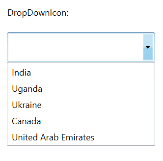
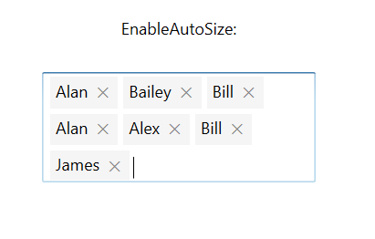

# Customizing AutoComplete

AutoComplete provides user-friendly customizing options for both text box and drop-down. This section explains how to customize the entire AutoComplete control.

## Customizing the text box

The `Text`, `FontSize`, `FontWeight`, and `FontFamily` properties are used to customize the text box.





<Window x:Class="AutoCompleteSample.MainWindow"
        xmlns="http://schemas.microsoft.com/winfx/2006/xaml/presentation"
        xmlns:x="http://schemas.microsoft.com/winfx/2006/xaml"
        xmlns:d="http://schemas.microsoft.com/expression/blend/2008"
        xmlns:mc="http://schemas.openxmlformats.org/markup-compatibility/2006"
        xmlns:local="clr-namespace:AutoCompleteSample"
        mc:Ignorable="d"
        xmlns:editors="clr-namespace:Syncfusion.Windows.Controls.Input;assembly=Syncfusion.SfInput.Wpf"
        Title="MainWindow" Height="450" Width="800">
    <Window.Content>
        <Grid>
            <editors:SfTextBoxExt x:Name="textBoxExt" 
                              Text="TextBox"
                              FontSize="20"
                              FontWeight="Bold"
                              FontFamily="Times New Roman"
                              HorizontalAlignment="Center" 
                              VerticalAlignment="Center" 
                              Width="200">
            </editors:SfTextBoxExt>
        </Grid>
    </Window.Content>
</Window>





using Syncfusion.Windows.Controls.Input;
using System.Windows;
using System.Windows.Media;

namespace AutoCompleteSample
{
    /// 

    /// Interaction logic for MainWindow.xaml
    /// 

    public partial class MainWindow : Window
    {
        public MainWindow()
        {
            InitializeComponent();
            SfTextBoxExt textBoxExt = new SfTextBoxExt()
            {
                Text = "TextBox",
                FontSize = 20,
                FontWeight = FontWeights.Bold,
                FontFamily = new FontFamily("Time New Roman"),
                HorizontalAlignment = HorizontalAlignment.Center,
                VerticalAlignment = VerticalAlignment.Center,
                Width = 200
            };

            this.Content = textBoxExt;
        }
    }
}





## Customizing the suggestion box

### Changing the background color of suggestion box

The `DropDownBackground` property is used to modify the background color of suggestion box. The following code example demonstrates how to change the background color of suggestion box.





<Window x:Class="AutoCompleteSample.MainWindow"
        xmlns="http://schemas.microsoft.com/winfx/2006/xaml/presentation"
        xmlns:x="http://schemas.microsoft.com/winfx/2006/xaml"
        xmlns:d="http://schemas.microsoft.com/expression/blend/2008"
        xmlns:mc="http://schemas.openxmlformats.org/markup-compatibility/2006"
        xmlns:local="clr-namespace:AutoCompleteSample"
        mc:Ignorable="d"
        xmlns:editors="clr-namespace:Syncfusion.Windows.Controls.Input;assembly=Syncfusion.SfInput.Wpf"
        Title="MainWindow" Height="450" Width="800">
    <Window.Content>
        <Grid>
            <editors:SfTextBoxExt x:Name="textBoxExt" 
                                  HorizontalAlignment="Center" 
                                  VerticalAlignment="Center"
                                  AutoCompleteMode="Suggest"
                                  DropDownBackground="AliceBlue"
                                  Width="300"/>
        </Grid>
    </Window.Content>
</Window>





using Syncfusion.Windows.Controls.Input;
using System.Collections.Generic;
using System.Windows;
using System.Windows.Media;

namespace AutoCompleteSample
{
    /// 

    /// Interaction logic for MainWindow.xaml
    /// 

    public partial class MainWindow : Window
    {
        public MainWindow()
        {
            InitializeComponent();
            SfTextBoxExt textBoxExt = new SfTextBoxExt()
            {
                HorizontalAlignment = HorizontalAlignment.Center,
                VerticalAlignment = VerticalAlignment.Center,
                Width = 200,
                AutoCompleteMode = AutoCompleteMode.Suggest,
                DropDownBackground = new SolidColorBrush(Colors.AliceBlue)
            };

            List<string> list = new List<string>()
            {
                 "India",
                 "Uganda",
                 "Ukraine",
                 "Canada",
                 "United Arab Emirates"
            };

            textBoxExt.AutoCompleteSource = list;
            this.Content = textBoxExt;
        }
    }
}





## DropDownIcon

This feature allows the users to set the drop down icon for the Text Box control using `ShowDropDownButton`.





<Window x:Class="Demo_Sample.IsSelectedItemsVisibleInDropDown"
        xmlns="http://schemas.microsoft.com/winfx/2006/xaml/presentation"
        xmlns:x="http://schemas.microsoft.com/winfx/2006/xaml"
        xmlns:d="http://schemas.microsoft.com/expression/blend/2008"
        xmlns:editors="clr-namespace:Syncfusion.Windows.Controls.Input;assembly=Syncfusion.SfInput.Wpf"
        xmlns:mc="http://schemas.openxmlformats.org/markup-compatibility/2006"
        xmlns:local="clr-namespace:Demo_Sample"
        mc:Ignorable="d"
        Title="IsSelectedItemsVisibleInDropDown" Height="450" Width="800">
    <StackPanel VerticalAlignment="Center">
        <StackPanel VerticalAlignment="Center" Margin="20">
            <StackPanel VerticalAlignment="Center" Margin="0,20,0,20" HorizontalAlignment="Left">
                <TextBlock Text="DropDownIcon:"/>
            </StackPanel>
            <editors:SfTextBoxExt HorizontalAlignment="Left" 
                                  x:Name="autoComplete1" 
                                  ShowDropDownButton="True"
                                  VerticalAlignment="Center"
                                  Height="40" Width="200"/>
        </StackPanel>
    </StackPanel>
</Window>





using System.Collections.Generic;
using System.Windows;
using Syncfusion.Windows.Controls.Input;

namespace Demo_Sample
{
    /// 

    /// Interaction logic for IsSelectedItemsVisibleInDropDown.xaml
    /// 

    public partial class IsSelectedItemsVisibleInDropDown : Window
    {
        public IsSelectedItemsVisibleInDropDown()
        {
            InitializeComponent();
            SfTextBoxExt textBoxExt = new SfTextBoxExt()
            {
                VerticalAlignment = VerticalAlignment.Center,
                Width = 200,
                Height = 40,
                ShowDropDownButton = true,
                AutoCompleteMode = AutoCompleteMode.Suggest,
            };

            List<string> list = new List<string>()
            {
                 "India",
                 "Uganda",
                 "Ukraine",
                 "Canada",
                 "United Arab Emirates"
            };

            autoComplete1.AutoCompleteSource = list;
        }
    }
}





## EnableAutoSize

This feature allows the control to grow in size when the additional tokens are added behind the view.





<Window x:Class="Demo_Sample.EnableAutoSize"
        xmlns="http://schemas.microsoft.com/winfx/2006/xaml/presentation"
        xmlns:x="http://schemas.microsoft.com/winfx/2006/xaml"
        xmlns:d="http://schemas.microsoft.com/expression/blend/2008"
        xmlns:mc="http://schemas.openxmlformats.org/markup-compatibility/2006"
        xmlns:editors="clr-namespace:Syncfusion.Windows.Controls.Input;assembly=Syncfusion.SfInput.Wpf"
        xmlns:local="clr-namespace:Demo_Sample"
        mc:Ignorable="d"
        Title="EnableAutoSize" Height="450" Width="800">
    <StackPanel VerticalAlignment="Center">
            <TextBlock Text="EnableAutoSize:" Height="40" HorizontalAlignment="Center"/>
            <editors:SfTextBoxExt x:Name="autoComplete"
                                  MultiSelectMode="Token"
                                  TokensWrapMode="Wrap"
                                  AutoCompleteMode="Suggest"
                                  HorizontalAlignment="Center"                         
                                  EnableAutoSize="True"
                                  Width="200"/>

    </StackPanel>
</Window>




using System.Collections.Generic;
using System.Windows;

namespace Demo_Sample
{
    /// 

    /// Interaction logic for EnableAutoSize.xaml
    /// 

    public partial class EnableAutoSize : Window
    {
        public EnableAutoSize()
        {
            InitializeComponent();
            List<string> items = new List<string>()
            {
                    "Alan",
                    "Lucas",
                    "Alex",
                    "James",
                    "Bill",
                    "Bailey",
            };

            autoComplete.AutoCompleteSource = items;
        }
    }     
}

