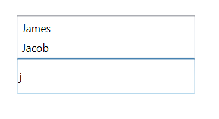
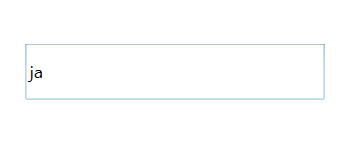
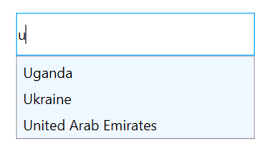
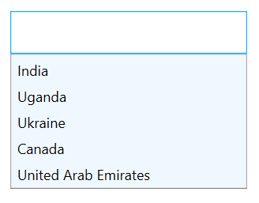

# Dealing with suggestion box

Suggestion box is the drop-down list box, which displays the filtered suggestions inside a popup. This section explains the properties that deals with drop-down list in the AutoComplete control.

## Suggestion box placement mode

The SuggestionBoxPlacement property defines the position of popup relative to the control. It contains three built-in options:

1. Top
2. Bottom
3. None

The default value is bottom.

### Top

The drop-down list will open at the top of the control.




<Window x:Class="AutoCompleteSample.MainWindow"
        xmlns="http://schemas.microsoft.com/winfx/2006/xaml/presentation"
        xmlns:x="http://schemas.microsoft.com/winfx/2006/xaml"
        xmlns:d="http://schemas.microsoft.com/expression/blend/2008"
        xmlns:mc="http://schemas.openxmlformats.org/markup-compatibility/2006"
        xmlns:local="clr-namespace:AutoCompleteSample"
        mc:Ignorable="d"
        xmlns:editors="clr-namespace:Syncfusion.Windows.Controls.Input;assembly=Syncfusion.SfInput.Wpf"
        Title="MainWindow" Height="450" Width="800">
    <Window.DataContext>
        <local:EmployeeViewModel/>
    </Window.DataContext>
    <Window.Content>
        <editors:SfTextBoxExt HorizontalAlignment="Center"
                                  VerticalAlignment="Center"
                                  Width="300"
                                  Height="40"
                                  SearchItemPath="Name"
                                  SuggestionBoxPlacement="Top"
                                  AutoCompleteMode="Suggest"
                                  SuggestionMode="StartsWith"
                                  AutoCompleteSource="{Binding Employees}"/>
    </Window.Content>
</Window>




using Syncfusion.Windows.Controls.Input;
using System.Collections.Generic;
using System.Windows;
using System.Windows.Data;

namespace AutoCompleteSample
{
    /// 

    /// Interaction logic for MainWindow.xaml
    /// 

    public partial class MainWindow : Window
    {
        public MainWindow()
        {
            InitializeComponent();
            EmployeeViewModel viewModel = new EmployeeViewModel();
            this.DataContext = viewModel;
            SfTextBoxExt textBoxExt = new SfTextBoxExt()
            {
                HorizontalAlignment = HorizontalAlignment.Center,
                VerticalAlignment = VerticalAlignment.Center,
                Width = 300,
                Height = 40,
                SearchItemPath = "Name",
                SuggestionBoxPlacement = SuggestionBoxPlacement.Top,
                AutoCompleteMode = AutoCompleteMode.Suggest,
                SuggestionMode = SuggestionMode.StartsWith,
            };

            Binding autoCompleteSourceBinding = new Binding();
            autoCompleteSourceBinding.Source = viewModel;
            autoCompleteSourceBinding.Path = new PropertyPath("Employees");
            BindingOperations.SetBinding(textBoxExt, SfTextBoxExt.AutoCompleteSourceProperty, autoCompleteSourceBinding);
            this.Content = textBoxExt;
        }
    }

    public class Employee
    {
        public string Name { get; set; }
        public string Email { get; set; }
    }

    public class EmployeeViewModel
    {
        private List<Employee> employees;
        public List<Employee> Employees
        {
            get { return employees; }

            set { employees = value; }
        }
        public EmployeeViewModel()
        {
            Employees = new List<Employee>();
            Employees.Add(new Employee { Name = "Lucas", Email = "lucas@syncfusion.com" });
            Employees.Add(new Employee { Name = "James", Email = "james@syncfusion.com" });
            Employees.Add(new Employee { Name = "Jacob", Email = "jacob@syncfusion.com" });
        }
    }
}




Drop down list opening at the top
{:.caption}

### Bottom

The drop-down list will open at the bottom of the control.




<Window x:Class="AutoCompleteSample.MainWindow"
        xmlns="http://schemas.microsoft.com/winfx/2006/xaml/presentation"
        xmlns:x="http://schemas.microsoft.com/winfx/2006/xaml"
        xmlns:d="http://schemas.microsoft.com/expression/blend/2008"
        xmlns:mc="http://schemas.openxmlformats.org/markup-compatibility/2006"
        xmlns:local="clr-namespace:AutoCompleteSample"
        mc:Ignorable="d"
        xmlns:editors="clr-namespace:Syncfusion.Windows.Controls.Input;assembly=Syncfusion.SfInput.Wpf"
        Title="MainWindow" Height="450" Width="800">
    <Window.DataContext>
        <local:EmployeeViewModel/>
    </Window.DataContext>
    <Window.Content>
        <editors:SfTextBoxExt HorizontalAlignment="Center"
                                  VerticalAlignment="Center"
                                  Width="300"
                                  Height="40"
                                  SearchItemPath="Name"
                                  SuggestionBoxPlacement="Bottom"
                                  AutoCompleteMode="Suggest"
                                  SuggestionMode="StartsWith"
                                  AutoCompleteSource="{Binding Employees}"/>
    </Window.Content>
</Window>




using Syncfusion.Windows.Controls.Input;
using System.Collections.Generic;
using System.Windows;
using System.Windows.Data;

namespace AutoCompleteSample
{
    /// 

    /// Interaction logic for MainWindow.xaml
    /// 

    public partial class MainWindow : Window
    {
        public MainWindow()
        {
            InitializeComponent();
            EmployeeViewModel viewModel = new EmployeeViewModel();
            this.DataContext = viewModel;
            SfTextBoxExt textBoxExt = new SfTextBoxExt()
            {
                HorizontalAlignment = HorizontalAlignment.Center,
                VerticalAlignment = VerticalAlignment.Center,
                Width = 300,
                Height = 40,
                SearchItemPath = "Name",
                SuggestionBoxPlacement = SuggestionBoxPlacement.Bottom,
                AutoCompleteMode = AutoCompleteMode.Suggest,
                SuggestionMode = SuggestionMode.StartsWith,
            };

            Binding autoCompleteSourceBinding = new Binding();
            autoCompleteSourceBinding.Source = viewModel;
            autoCompleteSourceBinding.Path = new PropertyPath("Employees");
            BindingOperations.SetBinding(textBoxExt, SfTextBoxExt.AutoCompleteSourceProperty, autoCompleteSourceBinding);
            this.Content = textBoxExt;
        }
    }

    public class Employee
    {
        public string Name { get; set; }
        public string Email { get; set; }
    }

    public class EmployeeViewModel
    {
        private List<Employee> employees;
        public List<Employee> Employees
        {
            get { return employees; }

            set { employees = value; }
        }
        public EmployeeViewModel()
        {
            Employees = new List<Employee>();
            Employees.Add(new Employee { Name = "Lucas", Email = "lucas@syncfusion.com" });
            Employees.Add(new Employee { Name = "James", Email = "james@syncfusion.com" });
            Employees.Add(new Employee { Name = "Jacob", Email = "jacob@syncfusion.com" });
        }
    }
}




Drop down list opening at the bottom
{:.caption}

### None

The drop-down list will not open.




<Window x:Class="AutoCompleteSample.MainWindow"
        xmlns="http://schemas.microsoft.com/winfx/2006/xaml/presentation"
        xmlns:x="http://schemas.microsoft.com/winfx/2006/xaml"
        xmlns:d="http://schemas.microsoft.com/expression/blend/2008"
        xmlns:mc="http://schemas.openxmlformats.org/markup-compatibility/2006"
        xmlns:local="clr-namespace:AutoCompleteSample"
        mc:Ignorable="d"
        xmlns:editors="clr-namespace:Syncfusion.Windows.Controls.Input;assembly=Syncfusion.SfInput.Wpf"
        Title="MainWindow" Height="450" Width="800">
    <Window.DataContext>
        <local:EmployeeViewModel/>
    </Window.DataContext>
    <Window.Content>
        <editors:SfTextBoxExt HorizontalAlignment="Center"
                                  VerticalAlignment="Center"
                                  Width="300"
                                  Height="40"
                                  SearchItemPath="Name"
                                  SuggestionBoxPlacement="None"
                                  AutoCompleteMode="Suggest"
                                  SuggestionMode="StartsWith"
                                  AutoCompleteSource="{Binding Employees}"/>
    </Window.Content>
</Window>




using Syncfusion.Windows.Controls.Input;
using System.Collections.Generic;
using System.Windows;
using System.Windows.Data;

namespace AutoCompleteSample
{
    /// 

    /// Interaction logic for MainWindow.xaml
    /// 

    public partial class MainWindow : Window
    {
        public MainWindow()
        {
            InitializeComponent();
            EmployeeViewModel viewModel = new EmployeeViewModel();
            this.DataContext = viewModel;
            SfTextBoxExt textBoxExt = new SfTextBoxExt()
            {
                HorizontalAlignment = HorizontalAlignment.Center,
                VerticalAlignment = VerticalAlignment.Center,
                Width = 300,
                Height = 40,
                SearchItemPath = "Name",
                SuggestionBoxPlacement = SuggestionBoxPlacement.None,
                AutoCompleteMode = AutoCompleteMode.Suggest,
                SuggestionMode = SuggestionMode.StartsWith,
            };

            Binding autoCompleteSourceBinding = new Binding();
            autoCompleteSourceBinding.Source = viewModel;
            autoCompleteSourceBinding.Path = new PropertyPath("Employees");
            BindingOperations.SetBinding(textBoxExt, SfTextBoxExt.AutoCompleteSourceProperty, autoCompleteSourceBinding);
            this.Content = textBoxExt;
        }
    }

    public class Employee
    {
        public string Name { get; set; }
        public string Email { get; set; }
    }

    public class EmployeeViewModel
    {
        private List<Employee> employees;
        public List<Employee> Employees
        {
            get { return employees; }

            set { employees = value; }
        }
        public EmployeeViewModel()
        {
            Employees = new List<Employee>();
            Employees.Add(new Employee { Name = "Lucas", Email = "lucas@syncfusion.com" });
            Employees.Add(new Employee { Name = "James", Email = "james@syncfusion.com" });
            Employees.Add(new Employee { Name = "Jacob", Email = "jacob@syncfusion.com" });
        }
    }
}




No drop down list
{:.caption}

## Maximum suggestion box height

The maximum height of the suggestion box in the Autocomplete control can be changed using the [MaximumDropDownHeight](https://help.syncfusion.com/cr/wpf/Syncfusion.SfInput.Wpf~Syncfusion.Windows.Controls.Input.SfTextBoxExt~MaxDropDownHeightProperty.html) property.





<Window x:Class="AutoCompleteSample.MainWindow"
        xmlns="http://schemas.microsoft.com/winfx/2006/xaml/presentation"
        xmlns:x="http://schemas.microsoft.com/winfx/2006/xaml"
        xmlns:d="http://schemas.microsoft.com/expression/blend/2008"
        xmlns:mc="http://schemas.openxmlformats.org/markup-compatibility/2006"
        xmlns:local="clr-namespace:AutoCompleteSample"
        mc:Ignorable="d"
        xmlns:editors="clr-namespace:Syncfusion.Windows.Controls.Input;assembly=Syncfusion.SfInput.Wpf"
        Title="MainWindow" Height="450" Width="800">
    <Window.Content>
        <Grid>
            <editors:SfTextBoxExt x:Name="textBoxExt"
                                  HorizontalAlignment="Center" 
                                  VerticalAlignment="Center" 
                                  AutoCompleteMode="Suggest"
                                  SuggestionMode="StartsWith"
                                  MaxDropDownHeight="500"
                                  Width="300">
                <editors:SfTextBoxExt.AutoCompleteSource>
                    <x:Array Type="sys:String" 
             xmlns:sys="clr-namespace:System;assembly=mscorlib">
                        <sys:String>India</sys:String>
                        <sys:String>Uganda</sys:String>
                        <sys:String>Ukraine</sys:String>
                        <sys:String>Canada</sys:String>
                        <sys:String>United Arab Emirates</sys:String>
                    </x:Array>
                </editors:SfTextBoxExt.AutoCompleteSource>
            </editors:SfTextBoxExt>
        </Grid>
    </Window.Content>
</Window>





using Syncfusion.Windows.Controls.Input;
using System.Collections.Generic;
using System.Windows;
using System.Windows.Data;

namespace AutoCompleteSample
{
    /// 

    /// Interaction logic for MainWindow.xaml
    /// 

    public partial class MainWindow : Window
    {
        public MainWindow()
        {
            InitializeComponent();
            SfTextBoxExt textBoxExt = new SfTextBoxExt()
            {
                HorizontalAlignment = HorizontalAlignment.Center,
                VerticalAlignment = VerticalAlignment.Center,
                Width = 300,
                AutoCompleteMode = AutoCompleteMode.Suggest,
                SuggestionMode = SuggestionMode.StartsWith,
                MaxDropDownHeight = 500
            };

            List<string> list = new List<string>()
            {
                 "India",
                 "Uganda",
                 "Ukraine",
                 "Canada",
                 "United Arab Emirates"
            };

            textBoxExt.AutoCompleteSource = list;
            this.Content = textBoxExt;
        }
    }
}





## Opening suggestion box on focus

Suggestion box can be shown whenever the control receives focus using the [ShowSuggestionsOnFocus](https://help.syncfusion.com/cr/wpf/Syncfusion.SfInput.Wpf~Syncfusion.Windows.Controls.Input.SfTextBoxExt~ShowSuggestionsOnFocusProperty.html) property. At that time, suggestion list is the complete list of data source.





<Window x:Class="AutoCompleteSample.MainWindow"
        xmlns="http://schemas.microsoft.com/winfx/2006/xaml/presentation"
        xmlns:x="http://schemas.microsoft.com/winfx/2006/xaml"
        xmlns:d="http://schemas.microsoft.com/expression/blend/2008"
        xmlns:mc="http://schemas.openxmlformats.org/markup-compatibility/2006"
        xmlns:local="clr-namespace:AutoCompleteSample"
        mc:Ignorable="d"
        xmlns:editors="clr-namespace:Syncfusion.Windows.Controls.Input;assembly=Syncfusion.SfInput.Wpf"
        Title="MainWindow" Height="450" Width="800">
    <Window.Content>
        <Grid>
            <editors:SfTextBoxExt x:Name="textBoxExt"
                                  HorizontalAlignment="Center" 
                                  VerticalAlignment="Center" 
                                  AutoCompleteMode="Suggest"
                                  SuggestionMode="StartsWith"
                                  ShowSuggestionsOnFocus="True"
                                  MaxDropDownHeight="500"
                                  Width="300">
                <editors:SfTextBoxExt.AutoCompleteSource>
                    <x:Array Type="sys:String" 
             xmlns:sys="clr-namespace:System;assembly=mscorlib">
                        <sys:String>India</sys:String>
                        <sys:String>Uganda</sys:String>
                        <sys:String>Ukraine</sys:String>
                        <sys:String>Canada</sys:String>
                        <sys:String>United Arab Emirates</sys:String>
                    </x:Array>
                </editors:SfTextBoxExt.AutoCompleteSource>
            </editors:SfTextBoxExt>
        </Grid>
    </Window.Content>
</Window>





using Syncfusion.Windows.Controls.Input;
using System.Collections.Generic;
using System.Windows;
using System.Windows.Data;

namespace AutoCompleteSample
{
    /// 

    /// Interaction logic for MainWindow.xaml
    /// 

    public partial class MainWindow : Window
    {
        public MainWindow()
        {
            InitializeComponent();
            SfTextBoxExt textBoxExt = new SfTextBoxExt()
            {
                HorizontalAlignment = HorizontalAlignment.Center,
                VerticalAlignment = VerticalAlignment.Center,
                Width = 300,
                AutoCompleteMode = AutoCompleteMode.Suggest,
                SuggestionMode = SuggestionMode.StartsWith,
                MaxDropDownHeight = 500,
                ShowSuggestionsOnFocus = true
            };

            List<string> list = new List<string>()
            {
                 "India",
                 "Uganda",
                 "Ukraine",
                 "Canada",
                 "United Arab Emirates"
            };

            textBoxExt.AutoCompleteSource = list;
            this.Content = textBoxExt;
        }
    }
}





