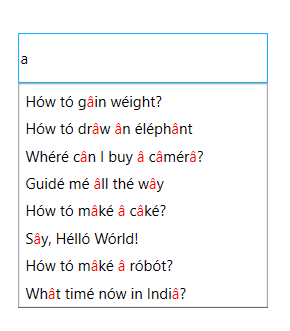

# Diacritic Sensitivity in WPF AutoComplete (SfTextBoxExt)

The [WPF AutoComplete](https://www.syncfusion.com/wpf-controls/autocomplete) control supports searching items containing diacritics with English characters from an en-US keyboard. The WPF AutoComplete control is implemented through the [SfTextBoxExt](https://help.syncfusion.com/cr/wpf/Syncfusion.Windows.Controls.Input.SfTextBoxExt.html) class. Enable or disable diacritic sensitivity by using the [IgnoreDiacritic](https://help.syncfusion.com/cr/wpf/Syncfusion.Windows.Controls.Input.SfTextBoxExt.html#Syncfusion_Windows_Controls_Input_SfTextBoxExt_IgnoreDiacritic) property. The following code example demonstrates how to enable diacritic sensitivity.





<editors:SfTextBoxExt HorizontalAlignment="Center" 
                      VerticalAlignment="Center" 
                      Height="40"
                      Width="200"
                      AutoCompleteMode="Suggest"
                      SuggestionMode="Contains"
                      IgnoreDiacritic="False"
                      HighlightedTextColor="Red"
                      TextHighlightMode="MultipleOccurrence"
                      SearchItemPath="Item"
                      AutoCompleteSource="{Binding DiacriticCollenction}"/>




textBoxExt.IgnoreDiacritic = false;





N> View [sample](https://github.com/SyncfusionExamples/wpf-textboxext-examples/tree/master/Samples/Diacritic-sensitivity) in GitHub
