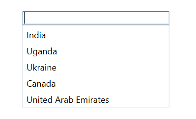
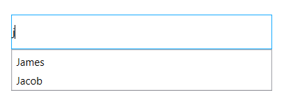

# Getting started with SfAutoComplete.

## Assembly deployment

Refer to this [Control Dependencies](https://help.syncfusion.com/wpf/control-dependencies#sftextboxext) section to get the list of assemblies or NuGet package that needs to be added as a reference to use the control in any application.

Refer to this [How to install nuget packages](https://help.syncfusion.com/wpf/nuget-packages) documentation to find more details about installing the NuGet package in a WPF application.

## Creating a simple application

Create a WPF application with [SfTextBoxExt](https://help.syncfusion.com/cr/cref_files/wpf/Syncfusion.SfInput.Wpf~Syncfusion.Windows.Controls.Input.SfTextBoxExt.html) control using the following steps:

### Create a project

Create a new WPF project in Visual Studio to display the [SfTextBoxExt](https://help.syncfusion.com/cr/cref_files/wpf/Syncfusion.SfInput.Wpf~Syncfusion.Windows.Controls.Input.SfTextBoxExt.html) control with their functionalities.

### Add a control using the designer

The [SfTextBoxExt](https://help.syncfusion.com/cr/cref_files/wpf/Syncfusion.SfInput.Wpf~Syncfusion.Windows.Controls.Input.SfTextBoxExt.html) control can be added to an application by dragging it from the toolbox to a designer view. The following required assembly references will be added automatically:

* Syncfusion.SfInput.WPF
* Syncfusion.SfShared.WPF

### Adding control manually in XAML

To add the control manually in XAML, follow the given steps:

1. Add the following required assembly references to the project:
    * Syncfusion.SfInput.WPF
    * Syncfusion.SfShared.WPF
2. Import Syncfusion WPF schema **http://schemas.syncfusion.com/wpf** in the XAML page.
3. Declare the [SfTextBoxExt](https://help.syncfusion.com/cr/cref_files/wpf/Syncfusion.SfInput.Wpf~Syncfusion.Windows.Controls.Input.SfTextBoxExt.html) control in the XAML page.




<Window x:Class="TextBoxExt.MainWindow"
        xmlns="http://schemas.microsoft.com/winfx/2006/xaml/presentation"
        xmlns:x="http://schemas.microsoft.com/winfx/2006/xaml"
        xmlns:d="http://schemas.microsoft.com/expression/blend/2008"
        xmlns:mc="http://schemas.openxmlformats.org/markup-compatibility/2006"
        xmlns:local="clr-namespace:TextBoxExt"
        mc:Ignorable="d"    
        xmlns:editors="http://schemas.syncfusion.com/wpf"
        Title="MainWindow" Height="450" Width="800">
    <editors:SfTextBoxExt HorizontalAlignment="Center" 
                                  VerticalAlignment="Center" 
                                  HorizontalContentAlignment="Center"
                                  Height="40"
                                  Width="200" 
                                  Text="Hello! World..."/>
</Window>
  



### Add a control manually in C#

To add the control manually in C#, follow the given steps:

1. Add the following required assembly references to the project:
    * Syncfusion.SfInput.WPF
    * Syncfusion.SfShared.WPF
2. Import the [SfTextBoxExt](https://help.syncfusion.com/cr/cref_files/wpf/Syncfusion.SfInput.Wpf~Syncfusion.Windows.Controls.Input.SfTextBoxExt.html) namespace using **Syncfusion.Windows.Controls.Input;**.
3. Create an [SfTextBoxExt](https://help.syncfusion.com/cr/cref_files/wpf/Syncfusion.SfInput.Wpf~Syncfusion.Windows.Controls.Input.SfTextBoxExt.html) instance, and add it to the window.




using System.Windows;
using Syncfusion.Windows.Controls.Input;

namespace TextBoxExt
{
    public partial class MainWindow : Window
    {
        public MainWindow()
        {
            InitializeComponent();
            SfTextBoxExt textBoxExt = new SfTextBoxExt();
            textBoxExt.HorizontalContentAlignment = HorizontalAlignment.Center;
            textBoxExt.HorizontalAlignment = HorizontalAlignment.Center;
            textBoxExt.VerticalAlignment = VerticalAlignment.Center;
            textBoxExt.Width = 200;
            textBoxExt.Height = 40;
            textBoxExt.Text = "Hello! World...";
            this.Content = textBoxExt;
        }
    }
}




## Populating AutoComplete with Data

AutoComplete is a data-bound control. So before create binding to the control, you must create data model for Application.

For illustration, let us create a textbox, which will populate a list of employees.

1.Create data object class named **Employee** and declare properties as shown below,



public class Employee
{
        string name;
        string email;

        public string Name
        {
            get { return name; }
            set { name = value; }
        }

        public string Email
        {
            get { return email; }
            set { email = value; }
        }
}
	


2.Create a **EmployeeViewModel** class with Employees property and Employees property is initialized with several data objects in constructor.



 public class EmployeeViewModel
 {
        private List<Employee> employees;
        public List<Employee> Employees
        {
            get { return employees; }

            set { employees = value; }
        }
        public EmployeeViewModel()
        {
            Employees = new List<Employee>();
            Employees.Add(new Employee() { Name = "Eric", Email = "Eric@syncfusion.com" });
            Employees.Add(new Employee() { Name = "James", Email = "James@syncfusion.com" });
            Employees.Add(new Employee() { Name = "Jacob", Email = "Jacob@syncfusion.com" });
            Employees.Add(new Employee() { Name = "Lucas", Email = "Lucas@syncfusion.com" });
            Employees.Add(new Employee() { Name = "Mark", Email = "Mark@syncfusion.com" });
            Employees.Add(new Employee() { Name = "Aldan", Email = "Aldan@syncfusion.com" });
            Employees.Add(new Employee() { Name = "Aldrin", Email = "Aldrin@syncfusion.com" });
            Employees.Add(new Employee() { Name = "Alan", Email = "Alan@syncfusion.com" });
            Employees.Add(new Employee() { Name = "Aaron", Email = "Aaron@syncfusion.com" });
        }
 }



3.To populate the AutoComplete with data, set the [AutoCompleteSource](https://help.syncfusion.com/cr/cref_files/wpf/Syncfusion.SfInput.Wpf~Syncfusion.Windows.Controls.Input.SfTextBoxExt~AutoCompleteSource.html) property to `IEnumerable` implementation.

Bind the collection created in previous step to [AutoCompleteSource](https://help.syncfusion.com/cr/cref_files/wpf/Syncfusion.SfInput.Wpf~Syncfusion.Windows.Controls.Input.SfTextBoxExt~AutoCompleteSource.html) property in XAML by setting EmployeeViewModel as `DataContext`.




<Window x:Class="TextBoxExt.MainWindow"
        xmlns="http://schemas.microsoft.com/winfx/2006/xaml/presentation"
        xmlns:x="http://schemas.microsoft.com/winfx/2006/xaml"
        xmlns:d="http://schemas.microsoft.com/expression/blend/2008"
        xmlns:mc="http://schemas.openxmlformats.org/markup-compatibility/2006"
        xmlns:local="clr-namespace:TextBoxExt"
        mc:Ignorable="d"    
        xmlns:editors="http://schemas.syncfusion.com/wpf"
        Title="MainWindow" Height="450" Width="800">

    <Window.DataContext>
        <local:EmployeeViewModel/>
    </Window.DataContext>
    <editors:SfTextBoxExt HorizontalAlignment="Center" 
                              VerticalAlignment="Center" 
                              Width="300"
                              Height="40"
                              SearchItemPath="Name"
                              AutoCompleteMode="Suggest"
                              AutoCompleteSource="{Binding Employees}" />

</Window>



EmployeeViewModel viewModel = new EmployeeViewModel();
this.DataContext = viewModel;
SfTextBoxExt textBoxExt = new SfTextBoxExt();
textBoxExt.HorizontalAlignment = HorizontalAlignment.Center;
textBoxExt.VerticalAlignment = VerticalAlignment.Center;
textBoxExt.Width = 200;
textBoxExt.Height = 40;
textBoxExt.SearchItemPath = "Name";
textBoxExt.AutoCompleteMode = AutoCompleteMode.Suggest;
textBoxExt.AutoCompleteSource = viewModel.Employees;
this.Content = textBoxExt;





For further details, refer to [AutoComplete source](https://help.syncfusion.com/wpf/autocomplete/autocomplete-and-filtering#autocomplete-source).

## AutoComplete modes 

Suggestions can be shown in number of ways. [SfTextBoxExt](https://help.syncfusion.com/cr/cref_files/wpf/Syncfusion.SfInput.Wpf~Syncfusion.Windows.Controls.Input.SfTextBoxExt.html) supports the following.

<table>
<tr>
<th>AutoCompleteMode</th>
<th>Description</th>
</tr>
<tr>
<td>Suggest</td>
<td>
Shows the suggestion in the drop-down list user.
</td>
</tr>
<tr>
<td>Append</td>
<td>
Appends the first suggestion to the text.
</td>
</tr>
<tr>
<td>SuggestAppend</td>
<td>
Shows the suggestion in the drop-down list and appends the first suggestion to the text.
</td>
</tr>
<tr>
<td>None</td>
<td>
In None mode, the search algorithm starts even when the item is not available in the data source.
</td>
</tr>
</table>

N> The default value of [AutoCompleteMode](https://help.syncfusion.com/cr/wpf/Syncfusion.SfInput.Wpf~Syncfusion.Windows.Controls.Input.SfTextBoxExt~AutoCompleteModeProperty.html) is None.




<editors:SfTextBoxExt HorizontalAlignment="Center" 
                      VerticalAlignment="Center" 
                      Width="300"
                      Height="40"
                      SearchItemPath="Name"
                      AutoCompleteMode="Suggest"
                      SuggestionMode="StartsWith"
                      AutoCompleteSource="{Binding Employees}" />




textBoxExt.AutoCompleteMode = AutoCompleteMode.Suggest;




## Selection 

By default single selection is enable in AutoComplete control. It can set the [MultiSelectMode](https://help.syncfusion.com/cr/cref_files/wpf/Syncfusion.SfInput.Wpf~Syncfusion.Windows.Controls.Input.SfTextBoxExt~MultiSelectMode.html) property to specify whether a single or multiple selection.

Index of the selected items can be retrieved using the [SuggestionIndex](https://help.syncfusion.com/cr/cref_files/wpf/Syncfusion.SfInput.Wpf~Syncfusion.Windows.Controls.Input.SfTextBoxExt~SuggestionIndex.html) property. 

The selected items of the AutoComplete can be retrieved using the [SelectedItem](https://help.syncfusion.com/cr/cref_files/wpf/Syncfusion.SfInput.Wpf~Syncfusion.Windows.Controls.Input.SfTextBoxExt~SelectedItem.html) property for single selection. 

In Multi-selection, [SelectedItems](https://help.syncfusion.com/cr/cref_files/wpf/Syncfusion.SfInput.Wpf~Syncfusion.Windows.Controls.Input.SfTextBoxExt~SelectedItems.html) property contains the items that are selected in the control.

The selected values of the AutoComplete can be retrieved using the [SelectedValue](https://help.syncfusion.com/cr/cref_files/wpf/Syncfusion.SfInput.Wpf~Syncfusion.Windows.Controls.Input.SfTextBoxExt~SelectedValue.html) property.

For further details, refer to the [Retrieving SelectedValue](https://help.syncfusion.com/wpf/autocomplete/single-and-multiple-selection#retrieving-selectedvalue) and [Setting and retrieving SelectedItem](https://help.syncfusion.com/wpf/autocomplete/single-and-multiple-selection#setting-and-retrieving-selecteditem).

N> View [sample](https://github.com/SyncfusionExamples/wpf-textboxext-examples/tree/master/Samples/Getting-Started) in GitHub