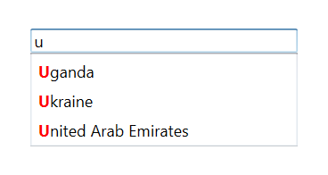
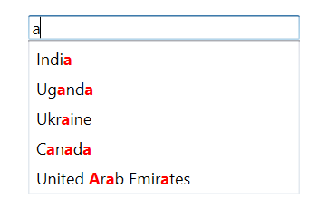

# Highlighting matched text

You can highlight matching characters in a suggestion list to pick an item with more clarity using [TextHighlightMode](https://help.syncfusion.com/cr/wpf/Syncfusion.SfInput.Wpf~Syncfusion.Windows.Controls.Input.SfTextBoxExt~TextHighlightModeProperty.html) property. The default value of TextHightlightMode is None. The matching text can be highlighted in the following two ways:

* First occurrence
* Multiple occurrence

The text highlight can be indicated with customizing style by enabling the following property:

* `HighlightedTextColor`: Sets the color of the highlighted text for differentiating the highlighted characters.

## First occurrence

It highlights the first position of the matching characters in the suggestion list.





<Window x:Class="AutoCompleteSample.MainWindow"
        xmlns="http://schemas.microsoft.com/winfx/2006/xaml/presentation"
        xmlns:x="http://schemas.microsoft.com/winfx/2006/xaml"
        xmlns:d="http://schemas.microsoft.com/expression/blend/2008"
        xmlns:mc="http://schemas.openxmlformats.org/markup-compatibility/2006"
        xmlns:local="clr-namespace:AutoCompleteSample"
        mc:Ignorable="d"
        xmlns:editors="clr-namespace:Syncfusion.Windows.Controls.Input;assembly=Syncfusion.SfInput.Wpf"
        Title="MainWindow" Height="450" Width="800">
    <Window.Content>
        <editors:SfTextBoxExt x:Name="textBoxExt" 
                              HorizontalAlignment="Center" 
                              VerticalAlignment="Center" 
                              AutoCompleteMode="Suggest"
                              SuggestionMode="StartsWith"
                              HighlightedTextColor="Red"
                              TextHighlightMode="FirstOccurrence"
                              Width="200">
            <editors:SfTextBoxExt.AutoCompleteSource>
                <x:Array Type="sys:String" 
             xmlns:sys="clr-namespace:System;assembly=mscorlib">
                    <sys:String>India</sys:String>
                    <sys:String>Uganda</sys:String>
                    <sys:String>Ukraine</sys:String>
                    <sys:String>Canada</sys:String>
                    <sys:String>United Arab Emirates</sys:String>
                </x:Array>
            </editors:SfTextBoxExt.AutoCompleteSource>
        </editors:SfTextBoxExt>
    </Window.Content>
</Window>





using Syncfusion.Windows.Controls.Input;
using System.Collections.Generic;
using System.Windows;
using System.Windows.Media;

namespace AutoCompleteSample
{
    /// 

    /// Interaction logic for MainWindow.xaml
    /// 

    public partial class MainWindow : Window
    {
        public MainWindow()
        {
            InitializeComponent();
            SfTextBoxExt textBoxExt = new SfTextBoxExt()
            {
                HorizontalAlignment = HorizontalAlignment.Center,
                VerticalAlignment = VerticalAlignment.Center,
                Width = 200,
                AutoCompleteMode = AutoCompleteMode.Suggest,
                SuggestionMode = SuggestionMode.StartsWith,
                TextHighlightMode = OccurrenceMode.FirstOccurrence,
                HighlightedTextColor = new SolidColorBrush(Colors.Red)
            };

            List<string> list = new List<string>()
            {
                 "India",
                 "Uganda",
                 "Ukraine",
                 "Canada",
                 "United Arab Emirates"
            };

            textBoxExt.AutoCompleteSource = list;
            this.Content = textBoxExt;
        }
    }
}





## Multiple occurrence

It highlights the matching character that presents everywhere in the suggestion list for Contains case in SuggestionMode.





<Window x:Class="AutoCompleteSample.MainWindow"
        xmlns="http://schemas.microsoft.com/winfx/2006/xaml/presentation"
        xmlns:x="http://schemas.microsoft.com/winfx/2006/xaml"
        xmlns:d="http://schemas.microsoft.com/expression/blend/2008"
        xmlns:mc="http://schemas.openxmlformats.org/markup-compatibility/2006"
        xmlns:local="clr-namespace:AutoCompleteSample"
        mc:Ignorable="d"
        xmlns:editors="clr-namespace:Syncfusion.Windows.Controls.Input;assembly=Syncfusion.SfInput.Wpf"
        Title="MainWindow" Height="450" Width="800">
    <Window.Content>
        <editors:SfTextBoxExt x:Name="textBoxExt" 
                              HorizontalAlignment="Center" 
                              VerticalAlignment="Center" 
                              AutoCompleteMode="Suggest"
                              SuggestionMode="Contains"
                              HighlightedTextColor="Red"
                              TextHighlightMode="MultipleOccurrence"
                              Width="200">
            <editors:SfTextBoxExt.AutoCompleteSource>
                <x:Array Type="sys:String" 
             xmlns:sys="clr-namespace:System;assembly=mscorlib">
                    <sys:String>India</sys:String>
                    <sys:String>Uganda</sys:String>
                    <sys:String>Ukraine</sys:String>
                    <sys:String>Canada</sys:String>
                    <sys:String>United Arab Emirates</sys:String>
                </x:Array>
            </editors:SfTextBoxExt.AutoCompleteSource>
        </editors:SfTextBoxExt>
    </Window.Content>
</Window>





using Syncfusion.Windows.Controls.Input;
using System.Collections.Generic;
using System.Windows;
using System.Windows.Media;

namespace AutoCompleteSample
{
    /// 

    /// Interaction logic for MainWindow.xaml
    /// 

    public partial class MainWindow : Window
    {
        public MainWindow()
        {
            InitializeComponent();
            SfTextBoxExt textBoxExt = new SfTextBoxExt()
            {
                HorizontalAlignment = HorizontalAlignment.Center,
                VerticalAlignment = VerticalAlignment.Center,
                Width = 200,
                AutoCompleteMode = AutoCompleteMode.Suggest,
                SuggestionMode = SuggestionMode.Contains,
                TextHighlightMode = OccurrenceMode.MultipleOccurrence,
                HighlightedTextColor = new SolidColorBrush(Colors.Red)
            };

            List<string> list = new List<string>()
            {
                 "India",
                 "Uganda",
                 "Ukraine",
                 "Canada",
                 "United Arab Emirates"
            };

            textBoxExt.AutoCompleteSource = list;
            this.Content = textBoxExt;
        }
    }
}




