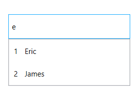

# MultiPath search in AutoComplete

Multi-path search can be achieved using the custom search feature by setting the `SuggestionMode` API as `Custom`. Users can define a custom filter and can be assigned to the `Filter` API.

**Model**



    public class Model
    {
        private int id;
        public int ID
        {
            get { return id; }
            set { id = value; }
        }
        private string name;
        public string Name
        {
            get { return name; }
            set { name = value; }
        }
    }
	


**ViewModel**



    public class ViewModel
    {
        public ICommand AutoCompleteLoaded
        {
            get;
            private set;
        }

        private ObservableCollection<Model> employeeCollection;
        public ObservableCollection<Model> EmployeeCollection
        {
            get { return employeeCollection; }
            set { employeeCollection = value; }
        }
        public ViewModel()
        {
            AutoCompleteLoaded = new DelegateCommand(AutoCompleteLoadedMethod);
            employeeCollection = new ObservableCollection<Model>();
            employeeCollection.Add(new Model() { ID = 1, Name = "Eric" });
            employeeCollection.Add(new Model() { ID = 2, Name = "James" });
            employeeCollection.Add(new Model() { ID = 3, Name = "Jacob" });
            employeeCollection.Add(new Model() { ID = 4, Name = "Lucas" });
            employeeCollection.Add(new Model() { ID = 5, Name = "Mark" });
            employeeCollection.Add(new Model() { ID = 6, Name = "Aldan" });
            employeeCollection.Add(new Model() { ID = 7, Name = "Aldrin" });
            employeeCollection.Add(new Model() { ID = 8, Name = "Alan" });
            employeeCollection.Add(new Model() { ID = 9, Name = "Aaron" });
        }
        private void AutoCompleteLoadedMethod(object obj)
        {
            var autocomplete = obj as SfTextBoxExt;
            if (autocomplete != null)
            {
                autocomplete.Filter = CustomFilter;
            }
        }
        public bool CustomFilter(string search, object item)
        {
            var model = item as Model;
            if (model != null)
            {
                if ((model.Name.ToLower().Contains(search.ToLower())) || ((model.ID).ToString().ToLower().Contains(search.ToLower())))
                {
                    return true;
                }
            }
            return false;
        }
    }
	






    <Window.DataContext>
        <local:ViewModel />
    </Window.DataContext>
    <StackPanel Margin="10" VerticalAlignment="Center">
        <editors:SfTextBoxExt
            x:Name="autoComplete1"
            Width="200"
            Height="40"
            HorizontalAlignment="Center"
            VerticalAlignment="Center"
            AutoCompleteMode="Suggest"
            AutoCompleteSource="{Binding EmployeeCollection}"
            SearchItemPath="Name"
            SuggestionMode="Custom">
            <editors:SfTextBoxExt.AutoCompleteItemTemplate>
                <DataTemplate>
                    <Grid HorizontalAlignment="Stretch">
                        <Grid.ColumnDefinitions>
                            <ColumnDefinition Width="20" />
                            <ColumnDefinition Width="Auto" />
                        </Grid.ColumnDefinitions>
                        <TextBlock
                            Grid.Column="0"
                            Padding="2,8,0,8"
                            VerticalAlignment="Center"
                            FontFamily="SegoeUI"
                            FontSize="12"
                            FontWeight="Normal"
                            Text="{Binding ID}" />
                        <TextBlock
                            Grid.Column="1"
                            Padding="10,8,0,8"
                            VerticalAlignment="Center"
                            FontFamily="SegoeUI"
                            FontSize="12"
                            FontWeight="Normal"
                            Text="{Binding Name}" />
                    </Grid>
                </DataTemplate>
            </editors:SfTextBoxExt.AutoCompleteItemTemplate>
            <interaction:Interaction.Triggers>
                <interaction:EventTrigger EventName="Loaded">
                    <interaction:InvokeCommandAction Command="{Binding AutoCompleteLoaded}" CommandParameter="{Binding ElementName=autoComplete1}" />
                </interaction:EventTrigger>
            </interaction:Interaction.Triggers>
        </editors:SfTextBoxExt>
    </StackPanel>





            ViewModel viewModel = new ViewModel();
            this.DataContext = viewModel;
            StackPanel stackPanel = new StackPanel()
            {
                Margin = new Thickness(10),
                VerticalAlignment = VerticalAlignment.Center
            };

            SfTextBoxExt autoComplete = new SfTextBoxExt()
            {
                Width = 200,
                Height = 40,
                HorizontalAlignment = HorizontalAlignment.Center,
                VerticalAlignment = VerticalAlignment.Center,
                AutoCompleteMode = AutoCompleteMode.Suggest,
                AutoCompleteSource = viewModel.EmployeeCollection,
                Filter= viewModel.CustomFilter,
                SearchItemPath = "Name",
                SuggestionMode = SuggestionMode.Custom
            };

            FrameworkElementFactory grid = new FrameworkElementFactory(typeof(Grid));
            grid.SetValue(Grid.HorizontalAlignmentProperty, HorizontalAlignment.Stretch);

            FrameworkElementFactory firstColumn = new FrameworkElementFactory(typeof(ColumnDefinition));
            firstColumn.SetValue(ColumnDefinition.WidthProperty, new GridLength(20.0));

            FrameworkElementFactory secondColumn = new FrameworkElementFactory(typeof(ColumnDefinition));
            secondColumn.SetValue(ColumnDefinition.WidthProperty, new GridLength(0.0, GridUnitType.Auto));

            FrameworkElementFactory textBlockID = new FrameworkElementFactory(typeof(TextBlock));
            textBlockID.SetValue(TextBlock.PaddingProperty,new Thickness(2, 8, 0, 8));
            textBlockID.SetValue(Grid.ColumnProperty, 0);
            textBlockID.SetValue(TextBlock.VerticalAlignmentProperty, VerticalAlignment.Center);
            textBlockID.SetValue(TextBlock.FontSizeProperty, 12.0);
            textBlockID.SetValue(TextBlock.FontFamilyProperty,new FontFamily("SegoeUI"));
            textBlockID.SetValue(TextBlock.FontWeightProperty, FontWeights.Normal);
            textBlockID.SetBinding(TextBlock.TextProperty, new Binding("ID"));

            FrameworkElementFactory textBlockName = new FrameworkElementFactory(typeof(TextBlock));
            textBlockName.SetValue(TextBlock.PaddingProperty, new Thickness(20,8,0,8));
            textBlockName.SetValue(Grid.ColumnProperty, 1);
            textBlockName.SetValue(TextBlock.VerticalAlignmentProperty, VerticalAlignment.Center);
            textBlockName.SetValue(TextBlock.FontSizeProperty, 12.0);
            textBlockName.SetValue(TextBlock.FontFamilyProperty, new FontFamily("SegoeUI"));
            textBlockName.SetValue(TextBlock.FontWeightProperty, FontWeights.Normal);
            textBlockName.SetValue(TextBlock.TextProperty, new Binding("Name"));

            grid.AppendChild(textBlockID);
            grid.AppendChild(textBlockName);
            DataTemplate template = new DataTemplate { VisualTree = grid };
            autoComplete.AutoCompleteItemTemplate = template;
            stackPanel.Children.Add(autoComplete);
            this.Content = stackPanel;





**Search the items with ID:**

**Search the items with Name:**

N> View [sample](https://github.com/SyncfusionExamples/wpf-textboxext-examples/tree/master/Samples/Multipath_Search) in GitHub.
