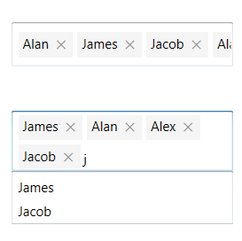
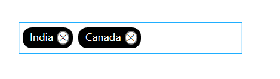
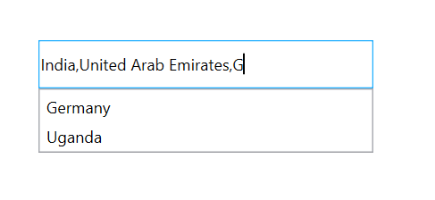

## Multiple selection in WPF AutoComplete (SfTextBoxExt)

Select the multiple items from a suggestion list using the [MultiSelectMode](https://help.syncfusion.com/cr/cref_files/wpf/Syncfusion.SfInput.Wpf~Syncfusion.Windows.Controls.Input.SfTextBoxExt~MultiSelectMode.html) property. There are two ways to perform multi-selection in autocomplete. The default value of MultiSelectMode is None.

* Token Representation

* Delimiter

## Token Representation

Selected items will be displayed with a customizable token representation and the users can remove each tokenized item with the close button.

### Wrap mode of token

The selected items can be displayed as token inside the SfAutoComplete in two ways:

* `Wrap` - When [TokensWrapMode](https://help.syncfusion.com/cr/cref_files/wpf/Syncfusion.SfInput.Wpf~Syncfusion.Windows.Controls.Input.SfTextBoxExt~TokensWrapMode.html) is set to `Wrap`, the selected items will be wrapped to the next line of the SfAutoComplete.

* `None` - When [TokensWrapMode](https://help.syncfusion.com/cr/cref_files/wpf/Syncfusion.SfInput.Wpf~Syncfusion.Windows.Controls.Input.SfTextBoxExt~TokensWrapMode.html) is set to `None`, the selected items will be wrapped in horizontal orientation.





<Window x:Class="Demo_Sample.Token"
        xmlns="http://schemas.microsoft.com/winfx/2006/xaml/presentation"
        xmlns:x="http://schemas.microsoft.com/winfx/2006/xaml"
        xmlns:d="http://schemas.microsoft.com/expression/blend/2008"
        xmlns:editors="clr-namespace:Syncfusion.Windows.Controls.Input;assembly=Syncfusion.SfInput.Wpf"
        xmlns:mc="http://schemas.openxmlformats.org/markup-compatibility/2006"
        xmlns:local="clr-namespace:Demo_Sample"
        mc:Ignorable="d"
        Title="Token" Height="450" Width="800">
    <StackPanel VerticalAlignment="Center">
            <TextBlock Text="None:"/>
            <editors:SfTextBoxExt HorizontalAlignment="Left" 
                                  x:Name="autoComplete1" 
                                  MultiSelectMode="Token"
                                  TokensWrapMode="None"
                                  AutoCompleteMode="Suggest"
                                  VerticalAlignment="Center"
                                  Height="40" Width="200"/>

            <TextBlock Text="Wrap:"/>
            <editors:SfTextBoxExt HorizontalAlignment="Left" 
                                  x:Name="autoComplete2" 
                                  MultiSelectMode="Token"
                                  TokensWrapMode="Wrap"
                                  AutoCompleteMode="Suggest"
                                  VerticalAlignment="Center"
                                  Height="40" Width="200"/>
    </StackPanel>
</Window>





using Syncfusion.Windows.Controls.Input;
using System.Collections.Generic;
using System.Windows;

namespace Demo_Sample
{
    /// 

    /// Interaction logic for Token.xaml
    /// 

    public partial class Token : Window
    {
        public Token()
        {
            InitializeComponent();
            List<string> list = new List<string>()
            {
                    "Lucas",
                    "James",
                    "Jacob",
                    "Alan",
                    "Alex",
            };

            autoComplete1.AutoCompleteSource = list;
            autoComplete2.AutoCompleteSource = list;
        }
    }
}




Get the sample from [this](https://www.syncfusion.com/downloads/support/directtrac/general/ze/ImageMemberPath-2093350688) link.

## Customization of Tokens

Using styles override we can customize the tokens.

Please find the code snippet for the Customization of Tokens.





<Window x:Class="AutoComplete_WPF.MainWindow"
        xmlns="http://schemas.microsoft.com/winfx/2006/xaml/presentation"
        xmlns:x="http://schemas.microsoft.com/winfx/2006/xaml"
        xmlns:d="http://schemas.microsoft.com/expression/blend/2008"
        xmlns:mc="http://schemas.openxmlformats.org/markup-compatibility/2006"
        xmlns:local="clr-namespace:AutoComplete_WPF"
        xmlns:editors="clr-namespace:Syncfusion.Windows.Controls.Input;assembly=Syncfusion.SfInput.Wpf" mc:Ignorable="d"
        Title="MainWindow" Height="450" Width="800">
      <Window.Resources>
        
                                    </Button.Resources>
                                </Button>
                            </Grid>
                        </Border>
                    </ControlTemplate>
                </Setter.Value>
            </Setter>
        </Style>
    </Window.Resources>
    <editors:SfTextBoxExt AutoCompleteMode="Suggest"
                          x:Name="autocomplete"
                                  SuggestionMode="Contains"
                                  Height="36"
                                  Width="250"
                                  MultiSelectMode="Token"
                                  VerticalAlignment="Center" 
                          VerticalContentAlignment="Center">
        <editors:SfTextBoxExt.AutoCompleteSource>
            <x:Array Type="sys:String" 
             xmlns:sys="clr-namespace:System;assembly=mscorlib">
                <sys:String>India</sys:String>
                <sys:String>America</sys:String>
                <sys:String>Africa</sys:String>
                <sys:String>Germany</sys:String>
                <sys:String>Uganda</sys:String>
                <sys:String>Ukraine</sys:String>
                <sys:String>Canada</sys:String>
                <sys:String>United Arab Emirates</sys:String>
            </x:Array>
        </editors:SfTextBoxExt.AutoCompleteSource>
    </editors:SfTextBoxExt>
</Window>





using Syncfusion.Windows.Controls.Input;
using System.Collections.Generic;
using System.Windows;

namespace Demo_Sample
{
    /// 

    /// Interaction logic for Token.xaml
    /// 

    public partial class Token : Window
    {
        public Token()
        {
            InitializeComponent();
            SfTextBoxExt textBoxExt = new SfTextBoxExt();          
            textBoxExt.VerticalAlignment = VerticalAlignment.Center;
            textBoxExt.Width = 200;
            textBoxExt.Height = 40;
            textBoxExt.AutoCompleteMode = AutoCompleteMode.Suggest;
            textBoxExt.SuggestionMode = SuggestionMode.Contains;
            textBoxExt.MultiSelectMode = MultiSelectMode.Token;
          
            List<string> list = new List<string>()
            {
                    "India",
                    "America",
                    "Africa",
                    "Germany",
                    "Uganda",
                    "Ukraine",
                    "Canada",
                    "United Arab Emirates",
            };

            textBoxExt.AutoCompleteSource = list;
        }
    }
}




Get the sample from [this](https://www.syncfusion.com/downloads/support/directtrac/general/ze/Token_Customization112174222) link.

## Delimiter

When selecting the multiple items, the selected items can be divided with a desired character given for a delimiter. You can set delimiter character with the [Delimiter](https://help.syncfusion.com/cr/cref_files/wpf/Syncfusion.SfInput.Wpf~Syncfusion.Windows.Controls.Input.SfTextBoxExt~Delimiter.html) property.





<Window x:Class="AutoComplete_WPF.MainWindow"
        xmlns="http://schemas.microsoft.com/winfx/2006/xaml/presentation"
        xmlns:x="http://schemas.microsoft.com/winfx/2006/xaml"
        xmlns:d="http://schemas.microsoft.com/expression/blend/2008"
        xmlns:mc="http://schemas.openxmlformats.org/markup-compatibility/2006"
        xmlns:local="clr-namespace:AutoComplete_WPF"
        xmlns:editors="clr-namespace:Syncfusion.Windows.Controls.Input;assembly=Syncfusion.SfInput.Wpf" mc:Ignorable="d"
        Title="MainWindow" Height="450" Width="800">
    <editors:SfTextBoxExt AutoCompleteMode="Suggest"
                                  SuggestionMode="Contains"
                                  Height="36"
                                  Width="250"
                                  MultiSelectMode="Delimiter"
                                  VerticalAlignment="Center" 
                                  VerticalContentAlignment="Center">
        <editors:SfTextBoxExt.AutoCompleteSource>
            <x:Array Type="sys:String" 
             xmlns:sys="clr-namespace:System;assembly=mscorlib">
                <sys:String>India</sys:String>
                <sys:String>America</sys:String>
                <sys:String>Africa</sys:String>
                <sys:String>Germany</sys:String>
                <sys:String>Uganda</sys:String>
                <sys:String>Ukraine</sys:String>
                <sys:String>Canada</sys:String>
                <sys:String>United Arab Emirates</sys:String>
            </x:Array>
        </editors:SfTextBoxExt.AutoCompleteSource>
    </editors:SfTextBoxExt>
</Window>





using Syncfusion.Windows.Controls.Input;
using System.Collections.Generic;
using System.Windows;

namespace Demo_Sample
{
    /// 

    /// Interaction logic for Token.xaml
    /// 

    public partial class Token : Window
    {
        public Token()
        {
            InitializeComponent();
            SfTextBoxExt textBoxExt = new SfTextBoxExt();          
            textBoxExt.VerticalAlignment = VerticalAlignment.Center;
            textBoxExt.Width = 200;
            textBoxExt.Height = 40;
            textBoxExt.AutoCompleteMode = AutoCompleteMode.Suggest;
            textBoxExt.SuggestionMode = SuggestionMode.Contains;
            textBoxExt.MultiSelectMode = MultiSelectMode.Delimiter;
          
            List<string> list = new List<string>()
            {
                    "India",
                    "America",
                    "Africa",
                    "Germany",
                    "Uganda",
                    "Ukraine",
                    "Canada",
                    "United Arab Emirates",
            };

            textBoxExt.AutoCompleteSource = list;
        }
    }
}




Get the sample from [this](https://www.syncfusion.com/downloads/support/directtrac/general/ze/Delimiter_WPF-520539446) link.
