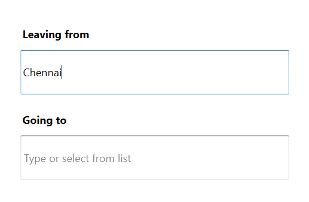

# WPF SfTextBoxExt (SfAutoComplete) Overview.

TextBoxExt is an extended version of the TextBox control. Most of the functionality of TextBoxExt is inherited from the [SfTextBox](http://msdn.microsoft.com/en-us/library/windows/apps/windows.ui.xaml.controls.textbox) class.

### Key features

* **Auto Complete modes**: The control provides suggestions to users based on a predefined collection while typing.
* **Watermark**: The control will prompt the users with some information when it is not in focus and contains an empty string.
* **Filtering suggestion items**: Suggestions can be filtered in 18 different modes like StartsWith, EndWith, Contains, Equals, and Custom. AutoComplete provides both case sensitive and insensitive modes.
* **Popup delay**: The filtering process can be delayed. Displaying filtered suggestions from a drop-down list may also be delayed for a period of time.
* **Minimum prefix characters**: Instead of displaying suggestion list on every character entry, matches can be filtered and displayed after a few character entries.
* **Customize Entry**: AutoComplete provides options to customize the Entry using Font, FontSize, FontFamily.
* **Customize SuggestionBox**: AutoComplete provides options to customize the dropdown list.
* **Diacritic Sense**: The control provides populating the items from a language with letters containing diacritics, and search for them with English characters from an en-US keyboard.
* **Highlighting Text**: The control provides highlighting the matching text in the Suggestion list based on the input given in it.
* **Custom filter**: AutoComplete provides the users to filter the item in the Suggestion list based on their filtering condition.
* **Multi Selection Support**: Selecting multiple items from a suggestion list.
* **SuggestionBox adjustment**: Adjust the position of popup relative to the control.
* **EnableAutoSize**: AutoSizing can be enabled in AutoComplete control so that the control will extend its layout based on the token size.
* **AutoComplete template**: We can set our own template.
* **NoResultsFoundTemplate**: We can set the desire text, if the typing item is doesn't exist in the collection.
* **Retrieving the selection**: We can retrieving the selected item, index, value. 