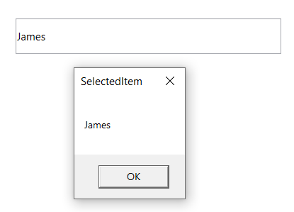
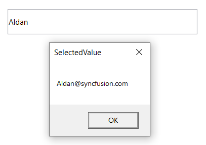
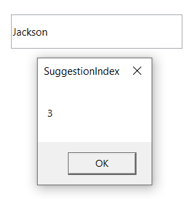

# Single and multiple selection 

Selection for the control depends on the [MultiSelectMode](https://help.syncfusion.com/cr/cref_files/wpf/Syncfusion.SfInput.Wpf~Syncfusion.Windows.Controls.Input.SfTextBoxExt~MultiSelectMode.html) property. There are two ways to perform multi-selection in autocomplete. The default value of [MultiSelectMode](https://help.syncfusion.com/cr/cref_files/wpf/Syncfusion.SfInput.Wpf~Syncfusion.Windows.Controls.Input.SfTextBoxExt~MultiSelectMode.html) is None.

* None

* Token 

* Delimiter

## Multiple selection using tokens 

Selected items will be displayed with a customizable token representation and it can be remove each tokenized item with the close button.

The selected items can be displayed as token inside the AutoComplete in two ways:

* `Wrap` - When [TokensWrapMode](https://help.syncfusion.com/cr/cref_files/wpf/Syncfusion.SfInput.Wpf~Syncfusion.Windows.Controls.Input.SfTextBoxExt~TokensWrapMode.html) is set to `Wrap`, the selected items will be wrapped to the next line of the Autocomplete.

* `None` - When [TokensWrapMode](https://help.syncfusion.com/cr/cref_files/wpf/Syncfusion.SfInput.Wpf~Syncfusion.Windows.Controls.Input.SfTextBoxExt~TokensWrapMode.html) is set to `None`, the selected items will be arranged in horizontal orientation.





<editors:SfTextBoxExt HorizontalAlignment="Left"
                      AutoCompleteMode="Suggest"
                      SearchItemPath="Name"
                      MultiSelectMode="Token"
                      Height="40"
                      AutoCompleteSource="{Binding Employees}"
                      VerticalAlignment="Center"
                      Width="200"/>




textBoxExt.MultiSelectMode = MultiSelectMode.Token;





### Customization of Tokens

Override the style of the token used for customization. 





      <Window.Resources>
        
                                    </Button.Resources>
                                </Button>
                            </Grid>
                        </Border>
                    </ControlTemplate>
                </Setter.Value>
            </Setter>
        </Style>
    </Window.Resources>
        <editors:SfTextBoxExt HorizontalAlignment="Left"
                                  AutoCompleteMode="Suggest"
                                  SearchItemPath="Name"
                                  MultiSelectMode="Token" 
                                  Height="40"
                                  AutoCompleteSource="{Binding Employees}"
                                  VerticalAlignment="Center"
                                  Width="200"/>
     




### Enable autosize in token mode 

Auto sizing can be enabled in AutoComplete control so that the control will extend its layout based on the tokens size in wrap mode.

[EnableAutoSize](https://help.syncfusion.com/cr/cref_files/wpf/Syncfusion.SfInput.Wpf~Syncfusion.Windows.Controls.Input.SfTextBoxExt~EnableAutoSize.html) property is used to enable the Auto sizing in AutoComplete control. To enable the API, need to set the [MultiSelectMode](https://help.syncfusion.com/cr/cref_files/wpf/Syncfusion.SfInput.Wpf~Syncfusion.Windows.Controls.Input.SfTextBoxExt~MultiSelectMode.html) as Token and [TokensWrapMode](https://help.syncfusion.com/cr/cref_files/wpf/Syncfusion.SfInput.Wpf~Syncfusion.Windows.Controls.Input.SfTextBoxExt~TokensWrapMode.html) as Wrap and the control height should not be provided. The default value of [EnableAutoSize](https://help.syncfusion.com/cr/cref_files/wpf/Syncfusion.SfInput.Wpf~Syncfusion.Windows.Controls.Input.SfTextBoxExt~EnableAutoSize.html) is false.





<editors:SfTextBoxExt HorizontalAlignment="Left"
                      AutoCompleteMode="Suggest"
                      SearchItemPath="Name"
                      MultiSelectMode="Token" 
                      TokensWrapMode="Wrap"
                      EnableAutoSize="True"
                      AutoCompleteSource="{Binding Employees}"
                      VerticalAlignment="Center"
                      Width="200"/>




textBoxExt.MultiSelectMode = MultiSelectMode.Token;
textBoxExt.TokensWrapMode = TokensWrapMode.Wrap;
textBoxExt.EnableAutoSize = true;





See also [Multiple selection using tokens ](https://help.syncfusion.com/wpf/autocomplete/single-and-multiple-selection#multiple-selection-using-tokens) topic in AutoComplete.

## Multiple selection using delimiter 

When selecting the multiple items, the selected items can be divided with a desired character given for a Delimiter. Delimiter character can be set with the [Delimiter](https://help.syncfusion.com/cr/cref_files/wpf/Syncfusion.SfInput.Wpf~Syncfusion.Windows.Controls.Input.SfTextBoxExt~Delimiter.html) property. To enable the Delimiter mode, you need to set the [MultiSelectMode](https://help.syncfusion.com/cr/cref_files/wpf/Syncfusion.SfInput.Wpf~Syncfusion.Windows.Controls.Input.SfTextBoxExt~MultiSelectMode.html) as Delimiter. The default value of Delimiter is comma.





<editors:SfTextBoxExt HorizontalAlignment="Center" 
                      VerticalAlignment="Center" 
                      Width="300"
                      Height="40"
                      MultiSelectMode="Delimiter"
                      SearchItemPath="Name"
                      AutoCompleteMode="Suggest"
                      AutoCompleteSource="{Binding Employees}" />




textBoxExt.MultiSelectMode = MultiSelectMode.Delimiter;





## Setting and retrieving SelectedItem 

The [SelectedItem](https://help.syncfusion.com/cr/cref_files/wpf/Syncfusion.SfInput.Wpf~Syncfusion.Windows.Controls.Input.SfTextBoxExt~SelectedItem.html) property is used to select a particular item from the suggestion list. [SelectedItem](https://help.syncfusion.com/cr/cref_files/wpf/Syncfusion.SfInput.Wpf~Syncfusion.Windows.Controls.Input.SfTextBoxExt~SelectedItem.html) property hold the selected item value for single selection. For multi selection the selected items value hold in [SelectedItems](https://help.syncfusion.com/cr/cref_files/wpf/Syncfusion.SfInput.Wpf~Syncfusion.Windows.Controls.Input.SfTextBoxExt~SelectedItems.html) property.

The following code snippet demonstrates how to set [SelectedItem](https://help.syncfusion.com/cr/cref_files/wpf/Syncfusion.SfInput.Wpf~Syncfusion.Windows.Controls.Input.SfTextBoxExt~SelectedItem.html).

Model Class:




public class Employee
{
        string name;
        string email;

        public string Name
        {
            get { return name; }
            set { name = value; }
        }

        public string Email
        {
            get { return email; }
            set { email = value; }
        }
}




In EmployeeViewModel class the [SelectedItem](https://help.syncfusion.com/cr/cref_files/wpf/Syncfusion.SfInput.Wpf~Syncfusion.Windows.Controls.Input.SfTextBoxExt~SelectedItem.html) updated initially from the Employees collection. 




public class EmployeeViewModel
{
        private List<Employee> employees;
        public List<Employee> Employees
        {
            get { return employees; }

            set { employees = value; }
        }

        private object selectedItem;
        public object SelectedItem
        {
            get { return selectedItem; }

            set { selectedItem = value; }
        }

        public EmployeeViewModel()
        {
            Employees = new List<Employee>();
            Employees.Add(new Employee() { Name = "Eric", Email = "Eric@syncfusion.com" });
            Employees.Add(new Employee() { Name = "James", Email = "James@syncfusion.com" });
            Employees.Add(new Employee() { Name = "Jacob", Email = "Jacob@syncfusion.com" });
            Employees.Add(new Employee() { Name = "Jackson", Email = "Jackson@syncfusion.com" });
            Employees.Add(new Employee() { Name = "Lucas", Email = "Lucas@syncfusion.com" });
            SelectedItem = Employees[0];
        }
}









<editors:SfTextBoxExt HorizontalAlignment="Center"                                
                      x:Name="autoComplete"
                      MaxDropDownHeight="100"
                      MultiSelectMode="None"  
                      AutoCompleteMode="Suggest"                                                          
                      SearchItemPath="Name"
                      SelectedItem="{Binding SelectedItem}"
                      AutoCompleteSource="{Binding Employees}"
                      VerticalAlignment="Center"                 
                      Height="40" 
                      Width="200"/>





The following code snippet demonstrates how to get [SelectedItem](https://help.syncfusion.com/cr/cref_files/wpf/Syncfusion.SfInput.Wpf~Syncfusion.Windows.Controls.Input.SfTextBoxExt~SelectedItem.html).





private void TextBoxExt_SelectedItemChanged(DependencyObject d, DependencyPropertyChangedEventArgs e)
{
         SfTextBoxExt textBoxExt = d as SfTextBoxExt;
         string selectedItem = "";
         if (textBoxExt.SelectedItem != null)
         {
            selectedItem =((textBoxExt.SelectedItem as Employee).Name).ToString();
         }

         MessageBox.Show(selectedItem, "SelectedItem", MessageBoxButton.OK, MessageBoxImage.None);
}





The following code snippet demonstrates how to set [SelectedItems](https://help.syncfusion.com/cr/cref_files/wpf/Syncfusion.SfInput.Wpf~Syncfusion.Windows.Controls.Input.SfTextBoxExt~SelectedItems.html).

Model Class:




public class Employee
{
        string name;
        string email;

        public string Name
        {
            get { return name; }
            set { name = value; }
        }

        public string Email
        {
            get { return email; }
            set { email = value; }
        }
}




In EmployeeViewModel class the [SelectedItems](https://help.syncfusion.com/cr/cref_files/wpf/Syncfusion.SfInput.Wpf~Syncfusion.Windows.Controls.Input.SfTextBoxExt~SelectedItems.html) updated initially from the Employees collection. 




public class EmployeeViewModel
{
        private List<Employee> employees;
        public List<Employee> Employees
        {
            get { return employees; }

            set { employees = value; }
        }

        private List<object> selectedItems;
        public List<object> SelectedItems
        {
            get { return selectedItems; }

            set { selectedItems = value; }
        }

        public EmployeeViewModel()
        {
            Employees = new List<Employee>();
            SelectedItems = new List<object>();
            Employees.Add(new Employee() { Name = "Eric", Email = "Eric@syncfusion.com" });
            Employees.Add(new Employee() { Name = "James", Email = "James@syncfusion.com" });
            Employees.Add(new Employee() { Name = "Jacob", Email = "Jacob@syncfusion.com" });
            Employees.Add(new Employee() { Name = "Jackson", Email = "Jackson@syncfusion.com" });
            Employees.Add(new Employee() { Name = "Lucas", Email = "Lucas@syncfusion.com" });
            SelectedItems.Add(Employees[2]);
            SelectedItems.Add(Employees[0]);
            SelectedItems.Add(Employees[1]);
        }
}









<editors:SfTextBoxExt HorizontalAlignment="Center"                                
                      x:Name="autoComplete"
                      MaxDropDownHeight="100"
                      MultiSelectMode="Token"  
                      AutoCompleteMode="Suggest"                                                          
                      SearchItemPath="Name"
                      SelectedItems="{Binding SelectedItems}"
                      AutoCompleteSource="{Binding Employees}"
                      VerticalAlignment="Center"                 
                      Height="40" 
                      Width="200"/>





### Retrieving SelectedValue 

The [SelectedValue](https://help.syncfusion.com/cr/cref_files/wpf/Syncfusion.SfInput.Wpf~Syncfusion.Windows.Controls.Input.SfTextBoxExt~SelectedValue.html) property is used to retrieve the selected values from the suggestion list, it can be retrieved the value depends on the [ValueMemberPath](https://help.syncfusion.com/cr/cref_files/wpf/Syncfusion.SfInput.Wpf~Syncfusion.Windows.Controls.Input.SfTextBoxExt~ValueMemberPath.html) property. 





<editors:SfTextBoxExt HorizontalAlignment="Left"                                
                      x:Name="autoComplete"
                      MaxDropDownHeight="100"
                      MultiSelectMode="None"  
                      AutoCompleteMode="Suggest"                                                          
                      SearchItemPath="Name"
                      ValueMemberPath="Email"
                      AutoCompleteSource="{Binding Employees}"
                      VerticalAlignment="Center"                                                      
                      SelectedItemChanged="AutoComplete_SelectedItemChanged"
                      Height="40" 
                      Width="200"/>





private void AutoComplete_SelectedItemChanged(DependencyObject d, DependencyPropertyChangedEventArgs e)
{
       SfTextBoxExt textBoxExt = d as SfTextBoxExt;
       if (textBoxExt.SelectedValue != null)
       {
          MessageBox.Show(textBoxExt.SelectedValue.ToString(), "SelectedValue", MessageBoxButton.OK, MessageBoxImage.None);
       }
}





### Retrieving SuggestionIndex

When an item is selected from suggestion list, their index can be retrieved using the [SuggestionIndex](https://help.syncfusion.com/cr/cref_files/wpf/Syncfusion.SfInput.Wpf~Syncfusion.Windows.Controls.Input.SfTextBoxExt~SuggestionIndex.html) property.

The [SuggestionIndex](https://help.syncfusion.com/cr/cref_files/wpf/Syncfusion.SfInput.Wpf~Syncfusion.Windows.Controls.Input.SfTextBoxExt~SuggestionIndex.html) property, holds the index of selected items in suggestion list.

The following code example demonstrates how to retrieve [SuggestionIndex](https://help.syncfusion.com/cr/cref_files/wpf/Syncfusion.SfInput.Wpf~Syncfusion.Windows.Controls.Input.SfTextBoxExt~SuggestionIndex.html).





<editors:SfTextBoxExt HorizontalAlignment="Left"                                
                      x:Name="autoComplete"
                      MaxDropDownHeight="100"
                      MultiSelectMode="None"  
                      AutoCompleteMode="Suggest"                                                          
                      SearchItemPath="Name"
                      ValueMemberPath="Email"
                      AutoCompleteSource="{Binding Employees}"
                      VerticalAlignment="Center"                                                      
                      SelectedItemChanged="AutoComplete_SelectedItemChanged"
                      Height="40" 
                      Width="200"/>





private void AutoComplete_SelectedItemChanged(DependencyObject d, DependencyPropertyChangedEventArgs e)
{
        string suggestionIndex = "";
        suggestionIndex = ((d as SfTextBoxExt).SuggestionIndex).ToString();
        MessageBoxResult messageBoxResult = MessageBox.Show(suggestionIndex, "SuggestionIndex");
}





## Displaying images 

This feature allows to provide the path for the image to be displayed in the text box control using the [ImageMemberPath](https://help.syncfusion.com/cr/cref_files/wpf/Syncfusion.SfInput.Wpf~Syncfusion.Windows.Controls.Input.SfTextBoxExt~ImageMemberPath.html) property.

For further details, refer to [Showing image in token and dropdown](https://help.syncfusion.com/wpf/autocomplete/autocomplete-and-filtering#showing-image-in-token-and-dropdown).

N> View [sample](https://github.com/SyncfusionExamples/wpf-textboxext-examples/tree/master/Samples/Single-and-multiple-selection) in GitHub
