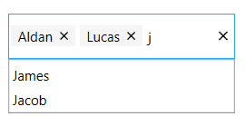

# Single and Multiple Selection in WPF Autocomplete (SfTextBoxExt)

In AutoComplete, selection can be managed using either single or multi-selection modes. This is controlled by the [MultiSelectMode](https://help.syncfusion.com/cr/wpf/Syncfusion.Windows.Controls.Input.SfTextBoxExt.html#Syncfusion_Windows_Controls_Input_SfTextBoxExt_MultiSelectMode) property. The default value of `MultiSelectMode` is `None`, which enables single selection.

## Single Selection

Single selection is achieved by setting the [MultiSelectMode](https://help.syncfusion.com/cr/wpf/Syncfusion.Windows.Controls.Input.SfTextBoxExt.html#Syncfusion_Windows_Controls_Input_SfTextBoxExt_MultiSelectMode) property to `None`. In this mode, you can set and retrieve the selected item using the [SelectedItem](https://help.syncfusion.com/cr/wpf/Syncfusion.Windows.Controls.Input.SfTextBoxExt.html#Syncfusion_Windows_Controls_Input_SfTextBoxExt_SelectedItem) property.

## Multi-selection

For multi-selection, there are two ways to represent selections within the control:

* Token 

* Delimiter

## Multiple Selection Using Tokens

Each selected item can be displayed as a token, with a close button for each token.

In token representation, the arrangement of items is determined by the [TokensWrapMode](https://help.syncfusion.com/cr/wpf/Syncfusion.Windows.Controls.Input.SfTextBoxExt.html#Syncfusion_Windows_Controls_Input_SfTextBoxExt_TokensWrapMode) property:

* `Wrap` - Selected items wrap to the next line.
* `None` - Selected items display in a single horizontal line.

Use the [SelectedItems](https://help.syncfusion.com/cr/wpf/Syncfusion.Windows.Controls.Input.SfTextBoxExt.html#Syncfusion_Windows_Controls_Input_SfTextBoxExt_SelectedItems) property to set and retrieve items in `MultiSelectMode`.





<editors:SfTextBoxExt HorizontalAlignment="Left"
                      AutoCompleteMode="Suggest"
                      SearchItemPath="Name"
                      MultiSelectMode="Token"
                      Height="40"
                      AutoCompleteSource="{Binding Employees}"
                      VerticalAlignment="Center"
                      Width="200"/>




textBoxExt.MultiSelectMode = MultiSelectMode.Token;





### Customization of Tokens

Customize tokens by overriding the default style, targeting the `TokenItem` class.





      <Window.Resources>
        
                                    </Button.Resources>
                                </Button>
                            </Grid>
                        </Border>
                    </ControlTemplate>
                </Setter.Value>
            </Setter>
        </Style>
    </Window.Resources>
        <editors:SfTextBoxExt HorizontalAlignment="Left"
                                  AutoCompleteMode="Suggest"
                                  SearchItemPath="Name"
                                  MultiSelectMode="Token" 
                                  Height="40"
                                  AutoCompleteSource="{Binding Employees}"
                                  VerticalAlignment="Center"
                                  Width="200"/>
     




### Enable Auto-size in Token Mode

When using `Wrap` mode, enabling the [EnableAutoSize](https://help.syncfusion.com/cr/wpf/Syncfusion.Windows.Controls.Input.SfTextBoxExt.html#Syncfusion_Windows_Controls_Input_SfTextBoxExt_EnableAutoSize) property re-renders the control height based on the number of lines tokens wrap inside the control.

To use this feature, set the `MultiSelectMode` as `Token` and `TokensWrapMode` as `Wrap`. By default, this feature is disabled.





<editors:SfTextBoxExt HorizontalAlignment="Left"
                      AutoCompleteMode="Suggest"
                      SearchItemPath="Name"
                      MultiSelectMode="Token" 
                      TokensWrapMode="Wrap"
                      EnableAutoSize="True"
                      AutoCompleteSource="{Binding Employees}"
                      VerticalAlignment="Center"
                      Width="200"/>




textBoxExt.MultiSelectMode = MultiSelectMode.Token;
textBoxExt.TokensWrapMode = TokensWrapMode.Wrap;
textBoxExt.EnableAutoSize = true;





### ShowClearButton

This feature allows showing or hiding the clear button in Token mode for the AutoComplete control using the [ShowClearButton](https://help.syncfusion.com/cr/wpf/Syncfusion.Windows.Controls.Input.SfTextBoxExt.html#Syncfusion_Windows_Controls_Input_SfTextBoxExt_ShowClearButton) property.





        <editors:SfTextBoxExt
            x:Name="textBoxExt"
            Width="200"
            HorizontalAlignment="Center"
            VerticalAlignment="Center"
            AutoCompleteMode="Suggest"
            AutoCompleteSource="{Binding Employees}"
            MultiSelectMode="Token"
            SearchItemPath="Name"
            ShowClearButton="True" />





textBoxExt.ShowClearButton = true; 





> Note: The default `ShowClearButton` property value is false. It applies only when `MultiSelectMode` is `Token`.

See also the [Multiple selection using tokens](https://help.syncfusion.com/wpf/autocomplete/single-and-multiple-selection#multiple-selection-using-tokens) topic in AutoComplete.

## Multiple Selection Using Delimiter

In `Delimiter` mode, each item is separated by a character specified in the [Delimiter](https://help.syncfusion.com/cr/wpf/Syncfusion.Windows.Controls.Input.SfTextBoxExt.html#Syncfusion_Windows_Controls_Input_SfTextBoxExt_Delimiter) property. By default, items are separated by a comma (`,`).





<editors:SfTextBoxExt HorizontalAlignment="Center" 
                      VerticalAlignment="Center" 
                      Width="300"
                      Height="40"
                      MultiSelectMode="Delimiter"
                      SearchItemPath="Name"
                      AutoCompleteMode="Suggest"
                      AutoCompleteSource="{Binding Employees}" />




textBoxExt.MultiSelectMode = MultiSelectMode.Delimiter;





## Setting and Retrieving SelectedItem

The [SelectedItem](https://help.syncfusion.com/cr/wpf/Syncfusion.Windows.Controls.Input.SfTextBoxExt.html#Syncfusion_Windows_Controls_Input_SfTextBoxExt_SelectedItem) property selects or retrieves a particular item from the suggestion list. It is used for single selection when `MultiSelectMode` is `None`. For multi-selection, where `MultiSelectMode` is set to either `Token` or `Delimiter`, use the [SelectedItems](https://help.syncfusion.com/cr/wpf/Syncfusion.Windows.Controls.Input.SfTextBoxExt.html#Syncfusion_Windows_Controls_Input_SfTextBoxExt_SelectedItems) property.

The `SelectedItem` and `SelectedItems` contain custom data objects, and the item displayed in the text field can be retrieved using the `SearchItemPath` property.
### Model Class:




public class Employee
{
        string name;
        string email;

        public string Name
        {
            get { return name; }
            set { name = value; }
        }

        public string Email
        {
            get { return email; }
            set { email = value; }
        }
}




In the `EmployeeViewModel` class, the [SelectedItem](https://help.syncfusion.com/cr/wpf/Syncfusion.Windows.Controls.Input.SfTextBoxExt.html#Syncfusion_Windows_Controls_Input_SfTextBoxExt_SelectedItem) is initially updated from the Employees collection.




public class EmployeeViewModel
{
        private List<Employee> employees;
        public List<Employee> Employees
        {
            get { return employees; }

            set { employees = value; }
        }

        private object selectedItem;
        public object SelectedItem
        {
            get { return selectedItem; }

            set { selectedItem = value; }
        }

        public EmployeeViewModel()
        {
            Employees = new List<Employee>();
            Employees.Add(new Employee() { Name = "Eric", Email = "Eric@syncfusion.com" });
            Employees.Add(new Employee() { Name = "James", Email = "James@syncfusion.com" });
            Employees.Add(new Employee() { Name = "Jacob", Email = "Jacob@syncfusion.com" });
            Employees.Add(new Employee() { Name = "Jackson", Email = "Jackson@syncfusion.com" });
            Employees.Add(new Employee() { Name = "Lucas", Email = "Lucas@syncfusion.com" });
            SelectedItem = Employees[0];
        }
}









<editors:SfTextBoxExt HorizontalAlignment="Center"                                
                      x:Name="autoComplete"
                      MaxDropDownHeight="100"
                      MultiSelectMode="None"  
                      AutoCompleteMode="Suggest"                                                          
                      SearchItemPath="Name"
                      SelectedItem="{Binding SelectedItem}"
                      AutoCompleteSource="{Binding Employees}"
                      VerticalAlignment="Center"                 
                      Height="40" 
                      Width="200"/>









private void TextBoxExt_SelectedItemChanged(DependencyObject d, DependencyPropertyChangedEventArgs e)
{
         SfTextBoxExt textBoxExt = d as SfTextBoxExt;
         string selectedItem = "";
         if (textBoxExt.SelectedItem != null)
         {
            selectedItem =((textBoxExt.SelectedItem as Employee).Name).ToString();
         }

         MessageBox.Show(selectedItem, "SelectedItem", MessageBoxButton.OK, MessageBoxImage.None);
}





### Model Class:




public class Employee
{
        string name;
        string email;

        public string Name
        {
            get { return name; }
            set { name = value; }
        }

        public string Email
        {
            get { return email; }
            set { email = value; }
        }
}




In the `EmployeeViewModel` class, the [SelectedItems](https://help.syncfusion.com/cr/wpf/Syncfusion.Windows.Controls.Input.SfTextBoxExt.html#Syncfusion_Windows_Controls_Input_SfTextBoxExt_SelectedItems) is initially updated from the Employees collection.




public class EmployeeViewModel
{
        private List<Employee> employees;
        public List<Employee> Employees
        {
            get { return employees; }

            set { employees = value; }
        }

        private ObservableCollection<object> selectedItems;
        public ObservableCollection<object> SelectedItems
        {
            get { return selectedItems; }

            set { selectedItems = value; }
        }

        public EmployeeViewModel()
        {
            Employees = new List<Employee>();
            SelectedItems = new ObservableCollection<object>();
            Employees.Add(new Employee() { Name = "Eric", Email = "Eric@syncfusion.com" });
            Employees.Add(new Employee() { Name = "James", Email = "James@syncfusion.com" });
            Employees.Add(new Employee() { Name = "Jacob", Email = "Jacob@syncfusion.com" });
            Employees.Add(new Employee() { Name = "Jackson", Email = "Jackson@syncfusion.com" });
            Employees.Add(new Employee() { Name = "Lucas", Email = "Lucas@syncfusion.com" });
            SelectedItems.Add(Employees[2]);
            SelectedItems.Add(Employees[0]);
            SelectedItems.Add(Employees[1]);
        }
}









<editors:SfTextBoxExt HorizontalAlignment="Center"                                
                      x:Name="autoComplete"
                      MaxDropDownHeight="100"
                      MultiSelectMode="Token"  
                      AutoCompleteMode="Suggest"                                                          
                      SearchItemPath="Name"
                      SelectedItems="{Binding SelectedItems}"
                      AutoCompleteSource="{Binding Employees}"
                      VerticalAlignment="Center"                 
                      Height="40" 
                      Width="200"/>





## Retrieving SelectedValue 

The [SelectedValue](https://help.syncfusion.com/cr/wpf/Syncfusion.Windows.Controls.Input.SfTextBoxExt.html#Syncfusion_Windows_Controls_Input_SfTextBoxExt_SelectedValue) property is used to retrieve selected values from the suggestion list. Set the [ValueMemberPath](https://help.syncfusion.com/cr/wpf/Syncfusion.Windows.Controls.Input.SfTextBoxExt.html#Syncfusion_Windows_Controls_Input_SfTextBoxExt_ValueMemberPathProperty) property to define which data to retrieve from `SelectedValue` based on the `SelectedItem` object.





<editors:SfTextBoxExt HorizontalAlignment="Left"                                
                      x:Name="autoComplete"
                      MaxDropDownHeight="100"
                      MultiSelectMode="None"  
                      AutoCompleteMode="Suggest"                                                          
                      SearchItemPath="Name"
                      ValueMemberPath="Email"
                      AutoCompleteSource="{Binding Employees}"
                      VerticalAlignment="Center"                                                      
                      SelectedItemChanged="AutoComplete_SelectedItemChanged"
                      Height="40" 
                      Width="200"/>





private void AutoComplete_SelectedItemChanged(DependencyObject d, DependencyPropertyChangedEventArgs e)
{
       SfTextBoxExt textBoxExt = d as SfTextBoxExt;
       if (textBoxExt.SelectedValue != null)
       {
          MessageBox.Show(textBoxExt.SelectedValue.ToString(), "SelectedValue", MessageBoxButton.OK, MessageBoxImage.None);
       }
}





### Retrieving SuggestionIndex

When an item is selected from the suggestion list, its index can be retrieved using the [SuggestionIndex](https://help.syncfusion.com/cr/wpf/Syncfusion.Windows.Controls.Input.SfTextBoxExt.html#Syncfusion_Windows_Controls_Input_SfTextBoxExt_SuggestionIndex) property.





<editors:SfTextBoxExt HorizontalAlignment="Left"                                
                      x:Name="autoComplete"
                      MaxDropDownHeight="100"
                      MultiSelectMode="None"  
                      AutoCompleteMode="Suggest"                                                          
                      SearchItemPath="Name"
                      ValueMemberPath="Email"
                      AutoCompleteSource="{Binding Employees}"
                      VerticalAlignment="Center"                                                      
                      SelectedItemChanged="AutoComplete_SelectedItemChanged"
                      Height="40" 
                      Width="200"/>





private void AutoComplete_SelectedItemChanged(DependencyObject d, DependencyPropertyChangedEventArgs e)
{
        string suggestionIndex = "";
        suggestionIndex = ((d as SfTextBoxExt).SuggestionIndex).ToString();
        MessageBoxResult messageBoxResult = MessageBox.Show(suggestionIndex, "SuggestionIndex");
}





## Displaying Images

This feature allows setting a path for images to be displayed in the text box control using the [ImageMemberPath](https://help.syncfusion.com/cr/wpf/Syncfusion.Windows.Controls.Input.SfTextBoxExt.html#Syncfusion_Windows_Controls_Input_SfTextBoxExt_ImageMemberPath) property.

> Note: This feature is applicable only with `MultiSelectMode` set to Token mode.

For more details, refer to [Showing image in token and dropdown](https://help.syncfusion.com/wpf/autocomplete/autocomplete-and-filtering#showing-image-in-token-and-drop-down).

> Note: View [sample](https://github.com/SyncfusionExamples/wpf-textboxext-examples/tree/master/Samples/Single-and-multiple-selection) on GitHub.
