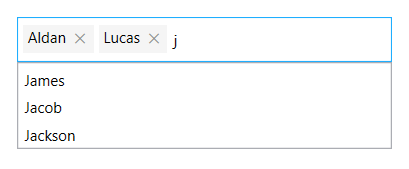
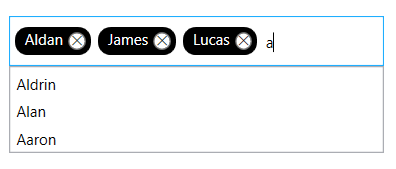
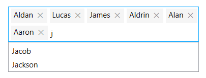
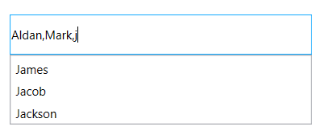
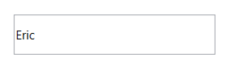
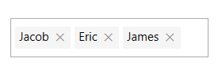

# Single and multiple selection 

In AutoComplete selection can be performed using single selection or multi-selection. This can be handled by [MultiSelectMode](https://help.syncfusion.com/cr/wpf/Syncfusion.Windows.Controls.Input.SfTextBoxExt.html#Syncfusion_Windows_Controls_Input_SfTextBoxExt_MultiSelectMode) property. The default value of `MultiSelectMode` is `None` which performs single selection.

## Single selection

The single selection can be performed by setting the [MultiSelectMode](https://help.syncfusion.com/cr/wpf/Syncfusion.Windows.Controls.Input.SfTextBoxExt.html#Syncfusion_Windows_Controls_Input_SfTextBoxExt_MultiSelectMode) property to None. In this mode we can set and retrieve the selected item using the [SelectedItem](https://help.syncfusion.com/cr/wpf/Syncfusion.Windows.Controls.Input.SfTextBoxExt.html#Syncfusion_Windows_Controls_Input_SfTextBoxExt_SelectedItem) property.

## Multi selection

The multi-selection, there are two ways to display the selection in the control. 

* Token 

* Delimiter

## Multiple selection using tokens 

Each selected items can be displayed as a token representation having a close button for each token. 

In token representation the control behavior of arranging the items can be done in two ways which is handled by the property [TokensWrapMode](https://help.syncfusion.com/cr/wpf/Syncfusion.Windows.Controls.Input.SfTextBoxExt.html#Syncfusion_Windows_Controls_Input_SfTextBoxExt_TokensWrapMode).

* `Wrap` - The selected items will be wrapped to the next line of the SfAutoComplete.

* `None` - The selected items will be arranged in horizontal layout in single line.

The [SelectedItems](https://help.syncfusion.com/cr/wpf/Syncfusion.Windows.Controls.Input.SfTextBoxExt.html#Syncfusion_Windows_Controls_Input_SfTextBoxExt_SelectedItems) property can be used to set and retrieve the items in `MultiSelectMode`.





<editors:SfTextBoxExt HorizontalAlignment="Left"
                      AutoCompleteMode="Suggest"
                      SearchItemPath="Name"
                      MultiSelectMode="Token"
                      Height="40"
                      AutoCompleteSource="{Binding Employees}"
                      VerticalAlignment="Center"
                      Width="200"/>




textBoxExt.MultiSelectMode = MultiSelectMode.Token;





### Customization of Tokens

The token can be customized by overriding the default style targeting the `TokenItem` class.





      <Window.Resources>
        
                                    </Button.Resources>
                                </Button>
                            </Grid>
                        </Border>
                    </ControlTemplate>
                </Setter.Value>
            </Setter>
        </Style>
    </Window.Resources>
        <editors:SfTextBoxExt HorizontalAlignment="Left"
                                  AutoCompleteMode="Suggest"
                                  SearchItemPath="Name"
                                  MultiSelectMode="Token" 
                                  Height="40"
                                  AutoCompleteSource="{Binding Employees}"
                                  VerticalAlignment="Center"
                                  Width="200"/>
     




### Enable autosize in token mode 

In token representation when we have set `Wrap` mode enabling the [EnableAutoSize](https://help.syncfusion.com/cr/wpf/Syncfusion.Windows.Controls.Input.SfTextBoxExt.html#Syncfusion_Windows_Controls_Input_SfTextBoxExt_EnableAutoSize) property re-renders the control height based on the number of lines the tokens are wrapped inside the control. 

To use this feature, it is need to set the `MultiSelectMode` as `Token` and `TokensWrapMode` as `Wrap`. By default this feature is disabled.





<editors:SfTextBoxExt HorizontalAlignment="Left"
                      AutoCompleteMode="Suggest"
                      SearchItemPath="Name"
                      MultiSelectMode="Token" 
                      TokensWrapMode="Wrap"
                      EnableAutoSize="True"
                      AutoCompleteSource="{Binding Employees}"
                      VerticalAlignment="Center"
                      Width="200"/>




textBoxExt.MultiSelectMode = MultiSelectMode.Token;
textBoxExt.TokensWrapMode = TokensWrapMode.Wrap;
textBoxExt.EnableAutoSize = true;





### ShowClearButton:

This feature allows to show or hide the clear button in Token mode for the AutoComplete control using the [ShowClearButton]( https://help.syncfusion.com/cr/wpf/Syncfusion.Windows.Controls.Input.SfTextBoxExt.html#Syncfusion_Windows_Controls_Input_SfTextBoxExt_ShowClearButton) property.





        <editors:SfTextBoxExt
            x:Name="textBoxExt"
            Width="200"
            HorizontalAlignment="Center"
            VerticalAlignment="Center"
            AutoCompleteMode="Suggest"
            AutoCompleteSource="{Binding Employees}"
            MultiSelectMode="Token"
            SearchItemPath="Name"
            ShowClearButton="True" />





textBoxExt.ShowClearButton = true; 





N> The default `ShowClearButton` property value is false. It will be only applicable for `MultiSelectMode` is `Token`.  

See also [Multiple selection using tokens ](https://help.syncfusion.com/wpf/autocomplete/single-and-multiple-selection#multiple-selection-using-tokens) topic in AutoComplete.

## Multiple selection using delimiter 

In `Delimiter` mode, each item is separated by a character that is set to the [Delimiter](https://help.syncfusion.com/cr/wpf/Syncfusion.Windows.Controls.Input.SfTextBoxExt.html#Syncfusion_Windows_Controls_Input_SfTextBoxExt_Delimiter) property. By default the items are separated by `,`(Comma).





<editors:SfTextBoxExt HorizontalAlignment="Center" 
                      VerticalAlignment="Center" 
                      Width="300"
                      Height="40"
                      MultiSelectMode="Delimiter"
                      SearchItemPath="Name"
                      AutoCompleteMode="Suggest"
                      AutoCompleteSource="{Binding Employees}" />




textBoxExt.MultiSelectMode = MultiSelectMode.Delimiter;





## Setting and retrieving SelectedItem 

The [SelectedItem](https://help.syncfusion.com/cr/wpf/Syncfusion.Windows.Controls.Input.SfTextBoxExt.html#Syncfusion_Windows_Controls_Input_SfTextBoxExt_SelectedItem) property is used to select a particular item from the suggestion list or to retrieve the item that is selected. The SelectedItem property can be used in single selection where the `MultiSelectMode` as `None`. For multi-selection where the `MultiSelectMode` is set either as `Token` or `Delimiter` the selected items can be set or retrieved using the [SelectedItems](https://help.syncfusion.com/cr/wpf/Syncfusion.Windows.Controls.Input.SfTextBoxExt.html#Syncfusion_Windows_Controls_Input_SfTextBoxExt_SelectedItems) property.

The `SelectedItem` and `SelectedItems` contains the object of the custom data and using the 
`SearchItemPath` property the value displayed in the text field can be retrieved.

Model Class:




public class Employee
{
        string name;
        string email;

        public string Name
        {
            get { return name; }
            set { name = value; }
        }

        public string Email
        {
            get { return email; }
            set { email = value; }
        }
}




In EmployeeViewModel class the [SelectedItem](https://help.syncfusion.com/cr/wpf/Syncfusion.Windows.Controls.Input.SfTextBoxExt.html#Syncfusion_Windows_Controls_Input_SfTextBoxExt_SelectedItem) updated initially from the Employees collection. 




public class EmployeeViewModel
{
        private List<Employee> employees;
        public List<Employee> Employees
        {
            get { return employees; }

            set { employees = value; }
        }

        private object selectedItem;
        public object SelectedItem
        {
            get { return selectedItem; }

            set { selectedItem = value; }
        }

        public EmployeeViewModel()
        {
            Employees = new List<Employee>();
            Employees.Add(new Employee() { Name = "Eric", Email = "Eric@syncfusion.com" });
            Employees.Add(new Employee() { Name = "James", Email = "James@syncfusion.com" });
            Employees.Add(new Employee() { Name = "Jacob", Email = "Jacob@syncfusion.com" });
            Employees.Add(new Employee() { Name = "Jackson", Email = "Jackson@syncfusion.com" });
            Employees.Add(new Employee() { Name = "Lucas", Email = "Lucas@syncfusion.com" });
            SelectedItem = Employees[0];
        }
}









<editors:SfTextBoxExt HorizontalAlignment="Center"                                
                      x:Name="autoComplete"
                      MaxDropDownHeight="100"
                      MultiSelectMode="None"  
                      AutoCompleteMode="Suggest"                                                          
                      SearchItemPath="Name"
                      SelectedItem="{Binding SelectedItem}"
                      AutoCompleteSource="{Binding Employees}"
                      VerticalAlignment="Center"                 
                      Height="40" 
                      Width="200"/>









private void TextBoxExt_SelectedItemChanged(DependencyObject d, DependencyPropertyChangedEventArgs e)
{
         SfTextBoxExt textBoxExt = d as SfTextBoxExt;
         string selectedItem = "";
         if (textBoxExt.SelectedItem != null)
         {
            selectedItem =((textBoxExt.SelectedItem as Employee).Name).ToString();
         }

         MessageBox.Show(selectedItem, "SelectedItem", MessageBoxButton.OK, MessageBoxImage.None);
}





Model Class:




public class Employee
{
        string name;
        string email;

        public string Name
        {
            get { return name; }
            set { name = value; }
        }

        public string Email
        {
            get { return email; }
            set { email = value; }
        }
}




In EmployeeViewModel class the [SelectedItems](https://help.syncfusion.com/cr/wpf/Syncfusion.Windows.Controls.Input.SfTextBoxExt.html#Syncfusion_Windows_Controls_Input_SfTextBoxExt_SelectedItems) updated initially from the Employees collection. 




public class EmployeeViewModel
{
        private List<Employee> employees;
        public List<Employee> Employees
        {
            get { return employees; }

            set { employees = value; }
        }

        private List<object> selectedItems;
        public List<object> SelectedItems
        {
            get { return selectedItems; }

            set { selectedItems = value; }
        }

        public EmployeeViewModel()
        {
            Employees = new List<Employee>();
            SelectedItems = new List<object>();
            Employees.Add(new Employee() { Name = "Eric", Email = "Eric@syncfusion.com" });
            Employees.Add(new Employee() { Name = "James", Email = "James@syncfusion.com" });
            Employees.Add(new Employee() { Name = "Jacob", Email = "Jacob@syncfusion.com" });
            Employees.Add(new Employee() { Name = "Jackson", Email = "Jackson@syncfusion.com" });
            Employees.Add(new Employee() { Name = "Lucas", Email = "Lucas@syncfusion.com" });
            SelectedItems.Add(Employees[2]);
            SelectedItems.Add(Employees[0]);
            SelectedItems.Add(Employees[1]);
        }
}









<editors:SfTextBoxExt HorizontalAlignment="Center"                                
                      x:Name="autoComplete"
                      MaxDropDownHeight="100"
                      MultiSelectMode="Token"  
                      AutoCompleteMode="Suggest"                                                          
                      SearchItemPath="Name"
                      SelectedItems="{Binding SelectedItems}"
                      AutoCompleteSource="{Binding Employees}"
                      VerticalAlignment="Center"                 
                      Height="40" 
                      Width="200"/>





## Retrieving SelectedValue 

The [SelectedValue](https://help.syncfusion.com/cr/wpf/Syncfusion.Windows.Controls.Input.SfTextBoxExt.html#Syncfusion_Windows_Controls_Input_SfTextBoxExt_SelectedValue) property is used to retrieve the selected values from the suggestion list. We have to set the [ValueMemberPath](https://help.syncfusion.com/cr/wpf/Syncfusion.Windows.Controls.Input.SfTextBoxExt.html#Syncfusion_Windows_Controls_Input_SfTextBoxExt_ValueMemberPathProperty) property when using custom data for the value we want to retrieve from `SelectedValue` based on the `SelectedItem` object.





<editors:SfTextBoxExt HorizontalAlignment="Left"                                
                      x:Name="autoComplete"
                      MaxDropDownHeight="100"
                      MultiSelectMode="None"  
                      AutoCompleteMode="Suggest"                                                          
                      SearchItemPath="Name"
                      ValueMemberPath="Email"
                      AutoCompleteSource="{Binding Employees}"
                      VerticalAlignment="Center"                                                      
                      SelectedItemChanged="AutoComplete_SelectedItemChanged"
                      Height="40" 
                      Width="200"/>





private void AutoComplete_SelectedItemChanged(DependencyObject d, DependencyPropertyChangedEventArgs e)
{
       SfTextBoxExt textBoxExt = d as SfTextBoxExt;
       if (textBoxExt.SelectedValue != null)
       {
          MessageBox.Show(textBoxExt.SelectedValue.ToString(), "SelectedValue", MessageBoxButton.OK, MessageBoxImage.None);
       }
}





### Retrieving SuggestionIndex

When an item is selected from suggestion list, their index can be retrieved using the [SuggestionIndex](https://help.syncfusion.com/cr/wpf/Syncfusion.Windows.Controls.Input.SfTextBoxExt.html#Syncfusion_Windows_Controls_Input_SfTextBoxExt_SuggestionIndex) property.





<editors:SfTextBoxExt HorizontalAlignment="Left"                                
                      x:Name="autoComplete"
                      MaxDropDownHeight="100"
                      MultiSelectMode="None"  
                      AutoCompleteMode="Suggest"                                                          
                      SearchItemPath="Name"
                      ValueMemberPath="Email"
                      AutoCompleteSource="{Binding Employees}"
                      VerticalAlignment="Center"                                                      
                      SelectedItemChanged="AutoComplete_SelectedItemChanged"
                      Height="40" 
                      Width="200"/>





private void AutoComplete_SelectedItemChanged(DependencyObject d, DependencyPropertyChangedEventArgs e)
{
        string suggestionIndex = "";
        suggestionIndex = ((d as SfTextBoxExt).SuggestionIndex).ToString();
        MessageBoxResult messageBoxResult = MessageBox.Show(suggestionIndex, "SuggestionIndex");
}





## Displaying images 

This feature allows to provide the path for the image to be displayed in the text box control using the [ImageMemberPath](https://help.syncfusion.com/cr/wpf/Syncfusion.Windows.Controls.Input.SfTextBoxExt.html#Syncfusion_Windows_Controls_Input_SfTextBoxExt_ImageMemberPath) property.

N> This feature is applicable only for MultiSelectMode with Token mode.

For further details, refer to [Showing image in token and dropdown](https://help.syncfusion.com/wpf/autocomplete/autocomplete-and-filtering#showing-image-in-token-and-drop-down).

N> View [sample](https://github.com/SyncfusionExamples/wpf-textboxext-examples/tree/master/Samples/Single-and-multiple-selection) in GitHub
