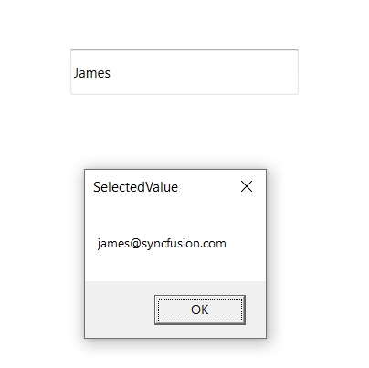

# Single and multiple Selection 

Select the multiple items from a suggestion list using the [MultiSelectMode](https://help.syncfusion.com/cr/cref_files/wpf/Syncfusion.SfInput.Wpf~Syncfusion.Windows.Controls.Input.SfTextBoxExt~MultiSelectMode.html) property. There are two ways to perform multi-selection in autocomplete. The default value of MultiSelectMode is None.

* None

* Token Representation

* Delimiter

## Setting and retrieving SelectedValue 

The [SelectedValue](https://help.syncfusion.com/cr/cref_files/wpf/Syncfusion.SfInput.Wpf~Syncfusion.Windows.Controls.Input.SfTextBoxExt~SelectedValue.html) property is used to retrieve the selected values from the suggestion list.





 <editors:SfTextBoxExt HorizontalAlignment="Left"                                
                                  x:Name="autoComplete"
                                  MaxDropDownHeight="100"
                                  MultiSelectMode="None"  
                                  AutoCompleteMode="Suggest"                                                          SearchItemPath="Name"
                                  ValueMemberPath="Email"
                                  AutoCompleteSource="{Binding Employees}"
                                  VerticalAlignment="Center"                                                      SelectedItemChanged="AutoComplete_SelectedItemChanged"
                                  Height="40" 
                                  Width="200"
                              />





        private void AutoComplete_SelectedItemChanged(DependencyObject d, DependencyPropertyChangedEventArgs e)
        {
            SfTextBoxExt textBoxExt = d as SfTextBoxExt;
            if (textBoxExt.SelectedValue != null)
            {
                MessageBox.Show(textBoxExt.SelectedValue.ToString(), "SelectedValue", MessageBoxButton.OK, MessageBoxImage.None);
            }
        }





## Setting and retrieving SelectedItem 

The [SelectedItem](https://help.syncfusion.com/cr/cref_files/wpf/Syncfusion.SfInput.Wpf~Syncfusion.Windows.Controls.Input.SfTextBoxExt~SelectedItem.html) property is used to select a particular item from the suggestion list. It can either get or set the SelectedItem.





 <editors:SfTextBoxExt HorizontalAlignment="Left"                                
                                  x:Name="autoComplete"
                                  MaxDropDownHeight="100"
                                  MultiSelectMode="None"  
                                  AutoCompleteMode="Suggest"                                                          SearchItemPath="Name"
                                  AutoCompleteSource="{Binding Employees}"
                                  VerticalAlignment="Center"                                                      SelectedItemChanged="AutoComplete_SelectedItemChanged"
                                  Height="40" 
                                  Width="200"
                              />





        private void TextBoxExt_SelectedItemChanged(DependencyObject d, DependencyPropertyChangedEventArgs e)
        {
            SfTextBoxExt textBoxExt = d as SfTextBoxExt;
            string selectedItem = "";
            if (textBoxExt.SelectedItem != null)
            {
                selectedItem =((textBoxExt.SelectedItem as Employee).Name).ToString();
            }

            MessageBox.Show(selectedItem, "SelectedItem", MessageBoxButton.OK, MessageBoxImage.None);
        }





## Multiple selection using tokens 

Selected items will be displayed with a customizable token representation and it can be remove each tokenized item with the close button.

The selected items can be displayed as token inside the SfAutoComplete in two ways:

* `Wrap` - When [TokensWrapMode](https://help.syncfusion.com/cr/cref_files/wpf/Syncfusion.SfInput.Wpf~Syncfusion.Windows.Controls.Input.SfTextBoxExt~TokensWrapMode.html) is set to `Wrap`, the selected items will be wrapped to the next line of the SfAutoComplete.

* `None` - When [TokensWrapMode](https://help.syncfusion.com/cr/cref_files/wpf/Syncfusion.SfInput.Wpf~Syncfusion.Windows.Controls.Input.SfTextBoxExt~TokensWrapMode.html) is set to `None`, the selected items will be wrapped in horizontal orientation.





        <editors:SfTextBoxExt HorizontalAlignment="Left"
                                  AutoCompleteMode="Suggest"
                                  SearchItemPath="Name"
                                  MultiSelectMode="Token" 
                                  TokensWrapMode="None"
                                  Height="40"
                                  AutoCompleteSource="{Binding Employees}"
                                  VerticalAlignment="Center"
                                  Width="200"/>
        <editors:SfTextBoxExt HorizontalAlignment="Left"
                                  AutoCompleteMode="Suggest"
                                  SearchItemPath="Name"
                                  MultiSelectMode="Token" 
                                  TokensWrapMode="Wrap"
                                  Height="40"
                                  AutoCompleteSource="{Binding Employees}"
                                  VerticalAlignment="Center"
                                  Width="200"/>





### Customization of Tokens

Using styles override used for customize the tokens.

Please find the code snippet for the Customization of Tokens.





      <Window.Resources>
        
                                    </Button.Resources>
                                </Button>
                            </Grid>
                        </Border>
                    </ControlTemplate>
                </Setter.Value>
            </Setter>
        </Style>
    </Window.Resources>
        <editors:SfTextBoxExt HorizontalAlignment="Left"
                                  AutoCompleteMode="Suggest"
                                  SearchItemPath="Name"
                                  MultiSelectMode="Token" 
                                  Height="40"
                                  AutoCompleteSource="{Binding Employees}"
                                  VerticalAlignment="Center"
                                  Width="200"/>
     




### Enable autosize in token mode 

AutoSizing can be enabled in AutoComplete control so that the control will extend its layout based on the token size.

[EnableAutoSize](https://help.syncfusion.com/cr/cref_files/wpf/Syncfusion.SfInput.Wpf~Syncfusion.Windows.Controls.Input.SfTextBoxExt~EnableAutoSize.html) property is used to enable the AutoSizing in AutoComplete control. To enable the API, need to set the MultiSelectMode as Token and TokensWrapMode as Wrap. The default value of EnableAutoSize is false.





        <editors:SfTextBoxExt HorizontalAlignment="Left"
                                  AutoCompleteMode="Suggest"
                                  SearchItemPath="Name"
                                  MultiSelectMode="Token" 
                                  TokensWrapMode="Wrap"
                                  EnableAutoSize="True"
                                  AutoCompleteSource="{Binding Employees}"
                                  VerticalAlignment="Center"
                                  Width="200"/>





## Multiple selection using delimiter 

When selecting the multiple items, the selected items can be divided with a desired character given for a delimiter. It Can be Set delimiter character with the [Delimiter](https://help.syncfusion.com/cr/cref_files/wpf/Syncfusion.SfInput.Wpf~Syncfusion.Windows.Controls.Input.SfTextBoxExt~Delimiter.html) property.





        <editors:SfTextBoxExt HorizontalAlignment="Center" 
                              VerticalAlignment="Center" 
                              Width="300"
                              Height="40"
                              MultiSelectMode="Delimiter"
                              SearchItemPath="Name"
                              AutoCompleteMode="Suggest"
                              AutoCompleteSource="{Binding Employees}" />





## Displaying images 

