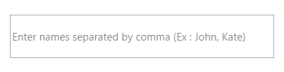
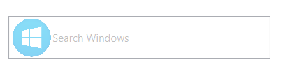
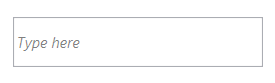
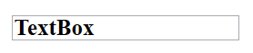
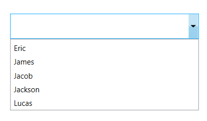

# Textbox customization in WPF Autocomplete (SfTextBoxExt)

AutoComplete provides the user-friendly customizing options for text box. This section explains how to customize the entire AutoComplete control.

## Water mark 

[Watermark](https://help.syncfusion.com/cr/wpf/Syncfusion.Windows.Controls.Input.SfTextBoxExt.html#Syncfusion_Windows_Controls_Input_SfTextBoxExt_Watermark) property, allows to specify some information when the text is empty. For illustration, let us create a simple textbox and indicate enter names separated by a comma.




<editors:SfTextBoxExt HorizontalAlignment="Center" 
                      VerticalAlignment="Center" 
                      Width="300" 
                      Height="50"
                      Watermark="Enter names separated by comma (Ex : John, Kate)"/>




textBoxExt.Watermark= "Enter names separated by comma (Ex : John, Kate)";




N> The Watermark property is of the object type. So, any framework elements can be hosted as Watermark content. The following example shows how to host an image and text as Watermark content.




<editors:SfTextBoxExt HorizontalAlignment="Center"
                      VerticalAlignment="Center" 
                      Height="50"
                      Width="300">
                <editors:SfTextBoxExt.Watermark>
                    <StackPanel Orientation="Horizontal">
                        <Image Source="Windows 8.png" 
                               Margin="2"/>
                        <TextBlock Text="Search Windows" 
                                   HorizontalAlignment="Center" 
                                   VerticalAlignment="Center" 
                                   Opacity="0.5"/>
                    </StackPanel>
                </editors:SfTextBoxExt.Watermark>
</editors:SfTextBoxExt>




### Water mark template 

Any business object can be bound to the Watermark property and that object can be decorated by applying the [WatermarkTemplate](https://help.syncfusion.com/cr/wpf/Syncfusion.Windows.Controls.Input.SfTextBoxExt.html#Syncfusion_Windows_Controls_Input_SfTextBoxExt_WatermarkTemplate)  property.




    <Window.Resources>
        <DataTemplate x:Key="WatermarkTemplate">
            <TextBlock Text="{Binding}" 
                       FontStyle="Italic" 
                       Opacity="1"/>
        </DataTemplate>
    </Window.Resources>
    <Window.Content>
        <Grid>
            <editors:SfTextBoxExt HorizontalAlignment="Center" 
                                  VerticalAlignment="Center"
                                  Width="200"
                                  Height="40"
                                  Watermark="Type here"
                                  WatermarkTemplate="{StaticResource WatermarkTemplate}">
            </editors:SfTextBoxExt>
        </Grid>
    </Window.Content>




## Customizing the TextBox

The [Text](https://help.syncfusion.com/cr/wpf/Syncfusion.Windows.Controls.Input.SfTextBoxExt.html#Syncfusion_Windows_Controls_Input_SfTextBoxExt_IgnoreCase), [FontSize](https://help.syncfusion.com/cr/wpf/Syncfusion.Windows.Controls.Input.SfTextBoxExt.html#Syncfusion_Windows_Controls_Input_SfTextBoxExt_IgnoreCase), [FontWeight](https://help.syncfusion.com/cr/wpf/Syncfusion.Windows.Controls.Input.SfTextBoxExt.html#Syncfusion_Windows_Controls_Input_SfTextBoxExt_IgnoreCase), and [FontFamily](https://help.syncfusion.com/cr/wpf/Syncfusion.Windows.Controls.Input.SfTextBoxExt.html#Syncfusion_Windows_Controls_Input_SfTextBoxExt_IgnoreCase) properties are used to customize the text in the AutoComplete control.





<editors:SfTextBoxExt x:Name="textBoxExt" 
                      Text="TextBox"
                      FontSize="20"
                      FontWeight="Bold"
                      FontFamily="Times New Roman"
                      HorizontalAlignment="Center" 
                      VerticalAlignment="Center" 
                      Width="200">
</editors:SfTextBoxExt>




textBoxExt.Text = "TextBox";
textBoxExt.FontSize = 20;
textBoxExt.FontWeight = FontWeights.Bold;
textBoxExt.FontFamily = new FontFamily("Times New Roman");





## Setting the Dropdown Icon 

This feature allows to set the drop-down icon for the TextBox control using the [ShowDropDownButton](https://help.syncfusion.com/cr/wpf/Syncfusion.Windows.Controls.Input.SfTextBoxExt.html#Syncfusion_Windows_Controls_Input_SfTextBoxExt_ShowDropDownButton).





<editors:SfTextBoxExt HorizontalAlignment="Center" 
                      VerticalAlignment="Center" 
                      Width="300"
                      Height="40"
                      ShowDropDownButton="True"
                      SearchItemPath="Name"
                      AutoCompleteMode="Suggest"
                      AutoCompleteSource="{Binding Employees}" />




textBoxExt.ShowDropDownButton = true;




N> View [sample](https://github.com/SyncfusionExamples/wpf-textboxext-examples/tree/master/Samples/Textbox-customization) in GitHub
