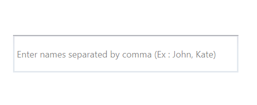

# WaterMark in WPF SfAutocomplete.

The control will prompt the user with some information, when it is not in focus and contains an empty string.

## Using the Watermark

[Watermark](https://help.syncfusion.com/cr/wpf/Syncfusion.SfInput.Wpf~Syncfusion.Windows.Controls.Input.SfTextBoxExt~WatermarkProperty.html) property allows the users to specify some information, when the text is empty. For illustration let us create a simple textbox, where the user is asked to enter names separated by a comma,




<Window x:Class="AutoCompleteSample.MainWindow"
        xmlns="http://schemas.microsoft.com/winfx/2006/xaml/presentation"
        xmlns:x="http://schemas.microsoft.com/winfx/2006/xaml"
        xmlns:d="http://schemas.microsoft.com/expression/blend/2008"
        xmlns:mc="http://schemas.openxmlformats.org/markup-compatibility/2006"
        xmlns:local="clr-namespace:AutoCompleteSample"
        mc:Ignorable="d"
        xmlns:editors="clr-namespace:Syncfusion.Windows.Controls.Input;assembly=Syncfusion.SfInput.Wpf"
        Title="MainWindow" Height="450" Width="800">
    <Window.Content>
        <Grid>
            <editors:SfTextBoxExt HorizontalAlignment="Center" 
                                  VerticalAlignment="Center" 
                                  Width="300" 
                                  Height="50"
                                  Watermark="Enter names separated by comma (Ex : John, Kate)"/>
        </Grid>
    </Window.Content>
</Window>




using Syncfusion.Windows.Controls.Input;
using System.Collections.Generic;
using System.Windows;

namespace AutoCompleteSample
{
    /// 

    /// Interaction logic for MainWindow.xaml
    /// 

    public partial class MainWindow : Window
    {
        public MainWindow()
        {
            InitializeComponent();
            SfTextBoxExt textBoxExt = new SfTextBoxExt()
            {
                HorizontalAlignment = HorizontalAlignment.Center,
                VerticalAlignment = VerticalAlignment.Center,
                Width = 300,
                Height = 50,
                Watermark = "Enter names separated by comma (Ex : John, Kate)"
            };

            this.Content = textBoxExt;
        }
    }
}




N> The Watermark property is of the object type so any Framework elements can be hosted as Watermark content. Below example shows how to host an image and text as Watermark content.




<Window x:Class="AutoCompleteSample.MainWindow"
        xmlns="http://schemas.microsoft.com/winfx/2006/xaml/presentation"
        xmlns:x="http://schemas.microsoft.com/winfx/2006/xaml"
        xmlns:d="http://schemas.microsoft.com/expression/blend/2008"
        xmlns:mc="http://schemas.openxmlformats.org/markup-compatibility/2006"
        xmlns:local="clr-namespace:AutoCompleteSample"
        mc:Ignorable="d"
        xmlns:editors="clr-namespace:Syncfusion.Windows.Controls.Input;assembly=Syncfusion.SfInput.Wpf"
        Title="MainWindow" Height="450" Width="800">
    <Window.Content>
            <Grid>
            <editors:SfTextBoxExt HorizontalAlignment="Center"
                                  VerticalAlignment="Center" 
                                  Height="50"
                                  Width="300">
                <editors:SfTextBoxExt.Watermark>
                    <StackPanel Orientation="Horizontal">
                        <Image Source="Windows 8.png" 
                               Margin="2"/>
                        <TextBlock Text="Search Windows" 
                                   HorizontalAlignment="Center" 
                                   VerticalAlignment="Center" 
                                   Opacity="0.5"/>
                    </StackPanel>
                </editors:SfTextBoxExt.Watermark>
            </editors:SfTextBoxExt>
        </Grid>
    </Window.Content>
</Window>




using Syncfusion.Windows.Controls.Input;
using System.Collections.Generic;
using System.Windows;

namespace AutoCompleteSample
{
    /// 

    /// Interaction logic for MainWindow.xaml
    /// 

    public partial class MainWindow : Window
    {
        public MainWindow()
        {
            InitializeComponent();
            SfTextBoxExt textBoxExt = new SfTextBoxExt()
            {
                HorizontalAlignment = HorizontalAlignment.Center,
                VerticalAlignment = VerticalAlignment.Center,
                Width = 300,
                Height = 50
            };

            StackPanel stackPanel = new StackPanel()
            {
                Orientation = Orientation.Horizontal
            };

            Image image = new Image()
            {
                Source = new BitmapImage(new Uri("Windows 8.png", UriKind.RelativeOrAbsolute))
            };

            TextBlock textBlock = new TextBlock()
            {
                Text = "Search Windows",
                HorizontalAlignment = HorizontalAlignment.Center,
                VerticalAlignment = VerticalAlignment.Center,
                Opacity = 0.5
            };

            stackPanel.Children.Add(image);
            stackPanel.Children.Add(textBlock);
            textBoxExt.Watermark = stackPanel;
            this.Content = textBoxExt;
        }
    }
}




## Using the Watermark template

Any business object can be bound to the Watermark property and that object can be decorated by applying the [WatermarkTemplate](https://help.syncfusion.com/cr/wpf/Syncfusion.SfInput.Wpf~Syncfusion.Windows.Controls.Input.SfTextBoxExt~WatermarkTemplateProperty.html)  property.




<Window x:Class="AutoCompleteSample.MainWindow"
        xmlns="http://schemas.microsoft.com/winfx/2006/xaml/presentation"
        xmlns:x="http://schemas.microsoft.com/winfx/2006/xaml"
        xmlns:d="http://schemas.microsoft.com/expression/blend/2008"
        xmlns:mc="http://schemas.openxmlformats.org/markup-compatibility/2006"
        xmlns:local="clr-namespace:AutoCompleteSample"
        mc:Ignorable="d"
        xmlns:editors="clr-namespace:Syncfusion.Windows.Controls.Input;assembly=Syncfusion.SfInput.Wpf"
        Title="MainWindow" Height="450" Width="800">
    <Window.Resources>
        <DataTemplate x:Key="WatermarkTemplate">
            <TextBlock Text="{Binding}" 
                       FontStyle="Italic" 
                       Opacity="1"/>
        </DataTemplate>
    </Window.Resources>
    <Window.Content>
        <Grid>
            <editors:SfTextBoxExt HorizontalAlignment="Center" 
                                  VerticalAlignment="Center"
                                  Width="200"
                                  Height="40"
                                  Watermark="Type here"
                                  WatermarkTemplate="{StaticResource WatermarkTemplate}">
            </editors:SfTextBoxExt>
        </Grid>
    </Window.Content>
</Window>




using Syncfusion.Windows.Controls.Input;
using System.Collections.Generic;
using System.Windows;

namespace AutoCompleteSample
{
    /// 

    /// Interaction logic for MainWindow.xaml
    /// 

    public partial class MainWindow : Window
    {
        public MainWindow()
        {
            InitializeComponent();
            SfTextBoxExt textBoxExt = new SfTextBoxExt()
            {
                HorizontalAlignment = HorizontalAlignment.Center,
                VerticalAlignment = VerticalAlignment.Center,
                Width = 300,
                Height = 50,
                Watermark = "Type here"
            };

            DataTemplate dt = new DataTemplate(typeof(TextBlock));
            textBoxExt.WatermarkTemplate = dt;

            FrameworkElementFactory txtElement = new FrameworkElementFactory(typeof(TextBlock));
            dt.VisualTree = txtElement;

            Binding bind = new Binding();
            bind.Path = new PropertyPath("Watermark");
            bind.Mode = BindingMode.TwoWay;
            bind.Source = textBoxExt;

            txtElement.SetBinding(TextBlock.TextProperty, bind);
            txtElement.SetValue(TextBlock.FontStyleProperty, FontStyles.Italic);
            txtElement.SetValue(TextBlock.OpacityProperty, 1.0);
            this.Content = textBoxExt;
        }
    }
}




The complete Getting Started sample is available in [this](https://www.syncfusion.com/downloads/support/directtrac/general/ze/AutoComplete_WPF754375762) link.