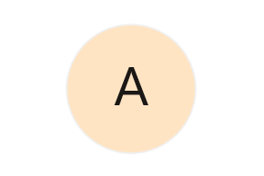
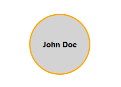

# Content Types in WPF AvatarView

The [SfAvatarView](https://help.syncfusion.com/cr/wpf/Syncfusion.Windows.Shared.SfAvatarView.html) control supports five types of content: [Default](https://help.syncfusion.com/cr/wpf/Syncfusion.Windows.Shared.AvatarContentType.html#Syncfusion_Windows_Shared_AvatarContentType_Default), [Initials](https://help.syncfusion.com/cr/wpf/Syncfusion.Windows.Shared.AvatarContentType.html#Syncfusion_Windows_Shared_AvatarContentType_Initials), [CustomImage](https://help.syncfusion.com/cr/wpf/Syncfusion.Windows.Shared.AvatarContentType.html#Syncfusion_Windows_Shared_AvatarContentType_CustomImage), [AvatarCharacter](https://help.syncfusion.com/cr/wpf/Syncfusion.Windows.Shared.AvatarContentType.html#Syncfusion_Windows_Shared_AvatarContentType_AvatarCharacter), and [GroupView](https://help.syncfusion.com/cr/wpf/Syncfusion.Windows.Shared.AvatarContentType.html#Syncfusion_Windows_Shared_AvatarContentType_Group).

## Default

The default content type displays the [Avatar1](https://help.syncfusion.com/cr/wpf/Syncfusion.Windows.Shared.AvatarCharacter.html#Syncfusion_Windows_Shared_AvatarCharacter_Avatar1) character image when initializing the control without the initials, custom image, or group source.




<syncfusion:SfAvatarView />

 


SfAvatarView avatarView = new SfAvatarView();
           



## Initials 

The Initials content type displays initials in the AvatarView. To use this content type, you must provide a value for the [AvatarName](https://help.syncfusion.com/cr/wpf/Syncfusion.Windows.Shared.SfAvatarView.html#Syncfusion_Windows_Shared_SfAvatarView_AvatarName) property, which sets the initials to be displayed in the avatar view. The initials will be formatted accordingly depending on the specified [InitialsType](https://help.syncfusion.com/cr/wpf/Syncfusion.Windows.Shared.SfAvatarView.html#Syncfusion_Windows_Shared_SfAvatarView_InitialsType) property.

### InitialsType

The [InitialsType](https://help.syncfusion.com/cr/wpf/Syncfusion.Windows.Shared.SfAvatarView.html#Syncfusion_Windows_Shared_SfAvatarView_InitialsType) property includes two types:

[SingleCharacter](https://help.syncfusion.com/cr/wpf/Syncfusion.Windows.Shared.AvatarInitialsType.html#Syncfusion_Windows_Shared_AvatarInitialsType_SingleCharacter) - Used to display a single character in the avatar.
[DoubleCharacter](https://help.syncfusion.com/cr/wpf/Syncfusion.Windows.Shared.AvatarInitialsType.html#Syncfusion_Windows_Shared_AvatarInitialsType_DoubleCharacter) - Used to display two characters in the avatar.

**Single character**

The single character initials type displays the first character of the [AvatarName](https://help.syncfusion.com/cr/wpf/Syncfusion.Windows.Shared.SfAvatarView.html#Syncfusion_Windows_Shared_SfAvatarView_AvatarName) property value as the avatar.




<syncfusion:SfAvatarView ContentType="Initials"
                         AvatarSize="ExtraLarge"
                         AvatarName="Alex"
                         Background="Bisque">
</syncfusion:SfAvatarView>



             

Grid grid = new Grid();
SfAvatarView avatarView = new SfAvatarView
{
    AvatarName = "Alex",
    ContentType = AvatarContentType.Initials,
    AvatarSize = AvatarSize.ExtraLarge,
    Background = new SolidColorBrush(Colors.Bisque)
};
grid.Children.Add(avatarView);
this.Content = grid;




**Double character**

The double character initials type displays a two-character text as an avatar set in the [AvatarName](https://help.syncfusion.com/cr/wpf/Syncfusion.Windows.Shared.SfAvatarView.html#Syncfusion_Windows_Shared_SfAvatarView_AvatarName) property. If the AvatarName consists of a single word, that word's first and last letters will be displayed. However, if the [AvatarName](https://help.syncfusion.com/cr/wpf/Syncfusion.Windows.Shared.SfAvatarView.html#Syncfusion_Windows_Shared_SfAvatarView_AvatarName) contains two or more words, the first letter of the first word and the first letter of the second word will be displayed.




<syncfusion:SfAvatarView ContentType="Initials"
                         AvatarSize="ExtraLarge"
                         AvatarName="Alex"
                         InitialsType="DoubleCharacter"
                         Background="Bisque">
</syncfusion:SfAvatarView>



          

Grid grid = new Grid();
SfAvatarView avatarView = new SfAvatarView
{
    AvatarName = "Alex Hales",
    ContentType = AvatarContentType.Initials,
    InitialsType = AvatarInitialsType.DoubleCharacter,
    AvatarSize = AvatarSize.ExtraLarge,
    Background = new SolidColorBrush(Colors.Bisque)
};
grid.Children.Add(avatarView);
this.Content = grid;




## Custom image

Add any custom image as the avatar by using the [ImageSource](https://help.syncfusion.com/cr/wpf/Syncfusion.Windows.Shared.SfAvatarView.html#Syncfusion_Windows_Shared_SfAvatarView_ImageSource) property.




<syncfusion:SfAvatarView ContentType="CustomImage"
                         AvatarSize="ExtraLarge"
                         ImageSource="pack://application:,,,/Images/person.png">
</syncfusion:SfAvatarView>

 


Grid grid = new Grid();
SfAvatarView avatarView = new SfAvatarView
{
    ContentType = AvatarContentType.CustomImage,
    AvatarSize = AvatarSize.ExtraLarge,
    ImageSource = new BitmapImage(new Uri("pack://application:,,,/Images/person.png")),
};
grid.Children.Add(avatarView);
this.Content = grid;
           



## Avatar character

Set the pre-defined avatar character images as avatar by using the [AvatarCharacter](https://help.syncfusion.com/cr/wpf/Syncfusion.Windows.Shared.AvatarContentType.html#Syncfusion_Windows_Shared_AvatarContentType_AvatarCharacter) property.




<syncfusion:SfAvatarView ContentType="AvatarCharacter"
                         AvatarSize="ExtraLarge"
                         AvatarCharacter="Avatar15">
</syncfusion:SfAvatarView>



            
Grid grid = new Grid();
SfAvatarView avatarView = new SfAvatarView
{
    ContentType = AvatarContentType.AvatarCharacter,
    AvatarSize = AvatarSize.ExtraLarge,
    AvatarCharacter = AvatarCharacter.Avatar15,
};
grid.Children.Add(avatarView);
this.Content = grid;
            



## Group view 

The [Group](https://help.syncfusion.com/cr/wpf/Syncfusion.Windows.Shared.AvatarContentType.html#Syncfusion_Windows_Shared_AvatarContentType_Group) content type allows you to display up to three images or initials within a single avatar view. To use this content type, you must set the following properties.

[GroupSource](https://help.syncfusion.com/cr/wpf/Syncfusion.Windows.Shared.SfAvatarView.html#Syncfusion_Windows_Shared_SfAvatarView_GroupSource): Used to set the ItemsSource for the group view.
[InitialsMemberPath](https://help.syncfusion.com/cr/wpf/Syncfusion.Windows.Shared.SfAvatarView.html#Syncfusion_Windows_Shared_SfAvatarView_InitialsMemberPath): Used to set the initials for the group view.
[InitialsColorMemberPath](https://help.syncfusion.com/cr/wpf/Syncfusion.Windows.Shared.SfAvatarView.html#Syncfusion_Windows_Shared_SfAvatarView_InitialsColorMemberPath): Used to set the initials color for the group view.
[BackgroundColorMemberPath](https://help.syncfusion.com/cr/wpf/Syncfusion.Windows.Shared.SfAvatarView.html#Syncfusion_Windows_Shared_SfAvatarView_BackgroundColorMemberPath): Used to set the background color for the group view.
[ImageSourceMemberPath](https://help.syncfusion.com/cr/wpf/Syncfusion.Windows.Shared.SfAvatarView.html#Syncfusion_Windows_Shared_SfAvatarView_ImageSourceMemberPath): Used to set the image source for the group view.

The following code example illustrates how to create an ItemsSource for a group avatar view.




public class Employee
{
   public string Name { get; set; }

   public string ImageSource { get; set; }

   public Color Background { get; set; }

   public Color InitialsColor { get; set; }
}

public class EmployeeViewModel
{
   public ObservableCollection<Employee> CollectionImage { get; set; }

   public EmployeeViewModel()
   {
      CollectionImage = new ObservableCollection<Employee>();
      CollectionImage.Add(new Employee { ImageSource="mike.png" });
      CollectionImage.Add(new Employee { Name = "Alex", InitialsColor = Color.FromArgb(0xFF, 0x24, 0x4F, 0x23), Background = Color.FromArgb(0xFF, 0xD6, 0xE8, 0xD7) });
      CollectionImage.Add(new Employee { ImageSource="ellanaa.png" });
   }    
}




The following code example illustrates how to set the group source and member paths for the avatar view.




<Window.DataContext>
    <local:EmployeeViewModel/>
</Window.DataContext>

<syncfusion:SfAvatarView ContentType="Group"   
                         GroupSource="{Binding CollectionImage}"
                         InitialsMemberPath="Name"
                         BackgroundColorMemberPath="Background"
                         ImageSourceMemberPath="ImageSource"
                         InitialsColorMemberPath="InitialsColor"
                         AvatarSize="ExtraLarge">
</syncfusion:SfAvatarView>




public partial class MainWindow : Window
{
   public MainWindow()
   {
      Grid grid = new Grid();
      EmployeeViewModel employeeViewModel = new EmployeeViewModel();
      grid.DataContext = employeeViewModel;
      SfAvatarView avatarView = new SfAvatarView
      {
         ContentType = AvatarContentType.Group,
         AvatarSize = AvatarSize.ExtraLarge,
         ImageSourceMemberPath = "ImageSource",
         InitialsMemberPath = "Name",
         BackgroundColorMemberPath = "Background",
         InitialsColorMemberPath = "InitialsColor"
      };
      avatarView.SetBinding(SfAvatarView.GroupSourceProperty, new System.Windows.Data.Binding("CollectionImage"));
      grid.Children.Add(avatarView);
      this.Content = grid;
   }
}




## Content Template

A [ContentTemplate](https://help.syncfusion.com/cr/wpf/Syncfusion.Windows.Shared.SfAvatarView.html#Syncfusion_Windows_Shared_SfAvatarView_ContentTemplate) in AvatarView is a DataTemplate that defines how the avatar's content should be displayed. By default, the SfAvatarView displays an image or initials. However, you can customize the avatar content using the ContentTemplate property to define a custom layout, such as text or UI elements.




<Window.Resources>
    <DataTemplate x:Key="AvatarContentTemplate">
        <Grid>
            <Ellipse StrokeThickness="2" Fill="{Binding Background}">
                <Ellipse.Stroke>
                    <SolidColorBrush Color="Orange"/>
                </Ellipse.Stroke>
            </Ellipse>
            <TextBlock Text="{Binding AvatarName}"
                       VerticalAlignment="Center"
                       HorizontalAlignment="Center"
                       Foreground="{Binding Foreground}"
                       FontWeight="Bold"/>
        </Grid>
    </DataTemplate>
</Window.Resources>

<Grid>
    <syncfusion:SfAvatarView AvatarSize="ExtraLarge"
                             AvatarShape="Square"
                             Content="{Binding SelectedAvatar}"
                             ContentTemplate="{StaticResource AvatarContentTemplate}"
                             Background="Transparent"/>
</Grid>




public partial class MainWindow : Window
{
    public MainWindow()
    {
        InitializeComponent();
        DataContext = new AvatarViewModel();
    }
}

public class AvatarViewModel
{
    public ObservableCollection<AvatarItem> Avatars { get; set; }
    public AvatarItem SelectedAvatar { get; set; }

    public AvatarViewModel()
    {
        Avatars = new ObservableCollection<AvatarItem>
        {
            new AvatarItem
            {
                AvatarName = "John Doe",
                Foreground = new SolidColorBrush(Colors.Black),
                Background = new SolidColorBrush(Colors.LightGray)
                
            },
            new AvatarItem
            {
                AvatarName = "Alice",
                Foreground = new SolidColorBrush(Colors.White),
                Background = new SolidColorBrush(Colors.Green)
            }
        };
        // Set default avatar
        SelectedAvatar = Avatars[0];
    }
}

public class AvatarItem
{
    public string AvatarName { get; set; }
    public Brush Foreground { get; set; }
    public Brush Background { get; set; }
}




