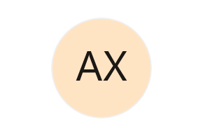
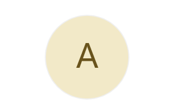

# Customization in WPF AvatarView 

The [SfAvatarView](https://help.syncfusion.com/cr/wpf/Syncfusion.Windows.Shared.SfAvatarView.html) control offers a range of customization options, including modifying its border, background, and more.

## Border

Customize the `AvatarView` control border using the [BorderBrush](https://learn.microsoft.com/en-us/windows/windows-app-sdk/api/winrt/microsoft.ui.xaml.controls.control.borderbrush) and [BorderThickness](https://learn.microsoft.com/en-us/windows/windows-app-sdk/api/winrt/microsoft.ui.xaml.controls.control.borderthickness) properties.

**BorderBrush**

Customize the border color of the AvatarView control by using the [BorderBrush](https://learn.microsoft.com/en-us/windows/windows-app-sdk/api/winrt/microsoft.ui.xaml.controls.control.borderbrush) property.




<syncfusion:SfAvatarView  ContentType="AvatarCharacter" 
                          AvatarCharacter="Avatar16"
                          AvatarSize="ExtraLarge"
                          BorderBrush="Red">
</syncfusion:SfAvatarView>




Grid grid = new Grid();
SfAvatarView avatarView = new SfAvatarView
{
    ContentType = AvatarContentType.AvatarCharacter,
    AvatarShape = AvatarShape.Circle,
    AvatarSize = AvatarSize.ExtraLarge,
    AvatarCharacter = AvatarCharacter.Avatar16,
    BorderBrush = new SolidColorBrush(Colors.Red),
    BorderThickness = new Thickness(2)
};
grid.Children.Add(avatarView);
this.Content = grid;




**BorderThickness**

Customize the border thickness of the AvatarView control by using the [BorderThickness](https://learn.microsoft.com/en-us/windows/windows-app-sdk/api/winrt/microsoft.ui.xaml.controls.control.borderthickness) property.




<syncfusion:SfAvatarView   AvatarShape="Custom"
                           AvatarSize="ExtraLarge"
                           BorderBrush="Black" 
                           BorderThickness="4">
</syncfusion:SfAvatarView>




Grid grid = new Grid();
SfAvatarView avatarView = new SfAvatarView
{
    AvatarShape = AvatarShape.Circle,
    AvatarSize = AvatarSize.ExtraLarge,
    BorderThickness = new Thickness(4),
    BorderBrush = new SolidColorBrush(Colors.Black),
};
grid.Children.Add(avatarView);
this.Content = grid;




## Background

Customize the background of the AvatarView control by using the [Background](https://learn.microsoft.com/en-us/windows/windows-app-sdk/api/winrt/microsoft.ui.xaml.controls.control.background) property.




<syncfusion:SfAvatarView ContentType="Initials"
                         AvatarSize="ExtraLarge"
                         AvatarName="Alex"
                         InitialsType="DoubleCharacter"
                         Background="Bisque">
</syncfusion:SfAvatarView>



          
Grid grid = new Grid();
SfAvatarView avatarView = new SfAvatarView
{
    AvatarName = "Alex";
    ContentType = AvatarContentType.Initials,
    AvatarSize = AvatarSize.ExtraLarge,
    avatarView.InitialsType = AvatarInitialsType.DoubleCharacter,
    Background = new SolidColorBrush(Colors.Bisque),
};
grid.Children.Add(avatarView);
this.Content = grid;




## Gradient background

Use the `LinearGradientBrush` or `RadialGradientBrush` for the [Background](https://learn.microsoft.com/en-us/windows/windows-app-sdk/api/winrt/microsoft.ui.xaml.controls.control.background) property to specify a range of colors to apply the gradient background for the AvatarView as shown in the following code example.




<syncfusion:SfAvatarView  ContentType="Initials" 
                          AvatarName="Alex"
                          AvatarSize="ExtraLarge"
                          InitialsType="DoubleCharacter">
            <syncfusion:SfAvatarView.Background>
                <LinearGradientBrush StartPoint="0,0"
                                     EndPoint="1,0">
                    <GradientStop Color="#2F9BDF" Offset="0"/>
                    <GradientStop Color="#51F1F2" Offset="1"/>
                </LinearGradientBrush>
            </syncfusion:SfAvatarView.Background>
</syncfusion:SfAvatarView>
  




Grid grid = new Grid();
SfAvatarView avatarView = new SfAvatarView
{
    AvatarShape = AvatarShape.Circle,
    ContentType = AvatarContentType.Initials,
    AvatarSize = AvatarSize.ExtraLarge,
    InitialsType = AvatarInitialsType.DoubleCharacter,
    AvatarName = "Alex",
    Background = new LinearGradientBrush()
    {
        StartPoint = new Point(0, 0),
        EndPoint = new Point(1, 0),
        GradientStops = new GradientStopCollection()
        {
            new GradientStop() { Color =  Color.FromArgb(255, 47, 155, 223), Offset = 0 },
            new GradientStop() { Color = Color.FromArgb(255, 81, 241, 242), Offset = 1 }
        }
    }
};
grid.Children.Add(avatarView);
this.Content = grid;




## Font

Customize the font of initials in the `AvatarView` control by using the [FontFamily](https://learn.microsoft.com/en-us/windows/windows-app-sdk/api/winrt/microsoft.ui.xaml.controls.control.fontfamily) and [Foreground](https://learn.microsoft.com/en-us/windows/windows-app-sdk/api/winrt/microsoft.ui.xaml.controls.control.foreground) properties.




<syncfusion:SfAvatarView  ContentType="Initials" 
                          AvatarName="Alex"
                          AvatarSize="ExtraLarge"
                          FontFamily="Segoe UI Variable Static Display"
                          Foreground="#FF69531C"
                          Background="#FFF2E9C8">
</syncfusion:SfAvatarView>
  



Grid grid = new Grid();
SfAvatarView avatarView = new SfAvatarView
{
    ContentType = AvatarContentType.Initials,
    AvatarName = "Alex",
    AvatarSize = AvatarSize.ExtraLarge,
    FontFamily = new FontFamily("Segoe UI Variable Static Display"),
    Foreground = new SolidColorBrush(Color.FromArgb(0xFF, 0x69, 0x53, 0x1C)),
    Background = new SolidColorBrush(Color.FromArgb(0xFF, 0xF2, 0xE9, 0xC8)),
};
grid.Children.Add(avatarView);
this.Content = grid;




