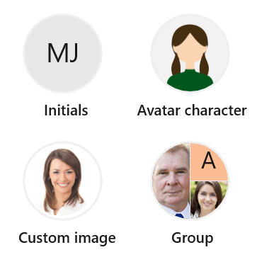

# Overview of WPF AvatarView

The [WPF AvatarView control](https://www.syncfusion.com/wpf-controls/avatar-view) provides a graphical representation of a user image that allows you to customize the view by adding an image, background color, icon, text, and more.

## Key features

* **Content type**: Display initials, images, and 25 pre-defined avatars.
* **Group view**: Add up to three images or initials in a single view.
* **Visual styles**: Use different visual styles like circle, square, and custom.
* **Customization**: Customize the height, width, border brush, border thickness, background, corner radius, and font.