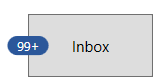
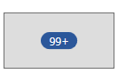
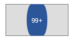
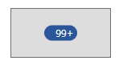
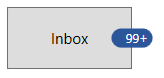

# Alignment and positioning in WPF Badge (SfBadge)

This section explains the alignment and positioning functionalities available in the WPF [Badge](https://help.syncfusion.com/cr/wpf/Syncfusion.Windows.Controls.Notification.SfBadge.html) control.

## Alignment of Badge

you can align the `Badge` either horizontally or vertically by using the `HorizontalAlignment` or `VerticalAlignment` properties. The default value of `HorizontalAlignment` property is `Right` and `VerticalAlignment` property is `Top`.

<table>

<tr>
<td class="invisible" ></td>
<th colspan = "4">HorizontalAlignment</th>
</tr>

<tr>
<th>VerticalAlignment</th>
<td>Left</td>
<td>Center</td>
<td>Right</td>
<td>Stretch</td>
</tr>

<tr>
<td>Top</td>
<td></td>
<td></td>
<td></td>
<td></td>
</tr>

<tr>
<td>Center</td>
<td></td>
<td></td>
<td></td>
<td></td>
</tr>

<tr>
<td>Bottom</td>
<td></td>
<td></td>
<td></td>
<td></td>
</tr>

<tr>
<td>Stretch</td>
<td></td>
<td></td>
<td></td>
<td></td>
</tr>
</table>




<Button Width="100"
        Height="50" 
        Content="Inbox">
    <notification:SfBadge.Badge>
        <notification:SfBadge HorizontalAlignment="Left"
                              VerticalAlignment="Center"
                              Content="99+"
                              x:Name="badge"/>
    </notification:SfBadge.Badge>
</Button>




badge.HorizontalAlignment = HorizontalAlignment.Left;
badge.VerticalAlignment = VerticalAlignment.Center;
badge.Content = "99+";




N> Download demo application from [GitHub](https://github.com/SyncfusionExamples/syncfusion-wpf-badge-control-examples/blob/main/Samples/Badge_Features)

## Positioning of Badge

You can change the horizontal or vertical position of the `Badge` either inside, outside or in the middle by using the [HorizontalAnchor](https://help.syncfusion.com/cr/wpf/Syncfusion.Windows.Controls.Notification.SfBadge.html#Syncfusion_Windows_Controls_Notification_SfBadge_HorizontalAnchor) and [VerticalAnchor](https://help.syncfusion.com/cr/wpf/Syncfusion.Windows.Controls.Notification.SfBadge.html#Syncfusion_Windows_Controls_Notification_SfBadge_VerticalAnchor) properties. It will be placed based on the value of `HorizontalAlignment` and `VerticalAlignment` properties. The default value of `HorizontalAnchor` and `VerticalAnchor` properties is `Center`.

For example, you will change the `HorizontalAnchor` and `VerticalAnchor` property values on when the value of `HorizontalAlignment` properties is `Right` and `VerticalAlignment` property is `Top`. `Badge` will be positioned as follows,

<table>

<tr>
<td class="invisible" ></td>
<th colspan = "4">HorizontalAnchor</th>
</tr>

<tr>
<th>VerticalAnchor</th>
<td>Inside</td>
<td>Center</td>
<td>OutSide</td>
</tr>

<tr>
<td>Inside</td>
<td></td>
<td></td>
<td></td>
</tr>

<tr>
<td>Center</td>
<td></td>
<td></td>
<td></td>
</tr>

<tr>
<td>Outside</td>
<td></td>
<td></td>
<td></td>
</tr>
</table>




<Button Width="100"
        Height="50" 
        Content="Inbox">
    <notification:SfBadge.Badge>
        <notification:SfBadge HorizontalAnchor="Outside"
                              VerticalAnchor="Center"
                            Content="10"
                            x:Name="badge"/>
    </notification:SfBadge.Badge>
</Button>




badge.HorizontalAnchor = BadgeAnchor.Outside;
badge.VerticalAnchor = BadgeAnchor.Center;
badge.Content = "10";




N> Download demo application from [GitHub](https://github.com/SyncfusionExamples/syncfusion-wpf-badge-control-examples/blob/main/Samples/Badge_Features)

## Place the Badge any where on the container

If you want to place the `Badge` anywhere on any shaped container, use the [HorizontalPosition](https://help.syncfusion.com/cr/wpf/Syncfusion.Windows.Controls.Notification.SfBadge.html#Syncfusion_Windows_Controls_Notification_SfBadge_HorizontalPosition) or [VerticalPosition](https://help.syncfusion.com/cr/wpf/Syncfusion.Windows.Controls.Notification.SfBadge.html#Syncfusion_Windows_Controls_Notification_SfBadge_VerticalPosition) properties. The value range for `HorizontalPosition` and `VerticalPosition` properties is `0` to`1`. The default value of `HorizontalPosition` property is `1` and `VerticalPosition` property is `0`.

For example, if you use any circular containers, you can easily place the `Badge` anywhere by using the `HorizontalPosition` and `VerticalPosition` properties.




<Image Source="/Images/avatar.png"
       Width="100"
       Height="100" >
    <notification:SfBadge.Badge>
        <notification:SfBadge Shape="None"
                              HorizontalPosition="0.9"
                              VerticalPosition="0.8"
                              x:Name="badge">
            <notification:SfBadge.Content>
                <Ellipse Width="20"
                         Height="20"
                         Fill="LimeGreen"/>
            </notification:SfBadge.Content>
        </notification:SfBadge>
    </notification:SfBadge.Badge>
</Image>




badge.HorizontalPosition = 0.9;
badge.VerticalPosition = 0.8;




N> Download demo application from [GitHub](https://github.com/SyncfusionExamples/syncfusion-wpf-badge-control-examples/blob/main/Samples/Custom_Alignment)

## Custom alignment and positioning of Badge

You can customize the horizontal or vertical position of the `Badge` either inside, outside or in the middle with any point by using the `HorizontalPosition` & `VerticalPosition` properties and [HorizontalAnchorPosition](https://help.syncfusion.com/cr/wpf/Syncfusion.Windows.Controls.Notification.SfBadge.html#Syncfusion_Windows_Controls_Notification_SfBadge_HorizontalAnchorPosition) & [VerticalAnchorPosition](https://help.syncfusion.com/cr/wpf/Syncfusion.Windows.Controls.Notification.SfBadge.html#Syncfusion_Windows_Controls_Notification_SfBadge_VerticalAnchorPosition) properties. This will effective only on by setting the `HorizontalAnchor` and `VerticalAnchor` properties value as `Custom`.  The value range for `HorizontalAnchorPosition` and `VerticalAnchorPosition` properties is `0` to`1`. The default value of `HorizontalAnchorPosition`and `VerticalAnchorPosition` properties is `0`.

<table>

<tr>
<td class="invisible" ></td>
<th colspan = "3">HorizontalPosition & 
HorizontalAnchorPosition</th>
</tr>

<tr>
<th>VerticalPosition & 

VerticalAnchorPosition</th>
<td>0</td>
<td >0.5</td>
<td>1</td>
</tr>

<tr>
<td>0</td>
<td></td>
<td></td>
<td></td>
</tr>

<tr>
<td>0.5</td>
<td></td>
<td></td>
<td></td>
</tr>

<tr>
<td>1</td>
<td></td>
<td></td>
<td></td>
</tr>
</table>




<Button Width="100"
        Height="50" 
        Content="Inbox">
    <notification:SfBadge.Badge>
        <notification:SfBadge HorizontalAnchor="Custom"
                              VerticalAnchor="Custom"
                              HorizontalAnchorPosition="0.2"
                              VerticalAnchorPosition="0.4"
                              Content="99+"
                              x:Name="badge2"/>
    </notification:SfBadge.Badge>
</Button>




badge.HorizontalAnchor = BadgeAnchor.Custom;
badge.VerticalAnchor = BadgeAnchor.Custom;
badge.HorizontalAnchorPosition = 0.2;
badge.VerticalAnchorPosition = 0.4;
badge.Content = "99+";




N> Download demo application from [GitHub](https://github.com/SyncfusionExamples/syncfusion-wpf-badge-control-examples/blob/main/Samples/Custom_Alignment)

## Badge content alignment

you can place the `Badge` content either horizontally or vertically by using the `HorizontalContentAlignment` or `VerticalContentAlignment` properties. The default value of `HorizontalContentAlignment` and `VerticalContentAlignment` properties is `Center`.




<Button Width="100"
        Height="50" 
        Content="Inbox">
    <notification:SfBadge.Badge>
        <notification:SfBadge HorizontalContentAlignment="Right"
                              VerticalContentAlignment="Center"
                              Content="10"
                              x:Name="badge"/>
    </notification:SfBadge.Badge>
</Button>




badge.HorizontalContentAlignment = HorizontalAlignment.Right;
badge.VerticalContentAlignment = VerticalAlignment.Center;
badge.Content = "99+";




N> Download demo application from [GitHub](https://github.com/SyncfusionExamples/syncfusion-wpf-badge-control-examples/blob/main/Samples/Badge_Features)
