# Alignment and Positioning in WPF SfBadge

This section explains the alignment and positioning functionalities available in the WPF [Badge](https://help.syncfusion.com/cr/wpf/Syncfusion.Windows.Controls.Notification.SfBadge.html) control.

## Alignment of Badge

You can align the `Badge` either horizontally or vertically by using the `HorizontalAlignment` or `VerticalAlignment` properties. The default value of the `HorizontalAlignment` property is `Right` and the `VerticalAlignment` property is `Top`.

<table>

<tr>
<td class="invisible" ></td>
<th colspan = "4">HorizontalAlignment</th>
</tr>

<tr>
<th>VerticalAlignment</th>
<td>Left</td>
<td>Center</td>
<td>Right</td>
<td>Stretch</td>
</tr>

<tr>
<td>Top</td>
<td></td>
<td></td>
<td></td>
<td>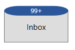</td>
</tr>

<tr>
<td>Center</td>
<td>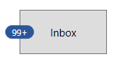</td>
<td>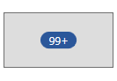</td>
<td>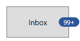</td>
<td>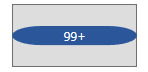</td>
</tr>

<tr>
<td>Bottom</td>
<td>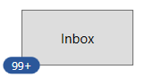</td>
<td></td>
<td></td>
<td></td>
</tr>

<tr>
<td>Stretch</td>
<td>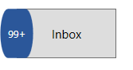</td>
<td>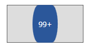</td>
<td>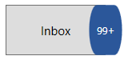</td>
<td>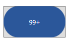</td>
</tr>
</table>




<Button Width="100"
        Height="50" 
        Content="Inbox">
    <notification:SfBadge.Badge>
        <notification:SfBadge HorizontalAlignment="Left"
                              VerticalAlignment="Center"
                              Content="99+"
                              x:Name="badge"/>
    </notification:SfBadge.Badge>
</Button>




badge.HorizontalAlignment = HorizontalAlignment.Left;
badge.VerticalAlignment = VerticalAlignment.Center;
badge.Content = "99+";




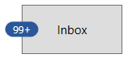

N> Download demo application from [GitHub](https://github.com/SyncfusionExamples/syncfusion-wpf-badge-control-examples/blob/main/Samples/Badge_Features)

## Positioning of Badge

You can change the horizontal or vertical position of the `Badge` to inside, center, outside, or custom by using the [HorizontalAnchor](https://help.syncfusion.com/cr/wpf/Syncfusion.Windows.Controls.Notification.SfBadge.html#Syncfusion_Windows_Controls_Notification_SfBadge_HorizontalAnchor) and [VerticalAnchor](https://help.syncfusion.com/cr/wpf/Syncfusion.Windows.Controls.Notification.SfBadge.html#Syncfusion_Windows_Controls_Notification_SfBadge_VerticalAnchor) properties. The `Badge` is placed based on the value of the `HorizontalAlignment` and `VerticalAlignment` properties. The default value of the `HorizontalAnchor` and `VerticalAnchor` properties is `Center`.

The table below shows the positioning behavior when `HorizontalAlignment="Right"` and `VerticalAlignment="Top"`. The C# `BadgeAnchor` enum ([API reference](https://help.syncfusion.com/cr/wpf/Syncfusion.Windows.Controls.Notification.BadgeAnchor.html)) provides the following values: `Inside`, `Center`, `Outside`, and `Custom`.

| HorizontalAnchor | VerticalAnchor | Behavior on a `Right` / `Top`-aligned badge |
|------------------|----------------|----------------------------------------------|
| `Inside`         | `Inside`       | The badge is moved into the container.       |
| `Center`         | `Inside`       | The badge is centered on the horizontal edge.|
| `Outside`        | `Inside`       | The badge is moved out of the container.     |
| `Inside`         | `Center`       | The badge is centered on the vertical edge.  |
| `Center`         | `Center`       | The badge is centered on the corner.         |
| `Outside`        | `Center`       | The badge is centered past the corner.       |
| `Inside`         | `Outside`      | The badge is moved further into the container.|
| `Center`         | `Outside`      | The badge is centered further out.           |
| `Outside`        | `Outside`      | The badge is moved furthest from the corner. |

<table>

<tr>
<td class="invisible" ></td>
<th colspan = "4">HorizontalAnchor</th>
</tr>

<tr>
<th>VerticalAnchor</th>
<td>Inside</td>
<td>Center</td>
<td>OutSide</td>
</tr>

<tr>
<td>Inside</td>
<td></td>
<td></td>
<td></td>
</tr>

<tr>
<td>Center</td>
<td></td>
<td>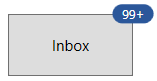</td>
<td></td>
</tr>

<tr>
<td>Outside</td>
<td></td>
<td></td>
<td></td>
</tr>
</table>




<Button Width="100"
        Height="50" 
        Content="Inbox">
    <notification:SfBadge.Badge>
        <notification:SfBadge HorizontalAnchor="Outside"
                              VerticalAnchor="Center"
                            Content="10"
                            x:Name="badge"/>
    </notification:SfBadge.Badge>
</Button>




badge.HorizontalAnchor = BadgeAnchor.Outside;
badge.VerticalAnchor = BadgeAnchor.Center;
badge.Content = "10";




N> Download demo application from [GitHub](https://github.com/SyncfusionExamples/syncfusion-wpf-badge-control-examples/blob/main/Samples/Badge_Features)

## Place the Badge anywhere on the container

If you want to place the `Badge` anywhere on any shaped container, use the [HorizontalPosition](https://help.syncfusion.com/cr/wpf/Syncfusion.Windows.Controls.Notification.SfBadge.html#Syncfusion_Windows_Controls_Notification_SfBadge_HorizontalPosition) or [VerticalPosition](https://help.syncfusion.com/cr/wpf/Syncfusion.Windows.Controls.Notification.SfBadge.html#Syncfusion_Windows_Controls_Notification_SfBadge_VerticalPosition) properties. The values are relative to the badge's parent container: `0` represents the left/top edge and `1` represents the right/bottom edge. The valid range is `0` to `1`. The default value of the `HorizontalPosition` property is `1` and the `VerticalPosition` property is `0`.

For example, if you use a circular container, you can easily place the `Badge` anywhere on its perimeter by using the `HorizontalPosition` and `VerticalPosition` properties.




<Image Source="/Images/avatar.png"
       Width="100"
       Height="100" >
    <notification:SfBadge.Badge>
        <notification:SfBadge Shape="None"
                              HorizontalPosition="0.9"
                              VerticalPosition="0.8"
                              x:Name="badge">
            <notification:SfBadge.Content>
                <Ellipse Width="20"
                         Height="20"
                         Fill="LimeGreen"/>
            </notification:SfBadge.Content>
        </notification:SfBadge>
    </notification:SfBadge.Badge>
</Image>




badge.HorizontalPosition = 0.9;
badge.VerticalPosition = 0.8;




N> Download demo application from [GitHub](https://github.com/SyncfusionExamples/syncfusion-wpf-badge-control-examples/blob/main/Samples/Custom_Alignment)

## Custom alignment and positioning of Badge

You can customize the horizontal or vertical position of the `Badge` to any point by using the `HorizontalPosition` and `VerticalPosition` properties together with the [HorizontalAnchorPosition](https://help.syncfusion.com/cr/wpf/Syncfusion.Windows.Controls.Notification.SfBadge.html#Syncfusion_Windows_Controls_Notification_SfBadge_HorizontalAnchorPosition) and [VerticalAnchorPosition](https://help.syncfusion.com/cr/wpf/Syncfusion.Windows.Controls.Notification.SfBadge.html#Syncfusion_Windows_Controls_Notification_SfBadge_VerticalAnchorPosition) properties. This is effective only when the `HorizontalAnchor` and `VerticalAnchor` properties are set to `Custom`. The valid range for both `HorizontalAnchorPosition` and `VerticalAnchorPosition` properties is `0` to `1`. The default value of the `HorizontalAnchorPosition` and `VerticalAnchorPosition` properties is `0`.

<table>

<tr>
<td class="invisible" ></td>
<th colspan = "3">HorizontalPosition & 
HorizontalAnchorPosition</th>
</tr>

<tr>
<th>VerticalPosition & 

VerticalAnchorPosition</th>
<td>0</td>
<td >0.5</td>
<td>1</td>
</tr>

<tr>
<td>0</td>
<td>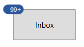</td>
<td></td>
<td></td>
</tr>

<tr>
<td>0.5</td>
<td></td>
<td>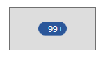</td>
<td>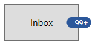</td>
</tr>

<tr>
<td>1</td>
<td>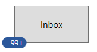</td>
<td></td>
<td></td>
</tr>
</table>




<Button Width="100"
        Height="50" 
        Content="Inbox">
    <notification:SfBadge.Badge>
        <notification:SfBadge HorizontalAnchor="Custom"
                              VerticalAnchor="Custom"
                              HorizontalAnchorPosition="0.2"
                              VerticalAnchorPosition="0.4"
                              Content="99+"
                              x:Name="badge2"/>
    </notification:SfBadge.Badge>
</Button>




badge.HorizontalAnchor = BadgeAnchor.Custom;
badge.VerticalAnchor = BadgeAnchor.Custom;
badge.HorizontalAnchorPosition = 0.2;
badge.VerticalAnchorPosition = 0.4;
badge.Content = "99+";




N> Download demo application from [GitHub](https://github.com/SyncfusionExamples/syncfusion-wpf-badge-control-examples/blob/main/Samples/Custom_Alignment)

## Badge content alignment

You can place the `Badge` content either horizontally or vertically by using the `HorizontalContentAlignment` or `VerticalContentAlignment` properties. The default value of the `HorizontalContentAlignment` and `VerticalContentAlignment` properties is `Center`.




<Button Width="100"
        Height="50" 
        Content="Inbox">
    <notification:SfBadge.Badge>
        <notification:SfBadge HorizontalContentAlignment="Right"
                              VerticalContentAlignment="Center"
                              Content="10"
                              x:Name="badge"/>
    </notification:SfBadge.Badge>
</Button>




badge.HorizontalContentAlignment = HorizontalAlignment.Right;
badge.VerticalContentAlignment = VerticalAlignment.Center;
badge.Content = "99+";




N> Download demo application from [GitHub](https://github.com/SyncfusionExamples/syncfusion-wpf-badge-control-examples/blob/main/Samples/Badge_Features)
