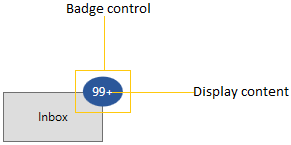
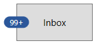
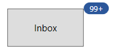

# Getting Started with WPF Badge (SfBadge)

This section explains the steps required to add the [Badge](https://help.syncfusion.com/cr/wpf/Syncfusion.Windows.Controls.Notification.SfBadge.html) control and its elements such as shapes, alignment and predefined colors. This section covers only basic features needed to get started with Syncfusion `Badge` control.

## Structure of SfBadge control

## Assembly deployment

Refer to the [Control Dependencies](https://help.syncfusion.com/wpf/control-dependencies#sfbadge) section to get the list of assemblies or NuGet package that needs to be added as a reference to use the control in any application.

Refer to this [documentation](https://help.syncfusion.com/wpf/visual-studio-integration/nuget-packages) to find more details about installing nuget packages in a WPF application.

## Adding WPF SfBadge via XAML

To add the `SfBadge` manually in XAML, follow these steps:

1. Create a new WPF project in Visual Studio.

2. Add the following required assembly references to the project:

    * Syncfusion.Shared.WPF
    * Syncfusion.Tools.WPF

3. Import Syncfusion WPF schema **http://schemas.syncfusion.com/wpf**, and declare the `SfBadge` in XAML page.




<Window
    x:Class="GettingStarted.MainWindow"
    xmlns="http://schemas.microsoft.com/winfx/2006/xaml/presentation"
    xmlns:x="http://schemas.microsoft.com/winfx/2006/xaml"
    xmlns:d="http://schemas.microsoft.com/expression/blend/2008"
    xmlns:mc="http://schemas.openxmlformats.org/markup-compatibility/2006"
    xmlns:notification="http://schemas.syncfusion.com/wpf"
    mc:Ignorable="d">
    <Grid>
        <notification:SfBadge Name="badge"/>
    </Grid>
</Window>




## Adding WPF SfBadge via C#

To add the `SfBadge` control manually in C#, follow these steps:

1. Create a new WPF application via Visual Studio.

2. Add the  following assembly references to the project,

    * Syncfusion.Shared.WPF
    * Syncfusion.Tools.WPF

3. Include the required namespace and create an instance of `SfBadge` and add it to the window.

4. Declare the `SfBadge` control using C#.




using Syncfusion.Windows.Controls.Notification;

namespace GettingStarted
{
    /// 

    /// Interaction logic for MainWindow.xaml
    /// 

    public partial class MainWindow : Window
    {
        public MainWindow()
        {
            this.InitializeComponent();
            // Creating an instance of the Badge control
            SfBadge badge = new SfBadge();
            grid.Children.Add(badge);
        }
    }
}




## Adding badge for a Button

If you want to assign `Badge` for any objects, create the `Badge` and assign the badge to the [SfBadge.Badge](https://help.syncfusion.com/cr/wpf/Syncfusion.Windows.Controls.Notification.SfBadge.html#Syncfusion_Windows_Controls_Notification_SfBadge_BadgeProperty) property. Before that you need to create a `SfBadge.Badge` object and add that object to the parent control.

Here, `Badge` control added for the `Button` control.




<Button Width="100"
        Height="50" 
        Content="Inbox">
    <notification:SfBadge.Badge>
        <notification:SfBadge Content="10"
                              x:Name="badge"/>
    </notification:SfBadge.Badge>
</Button>




//Creating Badge control
SfBadge sfBadge = new SfBadge();
sfBadge.Name = "badge";
sfBadge.Content = 10;

//Create button control as container for badge
Button button = new Button();
button.Width = 100;
button.Height = 50;
button.Content = "Primary";

//Assigning Badge control to button           
SfBadge.SetBadge(button, sfBadge);




N> Download demo application from [GitHub](https://github.com/SyncfusionExamples/syncfusion-wpf-badge-control-examples/blob/main/Samples/Getting_Started)

## Setting Badge display content

If you want to set or change the display content of the `Badge`, use the `Content` property. The default value of `Content` property is `null`.




<Button Width="100"
        Height="50" 
        Content="Inbox">
    <notification:SfBadge.Badge>
        <notification:SfBadge Content="99+"
                              x:Name="badge"/>
    </notification:SfBadge.Badge>
</Button>




badge.Content = "99+";




N> Download demo application from [GitHub](https://github.com/SyncfusionExamples/syncfusion-wpf-badge-control-examples/blob/main/Samples/Content_CustomUI)

## Alignment of Badge

you can align the `Badge` either horizontally or vertically by using the `HorizontalAlignment` or `VerticalAlignment` properties. The default value of `HorizontalAlignment` property is `Right` and `VerticalAlignment` property is `Top`.




<Button Width="100"
        Height="50" 
        Content="Inbox">
    <notification:SfBadge.Badge>
        <notification:SfBadge HorizontalAlignment="Left"
                              VerticalAlignment="Center"
                              Content="99+"
                              x:Name="badge"/>
    </notification:SfBadge.Badge>
</Button>




badge.HorizontalAlignment = HorizontalAlignment.Left;
badge.VerticalAlignment = VerticalAlignment.Center;
badge.Content = "99+";




N> Download demo application from [GitHub](https://github.com/SyncfusionExamples/syncfusion-wpf-badge-control-examples/blob/main/Samples/Badge_Features)

## Positioning of Badge

You can change the horizontal or vertical position of the `Badge` either inside, outside or in the middle by using the [HorizontalAnchor](https://help.syncfusion.com/cr/wpf/Syncfusion.Windows.Controls.Notification.SfBadge.html#Syncfusion_Windows_Controls_Notification_SfBadge_HorizontalAnchor) and [VerticalAnchor](https://help.syncfusion.com/cr/wpf/Syncfusion.Windows.Controls.Notification.SfBadge.html#Syncfusion_Windows_Controls_Notification_SfBadge_VerticalAnchor) properties. The default value of `HorizontalAnchor` and `VerticalAnchor` properties is `Center`.




<Button Width="100"
        Height="50" 
        Content="Inbox">
    <notification:SfBadge.Badge>
        <notification:SfBadge HorizontalAnchor="Outside"
                              VerticalAnchor="Center"
                              Content="10"
                              x:Name="badge"/>
    </notification:SfBadge.Badge>
</Button>




badge.HorizontalAnchor = BadgeAnchor.Outside;
badge.VerticalAnchor = BadgeAnchor.Center;
badge.Content = "10";




N> Download demo application from [GitHub](https://github.com/SyncfusionExamples/syncfusion-wpf-badge-control-examples/blob/main/Samples/Badge_Features)

## Place the Badge any where on the container

If you want to place the `Badge` anywhere on any shaped container, use the [HorizontalPosition](https://help.syncfusion.com/cr/wpf/Syncfusion.Windows.Controls.Notification.SfBadge.html#Syncfusion_Windows_Controls_Notification_SfBadge_HorizontalPosition) or [VerticalPosition](https://help.syncfusion.com/cr/wpf/Syncfusion.Windows.Controls.Notification.SfBadge.html#Syncfusion_Windows_Controls_Notification_SfBadge_VerticalPosition) properties. The value range for `HorizontalPosition` and `VerticalPosition` properties is `0` to`1`. The default value of `HorizontalPosition` property is `1` and `VerticalPosition` property is `0`.

For example, if you use any circular containers, you can easily place the `Badge` anywhere by using the `HorizontalPosition` and `VerticalPosition` properties.




<Image Source="/Images/avatar.png"
       Width="100"
       Height="100" >
    <notification:SfBadge.Badge>
        <notification:SfBadge Shape="None"
                              HorizontalPosition="0.9"
                              VerticalPosition="0.8"
                              x:Name="badge">
            <notification:SfBadge.Content>
                <Ellipse Width="20"
                         Height="20"
                         Fill="LimeGreen"/>
            </notification:SfBadge.Content>
        </notification:SfBadge>
    </notification:SfBadge.Badge>
</Image>




badge.HorizontalPosition = 0.9;
badge.VerticalPosition = 0.8;




N> Download demo application from [GitHub](https://github.com/SyncfusionExamples/syncfusion-wpf-badge-control-examples/blob/main/Samples/Custom_Alignment)

## Adding badge without BadgeContainer

You can directly add the `Badge` to any objects without using the `SfBadge.Badge` container.




public class ViewModel {
 public string ItemName { get; set; }
 public int? UnreadMessageount { get; set; }
}

public class ViewModel {
    public List<Model> MailItems { get; set; }
    public ViewModel(){
        MailItems = new List<Model>();
        MailItems.Add(new Model()
        {
            ItemName = "Inbox",
            UnreadMessageount = 20
        });
        MailItems.Add(new Model()
        {
            ItemName = "Drafts",
            UnreadMessageount = null
        });
        MailItems.Add(new Model()
        {
            ItemName = "Sent Items",
            UnreadMessageount = 5
        });
        MailItems.Add(new Model()
        {
            ItemName = "Deleted Items",
            UnreadMessageount = null
        });
        MailItems.Add(new Model()
        {
            ItemName = "Junk Email",
            UnreadMessageount = null
        });
    }
}







<Window.DataContext>
    <local:ViewModel></local:ViewModel>
</Window.DataContext>
<Grid>
    <ListView BorderThickness="1"
              BorderBrush="LightGray"
              ItemsSource="{Binding MailItems}" 
              SelectedIndex="0"
              VerticalAlignment="Center" 
              HorizontalAlignment="Center">
        <ListView.ItemTemplate>
            <DataTemplate>
                <Grid>
                    <Grid.ColumnDefinitions>
                        <ColumnDefinition Width="150"/>
                        <ColumnDefinition Width="100"/>
                    </Grid.ColumnDefinitions>
                    <ContentPresenter Grid.Column="0" 
                                      Content="{Binding ItemName}" 
                                      VerticalAlignment="Center"/>
                    <notification:SfBadge x:Name="badge4"
                                          Grid.Column="1" 
                                          Height="20" 
                                          Width="40" 
                                          Background="Orange"
                                          Content="{Binding UnreadMessageount}"
                                          Shape="Oval"/>
                </Grid>
            </DataTemplate>
        </ListView.ItemTemplate>
    </ListView>
</Grid>




N> Download demo application from [GitHub](https://github.com/SyncfusionExamples/syncfusion-wpf-badge-control-examples/blob/main/Samples/Badge_without_BadgeContainer)

## Predefined colors for displaying the badges

You can change background color of the `Badge` by using the [Fill](https://help.syncfusion.com/cr/wpf/Syncfusion.Windows.Controls.Notification.SfBadge.html#Syncfusion_Windows_Controls_Notification_SfBadge_Fill) property. Based on the value of `Fill` property, respective background color will be applied to the `Badge`. The default value of `Fill` property is `Accent`.

The `Badge` supports the following different essential states :

* Accent - DarkSlateBlue background will be applied

* Alt - DarkSlateGray background will be applied

* Default - WhiteSmoke background will be applied

* Error - OrangeRed background will be applied

* Information - RoyalBlue background will be applied

* Success - Green background will be applied

* Warning - Chocolate background will be applied




<Button Width="100"
        Height="50" 
        Content="Inbox">
    <notification:SfBadge.Badge>
        <notification:SfBadge Fill="Success"
                              Content="99+"
                              x:Name="badge"/>
    </notification:SfBadge.Badge>
</Button>




badge.Fill = BadgeFill.Success;
badge.Content = "99+";




N> Download demo application from [GitHub](https://github.com/SyncfusionExamples/syncfusion-wpf-badge-control-examples/blob/main/Samples/Badge_Features)

## Predefined shapes for displaying the Badge

You can change the default shape to either `Rectangle`, `Oval` or `Ellipse` by using [Shape](https://help.syncfusion.com/cr/wpf/Syncfusion.Windows.Controls.Notification.SfBadge.html#Syncfusion_Windows_Controls_Notification_SfBadge_Shape) property. If you want to display the `Badge` content without any default shapes , use the `Shape` property value as `None`. The default value of `Shape` property is `Oval`.




<Button Width="100"
        Height="50" 
        Content="Inbox">
    <notification:SfBadge.Badge>
        <notification:SfBadge Shape="Oval"
                              Content="99+"
                              x:Name="badge"/>
    </notification:SfBadge.Badge>
</Button>




badge.Shape = BadgeShape.Oval;
badge.Content = "99+";




N> Download demo application from [GitHub](https://github.com/SyncfusionExamples/syncfusion-wpf-badge-control-examples/blob/main/Samples/Badge_Features)

## Animate when content changes

You can enable the `Scale` or `Opacity` based animation for displaying the `Badge` text by using [AnimationType](https://help.syncfusion.com/cr/wpf/Syncfusion.Windows.Controls.Notification.SfBadge.html#Syncfusion_Windows_Controls_Notification_SfBadge_AnimationType) property. You can only see the animation when you change the text of the `Badge`. The default value of `AnimationType` property is `None`.




<Button Width="100"
        Height="50" 
        Content="Inbox">
    <notification:SfBadge.Badge>
        <notification:SfBadge AnimationType="Scale"
                              Shape="Ellipse"
                              x:Name="badge"/>
    </notification:SfBadge.Badge>
</Button>

<StackPanel Orientation="Vertical">
    <TextBlock Text="Badge content" 
               TextAlignment="Center" />
    <notification:UpDown MinValue="1"
                         MaxValue="10"
                         Step="1" 
                         NumberDecimalDigits="0"
                         Value="1"
                         x:Name="badgeContent"
                         ValueChanged="BadgeContent_ValueChanged"/> 




badge.AnimationType = BadgeAnimationType.Scale;
badge.Shape = BadgeShape.Ellipse;
badgeContent.ValueChanged += BadgeContent_ValueChanged;







private void BadgeContent_ValueChanged(DependencyObject d, DependencyPropertyChangedEventArgs e)
{
    this.badge.Content = Convert.ToInt32(e.NewValue).ToString();
}




### Scaling based animation

### Opacity based animation

N> Download demo application from [GitHub](https://github.com/SyncfusionExamples/syncfusion-wpf-badge-control-examples/blob/main/Samples/Badge_Features)

## Custom Content Formats

You can format the numbers which are displayed in the `Badge` content by using the converters. For example, you can display the number as `99+` which is greater than or equal to `100`.




<Button Width="100"
        Height="50" 
        Content="Inbox">
    <notification:SfBadge.Badge>
        <notification:SfBadge x:Name="badge"
                              Shape="Ellipse"
                              AnimationType="None"/>
    </notification:SfBadge.Badge>
</Button>

<StackPanel Orientation="Vertical">
    <TextBlock Text="Badge content" 
               TextAlignment="Center" />
    <syncfusion1:UpDown MinValue="1"
                        MaxValue="10000000"
                        Step="1" 
                        NumberDecimalDigits="0"
                        Value="1"
                        x:Name="badgeContent"
                        ValueChanged="BadgeContent_ValueChanged"/>
</StackPanel>




badge.AnimationType = BadgeAnimationType.None;
badge.Shape = BadgeShape.Ellipse;
badgeContent.ValueChanged += BadgeContent_ValueChanged;







private void BadgeContent_ValueChanged(DependencyObject d, DependencyPropertyChangedEventArgs e)
{
    int content_Value =Convert.ToInt32(e.NewValue);
    if (content_Value <= 99)
    {
        this.badge.Content = content_Value.ToString();
    }
    else if (content_Value <= 999)
    {
        this.badge.Content = "99+";
    }
    else if (content_Value < 99999)
    {
        this.badge.Content = (content_Value / 1000).ToString("0.#") + "K";
    }
    else if (content_Value < 999999)
    {
        this.badge.Content = (content_Value / 1000).ToString("#,0K");
    }
    else if (content_Value < 9999999)
    {
        this.badge.Content = (content_Value / 1000000).ToString("0.#") + "M";
    }
    else
    {
        this.badge.Content = (content_Value / 1000000).ToString("#,0M");
    }
}




N> Download demo application from [GitHub](https://github.com/SyncfusionExamples/syncfusion-wpf-badge-control-examples/blob/main/Samples/Content_CustomUI)

## Theme

Badge supports various built-in themes. Refer to the below links to apply themes for the Badge,

  * [Apply theme using SfSkinManager](https://help.syncfusion.com/wpf/themes/skin-manager)
	
  * [Create a custom theme using ThemeStudio](https://help.syncfusion.com/wpf/themes/theme-studio#creating-custom-theme)

  