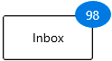

# WPF Badge (SfBadge) Overview

[Badge](https://help.syncfusion.com/cr/wpf/Syncfusion.Windows.Controls.Notification.SfBadge.html) control used to notify users of new or unread messages, notifications, or the status of something. 

## Badge control

## Key features

* Position - Position the `Badge` text around the `Badge` content.
* Predefined colors - Customize the `Badge` background with predefined colors for the success, warning, error and information states.
* Animation - Use animations for `Badge` text.
* Predefined and custom shapes for `Badge` control.
* Rotation - Rotate the `Badge` to any angle.
* Alignment - Align the `Badge` at any position
* Custom UI - Customized UI for control and its content.

