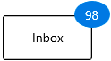

# WPF Badge (SfBadge) Overview

The [Badge](https://help.syncfusion.com/cr/wpf/Syncfusion.Windows.Controls.Notification.SfBadge.html) control is used to notify users of new or unread messages, notifications, or the status of something.

## Badge control

## Key features

* **Position** - Position the `Badge` text around the `Badge` content.
* **Predefined colors** - Customize the `Badge` background with predefined colors for the success, warning, error, and information states.
* **Animation** - Use scale or opacity animations for `Badge` text changes.
* **Shapes** - Predefined and custom shapes for the `Badge` control.
* **Rotation** - Rotate the `Badge` to any angle.
* **Alignment** - Align the `Badge` at any position.
* **Custom UI** - Customize the UI of the `Badge` and its content.

