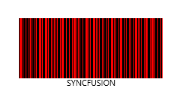
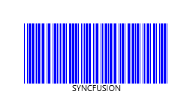

# Barcode Customization in WPF Barcode (SfBarcode)

## Overview

The color of the barcode can be customized by modifying the `DarkBarBrush` and `LightBarBrush` properties of the barcode control. The `DarkBarBrush` represents the color of the dark bar (Black color usually) and the `LightBarBrush` represents the color of the gap between two adjacent dark bars (White color usually).

## Customizing the barcode colors

The following code example shows how to set the dark and light bar colors.



<sync:SfBarcode x:Name="barcode" Text="82698640929" DarkBarBrush="Red" LightBarBrush="Blue" Symbology="Code128"/>



The following images illustrate the barcode rendered with different color combinations.

Barcode color combinations – Red
{:.caption}

Barcode color combinations – Blue
{:.caption}

## Limitations

N> The `DarkBarBrush` and `LightBarBrush` customizations are applicable only for one-dimensional barcodes. For a barcode symbol to be recognized by a scanner, there must be adequate contrast between the dark bars and the light spaces. Additionally, not all barcode scanners support colored barcodes.
