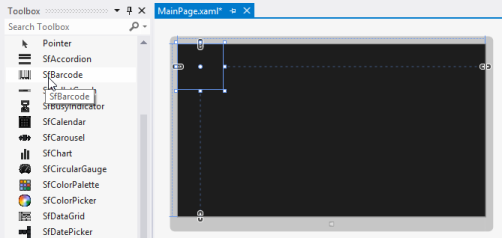

# Getting Started

## Add Barcode control to an Application 

The following assembly reference is required for deploying Barcode.



Namespace: Syncfusion.UI.Xaml.Controls.Barcode

Assembly: Syncfusion.SfBarcode.WPF



To create the SfBarcode control in Visual Studio:

1. Create a new WPF project. 

2. Drag the SfBarcode control from the Toolbox window to the Design View. An instance of the SfBarcode control is created in the Design view.

   

   SfBarcode Control after Dragging to Design View
   {:.caption}

The following code example shows how to create the Barcode control from XAML:



<Page xmlns:sync="using:Syncfusion.UI.Xaml.Controls.Barcode">

    <Grid>

        <sync:SfBarcode x:Name="barcode" Text="http://www.syncfusion.com" Symbology="QRBarcode">

                    <sync:SfBarcode.SymbologySettings>

                        <sync:QRBarcodeSetting XDimension="8"/>

                    </sync:SfBarcode.SymbologySettings>

                </sync:SfBarcode>

    </Grid>

</Page>



## Text

The text to be encoded can be set using the Text property. By default, this original text will be displayed at the bottom of the bar code. The location of the text can be toggled between top and bottom using TextLocation property. The horizontal alignment of the text can be set using TextAlignment. The text brush and other various font customization can also be done using the built-in font properties. Optionally, the user can hide the barcode text by setting the DisplayText property to false.



<sync:SfBarcode x:Name="barcode" Text="http://www.syncfusion.com" DisplayText="False” Symbology="QRBarcode"/>



## Rotation

Barcode control can be rotated to save space by using the Rotation property. The barcode can be rotated to 90, 180 and 270 degrees.