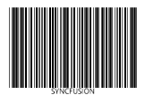

# WPF Barcode (SfBarcode) Overview

The Barcode control helps rendering bar codes in desktop (WPF) application. The control can be merged with into any desktop application and easy to encode text using the supported symbol types. The basic structure of a bar code consists of a leading and trailing quiet zone, a start pattern, one or more data characters, optionally one or two check characters, and a stop pattern. 

Barcode control rendering 1D bar code
{:.caption}

Barcode control rendering 2D bar code
{:.caption}

## Structure of the Control

Structure of Barcode control
{:.caption}
