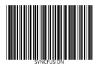
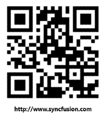

# WPF Barcode (SfBarcode) Overview

The Barcode control helps render barcodes in desktop (WPF) applications. The control can be merged into any desktop application and makes it easy to encode text using the supported symbol types. The basic structure of a barcode consists of a leading and trailing quiet zone, a start pattern, one or more data characters, optionally one or two check characters, and a stop pattern.

Barcode control rendering a 1D barcode
{:.caption}

Barcode control rendering a 2D barcode
{:.caption}

## Structure of the control

Structure of Barcode control
{:.caption}
