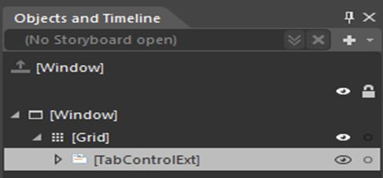
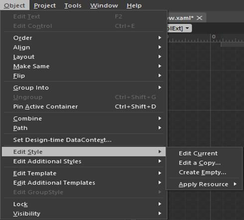
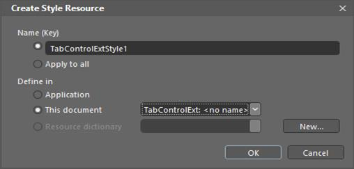
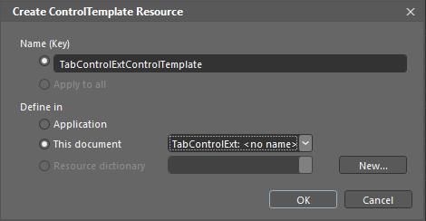

# Blend Support

The following section explains about the following topics:

* Edit control Style in Expression Blend
* Edit Control Template in Expression Blend

## Getting Started

The following steps help you edit the Template in Expression Blend.

### Edit control Style in Expression Blend

1. Open your application in Expression Blend. 
2. Expand the Window, Objects and Timeline.
3. In the “Objects and Timeline” pane, select Syncfusion Control for which you want to modify a style.

4. Expand the Object, Edit Style menu.

5. You have the following options:
      a. Edit Current – To edit Current applied style. When you don't have an applied Style to the control, this option is disabled.
      b. Edit a Copy – Helps to edit a copy of default style. When you select, **Create** **Style** **Resource** dialog box is opened, this dialog box is used to select the name for your style, as well as choose the location for where your file is defined in. 

      c. Create Empty – this option helps to create an empty style for selected control. If you choose it, the same **Create** **Style** **Resource** dialog box is opened. You can select the name for your style, as well as choose the location.

### Edit control Template in Expression Blend

1. Open your application in Expression Blend. 
2. Expand the Window, Objects and Timeline.
3. In the “Objects and Timeline” pane, select Syncfusion Control for which you want to modify a Template.

4. Expand the Object (  Edit Template

5. You have the following options:
      a. Edit Current – To edit the current Template of the control. When you don't have an applied Template to the control, this option is disabled.
      b. Edit a Copy – Helps to edit the default Template. When you select, **Create** **Style** **Resource** dialog box is opened and this dialog box is used to select the name for your style, as well as the location.

      c. Create Empty – This option helps to create an empty template for selected control. When you choose it, the same dialog box opens. You should select the name for your template, as well as the location.

