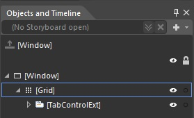
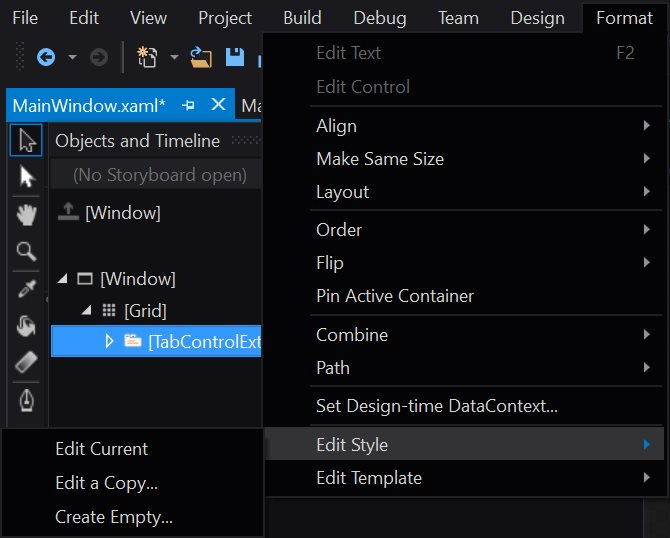
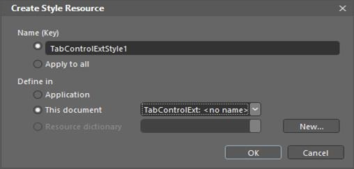
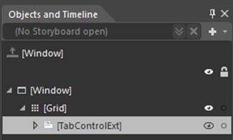
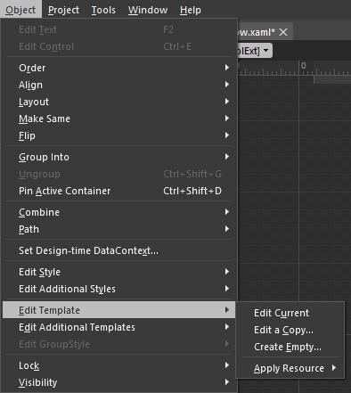

# Getting Started for Blend Support

Essential WPF control's Style and Template can be editable in Expression Blend and this section explains the same.

## Edit Control Style in Expression Blend

1.Open an application in Expression Blend. 

2.Expand the Views, choose Other Windows and then choose Objects and Timeline.

3.In the “Objects and Timeline” pane, select a Syncfusion control to modify a style.

4.Expand the Format, then choose Edit Style menu.

5.It provide the following options.

   * Edit Current – To edit current applied style. This option is disabled when control don't have a Style.
   * Edit a Copy – Helps to edit a copy of default style. When it select, Create Style Resource dialog box is opened, this dialog box is used to select the name for style, as well as choose the location for where file is defined in. 

   * Create Empty – this option helps to create an empty style for selected control. When it selected, the same Create Style Resource dialog box is opened and it is used to select the name for style, as well as choose the location.

## Edit ControlTemplate in Expression Blend

1.Open an application in Expression Blend. 

2.Expand the Views, choose Other Windows and then choose Objects and Timeline.

3.In the “Objects and Timeline” pane, select a Syncfusion control to modify a Template.

4.Right click on the Syncfusion control and choose Edit Template

5.It provide the following options.

* Edit Current – To edit the current Template of the control.This option is disabled when control don't have a Template.
* Edit a Copy – Helps to edit the default Template. When it select, Create ControlTemplate Resource dialog box is opened, this dialog box is used to select the name for Template, as well as choose the location for where file is defined in.

* Create Empty – This option helps to create an empty template for selected control. When it selected, the same dialog box opened. It is used to select the name for Template, as well as the location.

