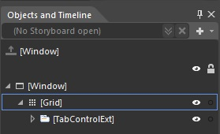
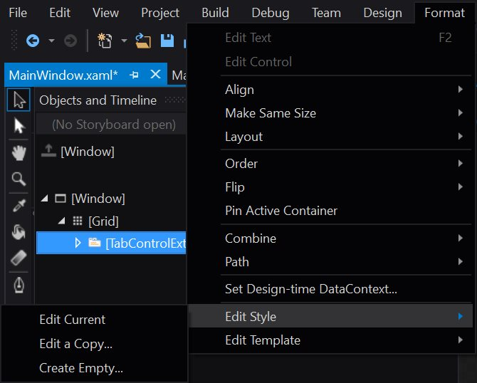
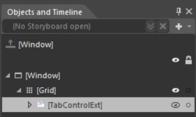
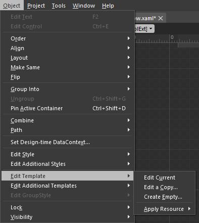

# Getting Started with Blend Support

Essential&reg; WPF control's Style and Template can be edited in Expression Blend and this section explains the same.

## Edit Control Style in Expression Blend

1. Open an application in Expression Blend.

2. Expand the `Views` menu, choose `Other Windows`, and then choose `Objects and Timeline`.

3.In the “Objects and Timeline” pane, select a Syncfusion&reg; control to modify a style.

4. The `Edit Style` menu provides the following options:

5. In the **Create Style Resource** dialog box, choose a name for the style and select **Define in: Application** (to make it available application-wide) or **Define in: this document** (to scope it to a specific resource dictionary or the current view), and then click **OK**. The style is added to the XAML and the designer surfaces it for editing.

## Edit ControlTemplate in Expression Blend

1. Open an application in Expression Blend.

2. Expand the `Views` menu, choose `Other Windows`, and then choose `Objects and Timeline`.

3. In the "Objects and Timeline" pane, select a Syncfusion&reg; control to modify a template.

4. Right-click the Syncfusion&reg; control and choose `Edit Template`.

5. The `Edit Template` menu provides the following options:

* **Edit Current** – To edit the current template of the control. This option is disabled when the control does not have a template.
* **Edit a Copy** – Helps you to edit a copy of the default template. When it is selected, the Create ControlTemplate Resource dialog box is opened. This dialog box is used to select the name for the template as well as the location where the template is defined.
* **Create Empty** – This option helps you to create an empty template for the selected control. When it is selected, the same Create ControlTemplate Resource dialog box is opened. It is used to select the name for the template as well as the location.

