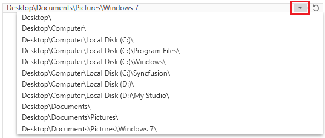

# Edit Mode

This feature allows you to easily edit a navigation path by using the [IsEnableEditMode](https://help.syncfusion.com/cr/wpf/Syncfusion.Windows.Tools.Controls.HierarchyNavigator.html#Syncfusion_Windows_Tools_Controls_HierarchyNavigator_IsEnableEditMode) property as `true`.

## AutoComplete 

1. Click the HierarchyNavigatorItemsControl, to start the Edit mode, which enables the AutoComplete function. 

2. In Edit mode, users can type a navigation path to display a list of navigation items below the HierarchyNavigatorItemsControl from which you can select.

3. using the Tab key, you can navigate from editing to select the drop-down suggestions from Top to bottom order. using Shift + Tab key to select the items from bottom to top order.

4. If we press the escape key while editing, the popup will be closed with the selected item or text edited in the HierarchyNavigator control.
After that if we press escape key again, the editor will be closed and control will turn back to select mode with the previous selected item.  

5. using the Enter key after selecting the dropdown item using the arrow keys or tab key, the item must be selected based on the matched item and the control turn back to select mode. 

6. You can paste the text into editor instead of typing. The control checks for possible matching items and should be shown in the popup.

7. If we enter the invalid path or text in the textbox, the popup should be closed. 




<syncfusion:HierarchyNavigator x:Name="hierarchyNavigator" 
                               IsEnableEditMode="true" />




HierarchyNavigator hierarchyNavigator = new HierarchyNavigator();
hierarchyNavigator.IsEnableEditMode = true;




## History

Items selected by users have been saved as History Items. To open the History popup, use the drop-down button on the control. Use the property [IsEnableHistory](https://help.syncfusion.com/cr/wpf/Syncfusion.Windows.Tools.Controls.HierarchyNavigator.html#Syncfusion_Windows_Tools_Controls_HierarchyNavigator_IsEnableHistory) as 'true' for history items.




<syncfusion:HierarchyNavigator x:Name="hierarchyNavigator"
                               IsEnableEditMode="true"
                               IsEnableHistory="true" />




HierarchyNavigator hierarchyNavigator = new HierarchyNavigator();
hierarchyNavigator.IsEnableEditMode = true;
hierarchyNavigator.IsEnableHistory = true;




