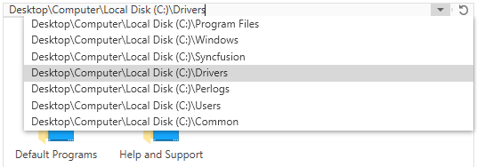

# Edit Mode in Hierarchical Navigator

This feature allows you to easily edit a navigation path by setting the [IsEnableEditMode](https://help.syncfusion.com/cr/wpf/Syncfusion.Windows.Tools.Controls.HierarchyNavigator.html#Syncfusion_Windows_Tools_Controls_HierarchyNavigator_IsEnableEditMode) property to `true`. The filter support is available in edit mode, which suggests matching nodes based on the path entered in the editor like the Windows Explorer.

To start the edit mode, click `HierarchyNavigatorItemsControl` and enter a navigation path that will display a drop-down list of filtered navigation paths, and then select the expected navigation path.

N> If you enter an incorrect path or text in the editor, the dropdown suggestion list will be closed.




<Window xmlns="http://schemas.microsoft.com/winfx/2006/xaml/presentation"
		xmlns:x="http://schemas.microsoft.com/winfx/2006/xaml"
		xmlns:syncfusion="http://schemas.syncfusion.com/wpf" 
		x:Class="HierarchicalNavigatorSample.MainWindow"
		Title="HierarchicalNavigator Sample" Height="350" Width="525">
	<Grid>
		<!--Adding HierarchicalNavigator control -->
		<syncfusion:HierarchicalNavigator x:Name="hierarchicalNavigator" Width="100" Height="100" IsEnableEditMode="true" VerticalAlignment="Center" HorizontalAlignment="Center"/>
	</Grid>
</Window>




using Syncfusion.Windows.Tools;
namespace HierarchicalNavigatorSample
{
	/// 

	/// Interaction logic for MainWindow.xaml
	/// 

	public partial class MainWindow : Window
	{
		public MainWindow()
		{
			InitializeComponent();
			//Creating an instance of HierarchicalNavigator control
			HierarchicalNavigator hierarchicalNavigator = new HierarchicalNavigator();
			hierarchyNavigator.IsEnableEditMode = true;
			
			//Adding HierarchicalNavigator as window content
			this.Content = hierarchicalNavigator;
		}
	}
}




