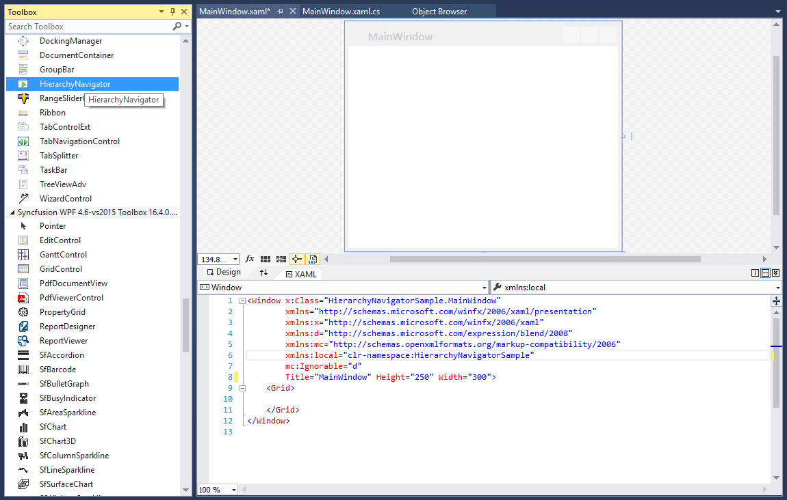
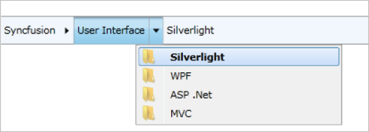

# Getting Started with WPF BreadCrumb

## Assembly deployment

Refer to the [Control Dependencies](https://help.syncfusion.com/wpf/control-dependencies#hierarchynavigator) section for the list of assemblies and NuGet packages required to use the BreadCrumb (HierarchyNavigator) control in a WPF application.

For more information about installing NuGet packages in a WPF application, refer to the following article:

[How to install nuget packages](https://help.syncfusion.com/wpf/installation/install-nuget-packages)

## Create a simple application

Follow these steps to create a WPF application that uses the `HierarchyNavigator` control.

## Create a project

Create a new WPF project in Visual Studio to use the `HierarchyNavigator` control and explore its features.

1. Open Visual Studio and click **File → New → Project**.
2. Select **WPF App (.NET)** (or **WPF App (.NET Framework)**) and click **Next**.
3. Enter the project name (for example, `HierarchyNavigatorSample`) and click **Create**.

## Add control through designer

You can add the `HierarchyNavigator` control to an application by dragging it from the **Toolbox** and dropping it onto the designer surface. The following required assembly references are added automatically.

* Syncfusion.Tools.WPF
* Syncfusion.Shared.WPF 

## Add control manually in XAML

To add the control manually in XAML, follow these steps:
1. Add the following required assembly references to the project:
	* Syncfusion.Tools.WPF
	* Syncfusion.Shared.WPF 
2. Import the Syncfusion WPF schema **http://schemas.syncfusion.com/wpf** in the XAML page.
3. Add the `HierarchyNavigator` control to the XAML page.




<Window xmlns="http://schemas.microsoft.com/winfx/2006/xaml/presentation"
		xmlns:x="http://schemas.microsoft.com/winfx/2006/xaml"
		xmlns:syncfusion="http://schemas.syncfusion.com/wpf" 
		x:Class="HierarchyNavigatorSample.MainWindow"
		Title="HierarchyNavigatorSample" Height="350" Width="525">
	<Grid>
		<!--Adding BreadCrumb control -->
		<syncfusion:HierarchyNavigator x:Name="hierarchyNavigator" Width="100" Height="100" VerticalAlignment="Center" HorizontalAlignment="Center"/>
	</Grid>
</Window>



{{ codesnippet1 | OrderList_Indent_Level_1 }}

## Add control manually in C#

To add the control manually in C#, follow the given steps:

1. Add the following required assembly references to the project:
	* Syncfusion.Tools.WPF
	* Syncfusion.Shared.WPF
2. Import the **Syncfusion.Windows.Tools.Controls** namespace.
3. Create an instance of `HierarchyNavigator` and add it to the window.




using System.Windows;
using Syncfusion.Windows.Tools.Controls;

namespace HierarchyNavigatorSample
{
	/// 

	/// Interaction logic for MainWindow.xaml
	/// 

	public partial class MainWindow : Window
	{
		public MainWindow()
		{
			InitializeComponent();
			//Creating an instance of HierarchyNavigator control
			HierarchyNavigator hierarchyNavigator = new HierarchyNavigator();
			//Adding HierarchyNavigator as window content
			this.Content = hierarchyNavigator;
		}
	}
}



{{ codesnippet2 | OrderList_Indent_Level_1 }}

## Add items using HierarchyNavigatorItem

You can populate the `HierarchyNavigator` control by adding [HierarchyNavigatorItem](https://help.syncfusion.com/cr/wpf/Syncfusion.Windows.Tools.Controls.HierarchyNavigatorItem.html) objects to its _Items_ collection.



<syncfusion:HierarchyNavigator x:Name="hierarchyNavigatorcontrol1" VerticalAlignment="Top" Height="30" Width="600">
    <syncfusion:HierarchyNavigator.Items>
        <syncfusion:HierarchyNavigatorItem Content="Syncfusion">
            <syncfusion:HierarchyNavigatorItem.Items>
                <syncfusion:HierarchyNavigatorItem Content="User Interface">
                    <syncfusion:HierarchyNavigatorItem.Items>
                        <syncfusion:HierarchyNavigatorItem Content="Silverlight"/>
                        <syncfusion:HierarchyNavigatorItem Content="WPF"/>
                        <syncfusion:HierarchyNavigatorItem Content="ASP .Net"/>
                        <syncfusion:HierarchyNavigatorItem Content="MVC"/>
                    </syncfusion:HierarchyNavigatorItem.Items>
                </syncfusion:HierarchyNavigatorItem>
            </syncfusion:HierarchyNavigatorItem.Items>
        </syncfusion:HierarchyNavigatorItem>
    </syncfusion:HierarchyNavigator.Items>
</syncfusion:HierarchyNavigator>


// Required using directive: using Syncfusion.Windows.Tools.Controls;
HierarchyNavigator hierarchyNavigator1 = new HierarchyNavigator() { Height = 30, Width = 600 };
HierarchyNavigatorItem hierarchyNavigatorItem1 = new HierarchyNavigatorItem() { Content = "Syncfusion" };
HierarchyNavigatorItem hierarchyNavigatorItem11 = new HierarchyNavigatorItem() { Content = "User Interface" };
HierarchyNavigatorItem hierarchyNavigatorItem111 = new HierarchyNavigatorItem() { Content = "Silverlight" };
HierarchyNavigatorItem hierarchyNavigatorItem112 = new HierarchyNavigatorItem() { Content = "WPF" };
HierarchyNavigatorItem hierarchyNavigatorItem113 = new HierarchyNavigatorItem() { Content = "ASP .Net" };
HierarchyNavigatorItem hierarchyNavigatorItem114 = new HierarchyNavigatorItem() { Content = "MVC" };

hierarchyNavigatorItem11.Items.Add(hierarchyNavigatorItem111);
hierarchyNavigatorItem11.Items.Add(hierarchyNavigatorItem112);
hierarchyNavigatorItem11.Items.Add(hierarchyNavigatorItem113);
hierarchyNavigatorItem11.Items.Add(hierarchyNavigatorItem114);
hierarchyNavigatorItem1.Items.Add(hierarchyNavigatorItem11);
hierarchyNavigator1.Items.Add(hierarchyNavigatorItem1);
this.Content = hierarchyNavigator1;



## Bind data

BreadCrumb supports data binding through its [ItemsSource](https://learn.microsoft.com/en-us/dotnet/api/system.windows.controls.itemscontrol.itemssourceproperty?view=netframework-4.7.2) property and can be bound to any collection of business objects. Refer to the [Data binding](https://help.syncfusion.com/wpf/breadcrumb/populating-data) section for more details.

Place the `HierarchyItem` and `HierarchicalItemsSource` classes in a new folder (for example, `Data/HierarchyItem.cs`) of the same project.

Follow these steps to bind a collection of business objects to the `HierarchyNavigator` control:

1. Create a class named `HierarchyItem`. Add the following using directive at the top of the file: `using System.Collections.ObjectModel;`.




using System.Collections.ObjectModel;
using System.ComponentModel;

public class HierarchyItem : INotifyPropertyChanged
{
	public string ContentString { get; set; }
	public HierarchyItem(string content, params HierarchyItem[] myItems)
	{
		this.ContentString = content;
		var items = new ObservableCollection<HierarchyItem>();
		foreach (var item in myItems)
		{
			items.Add(item);
		}
		HierarchyItems = items;
	}
	private ObservableCollection<HierarchyItem> itemsObservableCollection;
	public ObservableCollection<HierarchyItem> HierarchyItems
	{
		get { return itemsObservableCollection; }
		set
		{
			if (itemsObservableCollection != value)
			{
				itemsObservableCollection = value;
				OnPropertyChanged(nameof(HierarchyItems));
			}
		}
	}
	public event PropertyChangedEventHandler PropertyChanged;
	protected void OnPropertyChanged(string propertyName) =>
		PropertyChanged?.Invoke(this, new PropertyChangedEventArgs(propertyName));
}



{{ codesnippet3 | OrderList_Indent_Level_1 }}

2. Create a collection of _HierarchyItem_ objects and assign it to the _ItemsSource_ property.




public class HierarchicalItemsSource : ObservableCollection<HierarchyItem>
{
	public HierarchicalItemsSource()
	{
		this.Add(new HierarchyItem("Syncfusion",
		new HierarchyItem("User Interface",
		new HierarchyItem("Silverlight"),
		new HierarchyItem("WPF"),
		new HierarchyItem("ASP .Net"),
		new HierarchyItem("MVC")),
		new HierarchyItem("Reporting Edition",
		new HierarchyItem("IO"),
		new HierarchyItem("PDF generator"),
		new HierarchyItem("WPF")
		)));
	}
}



{{ codesnippet4 | OrderList_Indent_Level_1 }}

3. In XAML, bind the collection to the _ItemsSource_ property of the `HierarchyNavigator` control. 




<Window xmlns="http://schemas.microsoft.com/winfx/2006/xaml/presentation"
		xmlns:x="http://schemas.microsoft.com/winfx/2006/xaml"
		xmlns:syncfusion="http://schemas.syncfusion.com/wpf"
		xmlns:local="clr-namespace:HierarchyNavigatorSample"
		x:Class="HierarchyNavigatorSample.MainWindow"
		Title="HierarchyNavigatorSample" Height="350" Width="525">
	<Grid>
		<syncfusion:HierarchyNavigator Name="hierarchyNavigator2" Width="250" Height="25">
			<syncfusion:HierarchyNavigator.ItemsSource>
				<local:HierarchicalItemsSource />
			</syncfusion:HierarchyNavigator.ItemsSource>
			<syncfusion:HierarchyNavigator.ItemTemplate>
				<HierarchicalDataTemplate ItemsSource="{Binding HierarchyItems}">
					<TextBlock Text="{Binding ContentString}" Margin="2,0" />
				</HierarchicalDataTemplate>
			</syncfusion:HierarchyNavigator.ItemTemplate>
		</syncfusion:HierarchyNavigator>
	</Grid>
</Window>



{{ codesnippet5 | OrderList_Indent_Level_1 }}

## Theme

BreadCrumb supports a variety of built-in themes. Refer to the following articles to learn how to apply themes to the BreadCrumb control:

  * [Apply theme using SfSkinManager](https://help.syncfusion.com/wpf/themes/skin-manager)
  * [Create a custom theme using ThemeStudio](https://help.syncfusion.com/wpf/themes/theme-studio#creating-custom-theme)

