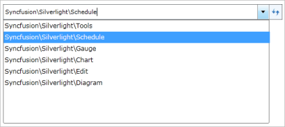

# Enabling Edit Mode in WPF HierarchyNavigator

A navigation path can be edited by using the AutoComplete functionality. By default, editing is disabled (set to false). If the IsEnableEditMode Boolean property is set to True, then editing will be enabled.



HierarchyNavigator hierarchyNavigator = new HierarchyNavigator();

hierarchyNavigator.IsEnableEditMode = true;



