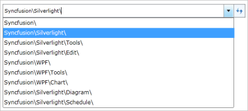

## Showing history 

When a user navigates to a different path, the paths navigated previously will be saved. Those paths can be viewed by clicking the arrow button next to the Refresh button. This will display a drop-down box with a list of all the paths navigated previously.

