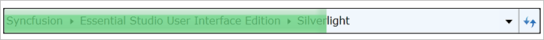

# Progress Bar in WPF BreadCrumb

The progress bar for the BreadCrumb control can be displayed or removed.

## There are two methods to display the progress bar:

1. Calling the ShowProgressBar method in BreadCrumb, which displays the progress bar for a time span of 500 ms.





HierarchyNavigator hierarchyNavigator = new HierarchyNavigator();
hierarchyNavigator.ShowProgressBar();




{{ codesnippet1 | OrderList_Indent_Level_1 }}

2. Passing an argument in the method to show a specified time span.  The image below shows a time span of 1000 ms that has been passed.





HierarchyNavigator hierarchyNavigator = new HierarchyNavigator();
hierarchyNavigator.ShowProgressBar(new TimeSpan(0, 0, 0, 0, 1000));




{{ codesnippet2 | OrderList_Indent_Level_1 }}

### The progress bar can be canceled by using two methods:

1. Calling the CancelProgressBar method in BreadCrumb.





HierarchyNavigator hierarchyNavigator = new HierarchyNavigator();
hierarchyNavigator.CancelProgressBar();




{{ codesnippet3 | OrderList_Indent_Level_1 }}

2. Passing an argument in the method to cancel the progress bar within a particular span of time. This method helps users cancel the progress bar when preferred. The image displayed below shows a time span of 1000 ms that has been passed.





HierarchyNavigator hierarchyNavigator = new HierarchyNavigator();
hierarchyNavigator.CancelProgressBar(new TimeSpan(0, 0, 0, 0, 1000));




{{ codesnippet4 | OrderList_Indent_Level_1 }}
